**SOFTWARE REQUIREMENT SPECIFICATION**

**Project:** Hotel Marketplace Management System

**Document ID:** SRS-HMS-001

**Version:** Revalidated Draft v1.2 - Screen Mock-up and Diagrams Integrated

**Date:** 2026-06-29

**Prepared by:** Ngô Minh Sơn, Phùng Duy Thái as Document Reviewer; Đinh Công Thái, Phạm Gia Bảo as Business Analysis .

**GROUP 1:**

**HE190004 - ĐINH CÔNG THÁI**

**HE191611 - PHÙNG DUY THÁI**

**HE176848 - NGÔ MINH SƠN**

**HE170525 - PHẠM GIA BẢO**

***Table of content***

Document Control 6

Source Basis 6

Important Scope Note 8

Revalidation Summary for v1.2 8

I. Record of Changes 9

II. Software Requirement Specification 10

1. Product Overview 10

1.1 Product Purpose 10

1.2 Business Context 10

1.3 Target Users 11

1.4 Operating Environment 11

1.5 Product Scope 11

1.5.1 In Scope for MVP+Staff v1.2 11

1.5.2 Out of Scope for MVP+Staff v1.2 12

1.6 System Boundary 13

1.7 External Entities 13

1.8 Context Diagram 14

2. User Requirements 14

2.1 Actors 14

2.2 Use Cases 16

2.2.1 Diagram(s) 16

Activity Diagrams for Complex Use Cases and Non-Screen Behavior 19

2.2.2 Use Case List 24

3. Software Features 28

3.1 Functional Overview 28

3.1.1 Screen Flow Diagrams 30

3.1.2 Screen Descriptions 32

3.1.3 Screen Authorization 35

3.1.4 Non-Screen Functions 37

3.1.5 Entity Relationship Diagram 39

3.1.6 Entity Details 43

3.1.7 Entity Origin Traceability 48

3.1.8 State Machine Diagrams 49

3.2 Feature Details 51

3.2.1 FEAT-AUTH - Authentication and Account Management 51

Purpose 51

Screen Mock-up and Screen Definition 51

SCR-001 - Register Screen 51

SCR-002 - Login Screen 53

SCR-003 - User Profile Screen 53

Use Case Description 54

Use Case Description - UC-003 Register Account 54

Use Case Description - UC-004 Login 56

Use Case Description - UC-025 Manage Own Profile 57

3.2.2 FEAT-MKT - Hotel Marketplace 58

Purpose 58

Screen Mock-up and Screen Definition 58

SCR-004 - Home / Search Screen 58

SCR-005 - Hotel Search Result Screen 59

SCR-006 - Hotel Detail Screen 60

Use Case Description 61

Use Case Description - UC-001 Search Hotels 61

Use Case Description - UC-002 View Hotel Detail 62

3.2.3 FEAT-CUST-BOOK - Customer Booking Creation and Online Payment 63

Purpose 63

Screen Mock-up and Screen Definition 63

SCR-007 - Booking Form Screen 63

SCR-008 - Booking Confirmation Screen 64

SCR-011 - Payment Instruction Screen 65

SCR-012 - Payment Result Screen 66

Use Case Description 67

Use Case Description - UC-005 Create Booking 67

Use Case Description - UC-006 Pay Online 68

3.2.4 FEAT-CUST-MYBOOK - Customer Booking Management 70

Purpose 70

Screen Mock-up and Screen Definition 70

SCR-009 - My Bookings Screen 70

SCR-010 - Customer Booking Detail Screen 71

SCR-013 - Customer Refund Status Screen 72

Use Case Description 73

Use Case Description - UC-007 Cancel Booking 73

Use Case Description - UC-008 View My Bookings 75

3.2.5 FEAT-HOTEL-SETUP - Hotel Profile and Configuration 76

Purpose 76

Screen Mock-up and Screen Definition 76

SCR-014 - Owner/Manager Dashboard 76

SCR-015 - Hotel Registration Screen 77

SCR-016 - Hotel Profile Management Screen 77

Use Case Description 78

Use Case Description - UC-009 Register Hotel Property 78

Use Case Description - UC-010 Manage Hotel Profile 79

3.2.6 FEAT-ROOM-INV - Room Inventory and Availability 80

Purpose 80

Screen Mock-up and Screen Definition 81

SCR-017 - Room Type Management Screen 81

SCR-018 - Physical Room Management Screen 81

SCR-019 - Availability Calendar Screen 83

SCR-035 - Room Status Board 84

Use Case Description 85

Use Case Description - UC-011 Manage Room Type 85

Use Case Description - UC-012 Manage Physical Room 86

Use Case Description - UC-013 Manage Room Availability 87

3.2.7 FEAT-STAFF - Hotel Staff Management 89

Purpose 89

Screen Mock-up and Screen Definition 89

SCR-028 - Staff Management Screen 89

SCR-029 - Staff Role Assignment Screen 90

Use Case Description 90

Use Case Description - UC-026 Manage Hotel Staff Accounts 90

Use Case Description - UC-027 Assign Staff Roles and Permissions 92

3.2.8 FEAT-FRONTDESK - Front Desk Operation 93

Purpose 93

Screen Mock-up and Screen Definition 93

SCR-020 - Hotel Booking List Screen 93

SCR-021 - Hotel Booking Detail Screen 94

SCR-022 - Front Desk Dashboard 95

SCR-023 - Arrival / Departure List Screen 96

SCR-024 - Room Assignment Board 97

SCR-025 - Check-in Screen 98

SCR-026 - Check-out / Payment Collection Screen 99

SCR-027 - Walk-in Booking Screen 101

Use Case Description 102

Use Case Description - UC-014 View Hotel Bookings 102

Use Case Description - UC-015 Check In Customer 103

Use Case Description - UC-016 Check Out Customer 104

Use Case Description - UC-017 Mark No-show 106

Use Case Description - UC-028 View Arrival and Departure List 107

Use Case Description - UC-029 Assign Physical Room 109

Use Case Description - UC-030 Record Pay-at-Property Payment 110

Use Case Description - UC-031 Create Walk-in Booking 112

3.2.9 FEAT-HOUSEKEEPING - Housekeeping Operation 114

Purpose 114

Screen Mock-up and Screen Definition 114

SCR-030 - Housekeeping Dashboard 114

SCR-031 - Housekeeping Task List Screen 115

SCR-032 - Housekeeping Task Detail Screen 115

Use Case Description 117

Use Case Description - UC-032 View Housekeeping Tasks 117

Use Case Description - UC-033 Update Room Cleaning Status 118

Use Case Description - UC-034 Report Room Issue 119

3.2.10 FEAT-MAINTENANCE - Maintenance Operation 121

Purpose 121

Screen Mock-up and Screen Definition 121

SCR-033 - Maintenance Request List Screen 121

SCR-034 - Maintenance Request Detail Screen 122

Use Case Description 123

Use Case Description - UC-035 View Maintenance Requests 123

Use Case Description - UC-036 Update Maintenance Request 124

Use Case Description - UC-037 Release Room from Maintenance 125

3.2.11 FEAT-ADMIN-APPROVAL - Platform Hotel Approval 127

Purpose 127

Screen Mock-up and Screen Definition 127

SCR-037 - Hotel Approval Screen 127

Use Case Description 128

Use Case Description - UC-018 Approve Hotel Property 128

3.2.12 FEAT-ADMIN-FINANCE - Platform Finance Administration 129

Purpose 129

Screen Mock-up and Screen Definition 129

SCR-038 - Commission Management Screen 129

SCR-039 - Payment Reconciliation Screen 130

SCR-040 - Refund Management Screen 131

SCR-041 - Settlement Management Screen 132

Use Case Description 133

Use Case Description - UC-019 Manage Commission Rate 133

Use Case Description - UC-020 Reconcile Payment 134

Use Case Description - UC-021 Process Refund Status 135

Use Case Description - UC-022 Mark Settlement 136

3.2.13 FEAT-ADMIN-REPORT - Platform Reporting 138

Purpose 138

Screen Mock-up and Screen Definition 138

SCR-036 - Admin Dashboard 138

Use Case Description 140

Use Case Description - UC-023 View Platform Dashboard 140

3.2.14 FEAT-AUTO-NOTI - Automation and Notification 140

Purpose 140

Screen Mock-up and Screen Definition 141

Use Case Description 141

Use Case Description - UC-024 Expire Unpaid Booking 141

4. Non-Functional Requirements 142

4.1 External Interfaces 142

4.2 Quality Attributes 142

5. Requirement Appendix 146

5.1 Business Rules 146

5.2 Status Lifecycles and Enumerations 155

5.2.1 Booking Status 155

5.2.2 Room Operational Status 155

5.2.3 Payment Status 155

5.2.4 Reconciliation Status 156

5.2.5 Refund Status 156

5.2.6 Settlement Status 156

5.2.7 Commission Status 156

5.2.8 Payment Collection Status 156

5.2.9 Housekeeping Task Status 157

5.2.10 Maintenance Request Status 157

5.3 Common Requirements 157

5.4 Application Messages List 158

5.5 Assumptions and Open Questions 167

5.5.1 Assumptions and Confirmed Scope Decisions 167

5.5.2 Open Questions 170

5.6 Traceability Matrix 170

5.7 Revalidation Notes 175

5.8 Documentation QA Summary 176

## Document Control

### Source Basis

| **Source ID** | **Source Type** | **Source / Artifact** | **What It Reveals** | **Confidence** |
| --- | --- | --- | --- | --- |
| SRC-001 | User requirement | Product purpose and operating environment provided in conversation | Multi-tenant hotel marketplace, hotel operations, platform administration, commission model, Flutter, ASP.NET Core Web API, Clean Architecture, SQL Server | High |
| SRC-002 | User clarification | Scope confirmation in conversation | Hotel only, private rooms only, Property Owner, instant booking, Platform Collect + Pay at Property, manual refund, manual settlement, payOS | High |
| SRC-003 | User scope update | User accepted prior SRS correction and requested staff actors | Add Hotel Manager, Receptionist, Housekeeping Staff, and Maintenance Staff | High |
| SRC-004 | Uploaded BA rules | srs\_sdd\_ba\_rules.md | FPT-style SRS structure, black-box SRS boundary, ID conventions, traceability, QA checklist | High |
| SRC-005 | Original SRS draft | hotel\_management\_system\_srs\_full.md | Baseline v1.0 requiring consistency fixes | High |
| SRC-006 | Method reference | Gomaa Software Modeling and Design / UML use case guidance | Use cases describe actor input and system response as black-box requirements; include/extend must be used carefully | High |
| SRC-007 | Final user decisions | Final clarification before v1.2 update | Remove section 2.2.3 detailed summaries; move detailed UC descriptions into Feature Details; use FPT-style UC table; add screen mock-up placeholders and diagram delegation blocks; include staff actors; one booking = one room type + quantity; payment timeout = 15 minutes; hotel-configurable cancellation policy; room-price-only amount; check-in identity document fields; customer sees booking receipt only | High |

### Important Scope Note

No source code repository was provided for this SRS update. Therefore, this document defines the intended business requirements for the **MVP+Staff v1.2** scope and explicitly marks uncertain items as assumptions or open questions. This SRS describes **WHAT** the system must do. It intentionally avoids controller, service, repository, SQL, class, method, and deployment design details, which belong to the Software Design Document.

### Revalidation Summary for v1.2

| **Review Area** | **v1.0 Issue** | **v1.2 Correction** |
| --- | --- | --- |
| Actor model | Property Owner performed all hotel operations; staff roles were out of scope. | Added Hotel Manager, Receptionist, Housekeeping Staff, and Maintenance Staff as hotel-scoped actors. |
| Target users | External systems were listed as target users. | Target users now include human roles only; payOS, Notification Service, and System Scheduler are external entities. |
| Use case relationships | Prior diagram delegation contained dangling/weak relationships. | Removed invalid include/extend relationships; retained only one valid include: UC-015 Check In Customer includes UC-029 Assign Physical Room. |
| Use case descriptions | Some later UCs had one-line flows. | All UCs now have numbered black-box Actor/System flows. |
| Feature grouping | Payment/Admin and Owner/Stay overlapped. | Split features by business capability: marketplace, customer booking, hotel setup, room inventory, staff, front desk, housekeeping, maintenance, platform approval, platform finance, reporting, automation. |
| Screen flow | Flow was too large and not grouped by business operation. | Split screen flows by Customer, Owner/Manager, Front Desk, Housekeeping, Maintenance, and Platform Admin. |
| Entity mapping | Some entities were missing or not traced to use cases. | Added entity origin trace; added HotelStaffAssignment, BookingRoomAssignment, PaymentCollectionRecord, HousekeepingTask, MaintenanceRequest, RoomStatusHistory, GuestStayRecord, and SettlementItem. |
| Booking lifecycle | Checked Out vs Completed was ambiguous. | Booking lifecycle now uses Checked Out as final stay-completed state for MVP+Staff; settlement is tracked separately. |
| QA summary | Prior summary marked pass despite known issues. | QA summary now separates corrected pass items from assumptions/open questions and confirms v1.2 placeholder readiness. |

---

## I. Record of Changes

| **Date** | **A/M/D** | **In Charge** | **Change Description** |
| --- | --- | --- | --- |
| 2026-06-29 | A | BA Documentation Assistant | Created full SRS Markdown draft based on user-confirmed scope and BA rules. |
| 2026-06-29 | M | BA + SA + QA Reviewer | Revalidated and updated SRS to v1.1: added hotel staff actors, corrected use case relationships, split features and screen flows, added staff/housekeeping/maintenance entities, strengthened authorization and traceability. |
| 2026-06-29 | M | BA + SA + QA Reviewer | Updated SRS to v1.2: removed Detailed Use Case section from User Requirements, moved detailed use case descriptions into Feature Details, added screen mock-up placeholders, strengthened screen definitions, converted diagram placeholders to Codex/draw.io-ready blocks, and applied final user-confirmed business rules. |
| 2026-07-02 | M | BA + SA Reviewer | Integrated SRS diagrams into the Markdown and DOCX, including context, use case, activity, screen flow, logical ERD, and state machine diagrams. |

---

## II. Software Requirement Specification

# 1. Product Overview

## 1.1 Product Purpose

The **Hotel Marketplace Management System** is a multi-tenant platform that allows guests and customers to search hotels, view hotel details, check private room availability, create bookings, pay online or at property, and manage booking status. The system also supports hotel-side operations for Property Owners and hotel staff roles, including Hotel Manager, Receptionist, Housekeeping Staff, and Maintenance Staff.

The platform earns revenue by charging commission on successful bookings. For MVP+Staff v1.2, the system supports two payment modes:

- **Platform Collect:** the customer pays the platform through payOS. The system records payment status, calculates platform commission, and allows the Platform Administrator to manually mark hotel settlement.

- **Pay at Property:** the customer pays the hotel directly. The system records the booking, allows authorized front desk staff to record payment collection, calculates platform commission receivable, and allows the Platform Administrator to manually mark commission collection.

The MVP+Staff business flow is:

Guest searches approved hotels
-> Customer registers/logs in
-> Customer books an available private room
-> Customer pays online or chooses Pay at Property
-> Hotel staff receives booking operationally
-> Receptionist assigns physical room and checks guest in
-> Receptionist checks guest out and records pay-at-property collection if needed
-> System creates housekeeping task and updates room status
-> Housekeeping Staff cleans room or reports issue
-> Maintenance Staff handles room issue when required
-> Platform Administrator reconciles payment, refund, commission, and settlement records

## 1.2 Business Context

| **Business Area** | **Description** |
| --- | --- |
| Hotel Marketplace | Public discovery and booking channel for customers. |
| Customer Booking Management | Customer-facing flow for account, booking, payment, cancellation, and booking status tracking. |
| Hotel Ownership and Configuration | Property Owner manages hotel profile, room inventory, staff accounts, and high-level hotel configuration. |
| Hotel Daily Operations | Receptionist, Housekeeping Staff, Maintenance Staff, and Hotel Manager perform operational work for assigned hotels. |
| Platform Administration | Marketplace control layer for approval, commission configuration, payment reconciliation, refund tracking, and settlement tracking. |

## 1.3 Target Users

| **User Group** | **Description** |
| --- | --- |
| Guest | Unauthenticated visitor who can browse and search approved hotels. |
| Customer | Registered user who can create bookings, pay online or at property, view bookings, and request cancellation. |
| Property Owner | Registered hotel owner who owns hotels, manages hotel configuration, room inventory, staff accounts, and high-level hotel operations. |
| Hotel Manager | Hotel-scoped manager delegated by Property Owner to oversee bookings, rooms, staff operations, housekeeping, maintenance, and hotel-level dashboard. |
| Receptionist | Front desk staff who handles arrival/departure list, booking detail, physical room assignment, check-in, check-out, no-show, and pay-at-property collection recording. |
| Housekeeping Staff | Staff member who views assigned cleaning tasks, updates room cleaning status, and reports room issues. |
| Maintenance Staff | Staff member who views, updates, and resolves maintenance requests for assigned hotels. |
| Platform Administrator | Internal platform operator who approves hotels, manages commission, monitors bookings/payments, records refund status, and marks settlement. |

## 1.4 Operating Environment

| **Layer** | **Target Technology** |
| --- | --- |
| Mobile Client | Flutter |
| Backend API | ASP.NET Core Web API, C# |
| Architecture | Clean Architecture |
| Database | Microsoft SQL Server |
| Payment Provider | payOS for MVP demo |
| Notification | Mock notification or future email/SMS/push provider |

Technology is listed here only as operating environment and integration context. Detailed technical design shall be documented in the SDD.

## 1.5 Product Scope

### 1.5.1 In Scope for MVP+Staff v1.2

| **Scope Area** | **Included Requirement Scope** |
| --- | --- |
| Account and Authentication | Guest browsing, Customer registration/login, Property Owner registration/login, staff login, Platform Administrator login, own profile, role-based and hotel-scoped access. |
| Staff and Authorization | Property Owner/Hotel Manager can manage hotel staff accounts and assign hotel-scoped roles such as Receptionist, Housekeeping Staff, and Maintenance Staff. |
| Hotel Marketplace | Search approved hotels, filter results, view hotel details, view available private room types. |
| Booking | Instant booking when availability exists, customer booking management, cancellation request, booking lifecycle, unpaid booking expiration. |
| Payment | Platform Collect through payOS, Pay at Property, payment status tracking, payment result notification handling, pay-at-property collection recording. |
| Refund | Refund eligibility tracking and manual refund processing status by Platform Administrator. |
| Commission | Commission rate per hotel, commission snapshot at booking time, commission record per successful booking. |
| Settlement | Manual marking of hotel settlement for Platform Collect and commission collection for Pay at Property. |
| Hotel Setup | Hotel profile, hotel images, amenities, cancellation policy, room types, physical private rooms, base price, availability calendar. |
| Front Desk Operation | Booking list, arrival/departure list, physical room assignment, check-in, check-out, basic invoice/folio, no-show, walk-in booking if enabled. |
| Housekeeping Operation | Housekeeping task list, room cleaning status update, room issue reporting. |
| Maintenance Operation | Maintenance request list, status update, resolution, and room release from maintenance. |
| Platform Administration | Hotel approval, commission management, payment reconciliation, refund management, settlement management, platform dashboard. |
| Notification | Booking, payment, cancellation, approval, check-in, check-out, housekeeping, maintenance, refund, and settlement notifications. Notification may be mocked in MVP. |
| Reporting | Basic dashboard metrics for platform and hotel operations. |

### 1.5.2 Out of Scope for MVP+Staff v1.2

| **Out-of-Scope Item** | **Reason / Future Release** |
| --- | --- |
| Hostel support | User confirmed hotel-only scope. |
| Dorm bed support | User confirmed private rooms only. |
| Separate Hotel Cashier / Hotel Accountant role | Receptionist or Hotel Manager records pay-at-property collection in MVP+Staff. |
| Platform Finance Operator role | Platform Administrator covers platform finance operations in MVP+Staff. |
| Full staff shift scheduling and attendance | Future workforce management feature. |
| Full housekeeping planning, laundry, inventory, minibar, lost-and-found workflows | Future hotel operations enhancement. |
| Maintenance spare-part inventory and vendor management | Future maintenance enhancement. |
| Dynamic seasonal pricing and rate plans | MVP uses base price per room type. |
| Coupons and promotions | Future pricing enhancement. |
| Automated online refund through payment gateway | MVP records manual refund processing status. |
| Automated bank payout to hotels | MVP records manual settlement status. |
| Tax and e-invoice integration | Requires additional legal/accounting requirements. |
| Customer-owner/staff chat | Future communication feature. |
| OTA/channel manager integration | Future integration. |
| Review and rating system | Recommended after completed-stay flow is stable. |
| Multi-currency support | MVP assumes Vietnamese Dong. |
| Multi-language support | Future enhancement unless separately required. |

## 1.6 System Boundary

The system boundary includes customer-facing search and booking, hotel owner configuration, hotel-scoped staff operation, platform administration, payment integration with payOS, notification recording or dispatch, and logical records for booking, payment, refund, commission, invoice, room assignment, housekeeping, maintenance, audit, and settlement.

The system does not directly execute real bank payout or automated refund in MVP+Staff v1.2. It records business status and allows the Platform Administrator to mark the result manually.

## 1.7 External Entities

| **External Entity ID** | **External Entity** | **Type** | **Description** | **Data / Control Flow** |
| --- | --- | --- | --- | --- |
| EXT-001 | payOS Payment Gateway | External System | Processes online payment for Platform Collect bookings. | Receives payment request data; returns payment result; sends payment notification. |
| EXT-002 | Notification Service | External System / Mock | Sends or records customer, hotel staff, owner, and admin notifications. | Receives notification event data; returns notification status if integrated. |
| EXT-003 | System Scheduler | Time-based Actor | Triggers time-based behavior such as unpaid booking expiration and housekeeping reminders if enabled. | Triggers expiration checks, task due checks, and notification events. |

## 1.8 Context Diagram

The context diagram shows the Hotel Marketplace Management System as a single system boundary. Human actors, external systems, and the time-based scheduler remain outside the boundary; internal controllers, repositories, database tables, and implementation classes are intentionally excluded.

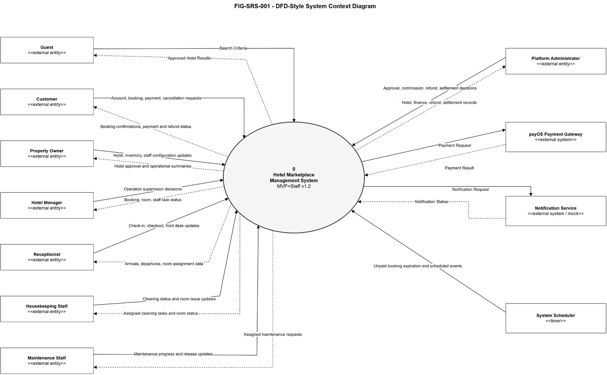

**Figure 1-1: System Context Diagram**

---

# 2. User Requirements

## 2.1 Actors

| **ID** | **Actor** | **Type** | **Description** | **Related Use Cases** | **Evidence / Assumption** |
| --- | --- | --- | --- | --- | --- |
| ACT-001 | Guest | Human | Unauthenticated visitor who can search and view approved hotels but cannot create a booking. | UC-001, UC-002, UC-003, UC-004 | Confirmed user scope. |
| ACT-002 | Customer | Human | Registered user who can search hotels, create bookings, pay online or at property, view bookings, and request cancellation. | UC-001, UC-002, UC-004, UC-005, UC-006, UC-007, UC-008, UC-025 | Confirmed user scope. |
| ACT-003 | Property Owner | Human | Registered hotel owner who manages owned hotels, room inventory, staff accounts, high-level configuration, hotel-level overview, and authorized front desk operations for owned hotels. | UC-004, UC-009 to UC-017, UC-025 to UC-031 | Confirmed plus staff-scope update. |
| ACT-004 | Hotel Manager | Human | Hotel-scoped manager delegated by owner to supervise hotel configuration, bookings, staff operations, housekeeping, and maintenance for assigned hotels. | UC-004, UC-010 to UC-017, UC-025 to UC-037 | Added by v1.2 staff update. |
| ACT-005 | Receptionist | Human | Front desk staff who operates arrivals, departures, room assignment, check-in, check-out, no-show, pay-at-property collection, walk-in booking, limited availability, and issue reporting for assigned hotels. | UC-004, UC-013 to UC-017, UC-025, UC-028 to UC-031, UC-034 | Added by v1.2 staff update. |
| ACT-006 | Housekeeping Staff | Human | Hotel staff who views assigned cleaning tasks, updates room cleaning status, and reports room issues for assigned hotels. | UC-004, UC-032, UC-033, UC-034, UC-025 | Added by v1.2 staff update. |
| ACT-007 | Maintenance Staff | Human | Hotel staff who views, updates, and resolves maintenance requests for assigned hotels. | UC-004, UC-035, UC-036, UC-037, UC-025 | Added by v1.2 staff update. |
| ACT-008 | Platform Administrator | Human | Platform operator who manages hotel approval, commission, payment reconciliation, refund status, settlement status, and platform dashboard. | UC-004, UC-018 to UC-023, UC-025 | Confirmed user scope. |
| ACT-009 | payOS Payment Gateway | External System | External payment gateway used for online payment processing. | UC-006, UC-020, NSF-001 | Confirmed by user. |
| ACT-010 | Notification Service | External System / Mock | Sends or records notifications for important business events. | UC-003, UC-005, UC-006, UC-007, UC-009, UC-015, UC-016, UC-017, UC-018, UC-021, UC-022, UC-032 to UC-037, UC-024, NSF-003 | Assumption for MVP notification support. |
| ACT-011 | System Scheduler | Time-based Actor | Represents automated time-based triggers such as unpaid booking expiration and scheduled notifications. | UC-024, NSF-002 | Assumption for non-screen behavior. |

**Actor modeling note:** Hotel staff actors are modeled as roles, not individuals. A single real person may hold multiple hotel-scoped roles, but the SRS separates actors because their permissions, screens, and business goals differ.

## 2.2 Use Cases

### 2.2.1 Diagram(s)

The use case diagrams are split by business capability to keep each diagram readable. Detailed use case descriptions are not placed in this section; they are documented under the relevant Feature Details in Section 3.2.

| **Figure** | **Diagram ID** | **Module View** | **Primary Coverage** |
| --- | --- | --- | --- |
| Figure 2-1 | FIG-SRS-002 | Account and Marketplace | Register account, login, own profile, hotel search, and hotel detail browsing. |
| Figure 2-2 | FIG-SRS-002 | Customer Booking and Payment | Booking creation, online payment, booking list/detail, cancellation, and unpaid booking expiration. |
| Figure 2-3 | FIG-SRS-002 | Hotel Setup, Room Inventory, and Staff | Hotel profile, room inventory, room availability, staff accounts, and staff role assignment. |
| Figure 2-4 | FIG-SRS-002 | Front Desk Operation | Hotel booking operation, room assignment, check-in, check-out, no-show, pay-at-property collection, and walk-in booking. |
| Figure 2-5 | FIG-SRS-002 | Housekeeping and Maintenance | Housekeeping tasks, cleaning status, room issue reporting, maintenance request update, and room release. |
| Figure 2-6 | FIG-SRS-002 | Platform Administration | Hotel approval, commission rate, payment reconciliation, refund status, settlement, and platform dashboard. |

Use case diagram boundaries:

- Use cases remain inside the Hotel Marketplace Management System boundary.

- Human actors and external systems remain outside the boundary.

- Include/extend relationships are used only where the relationship is explicit and valid in the SRS.

- Screens, controllers, services, repositories, APIs, database tables, and implementation classes are intentionally excluded.

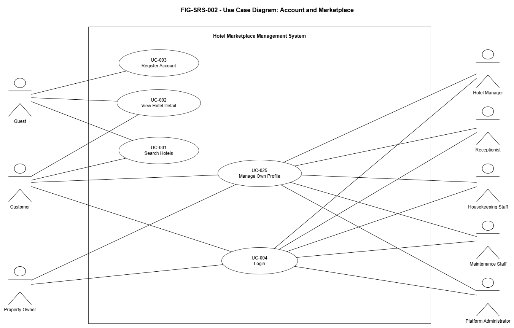

**Figure 2-1: Use Case Diagram of Account and Marketplace**

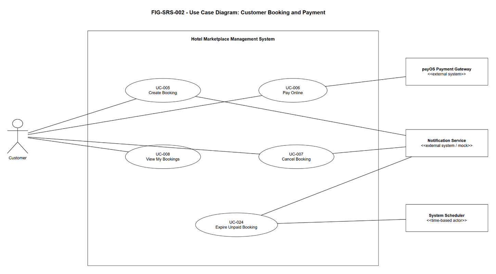

**Figure 2-2: Use Case Diagram of Customer Booking and Payment**

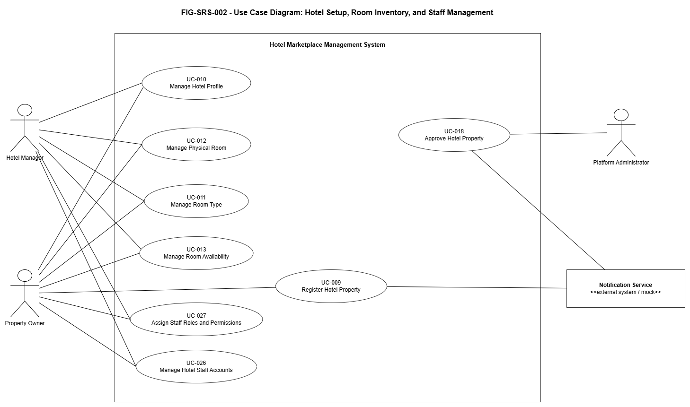

**Figure 2-3: Use Case Diagram of Hotel Setup, Inventory, and Staff**

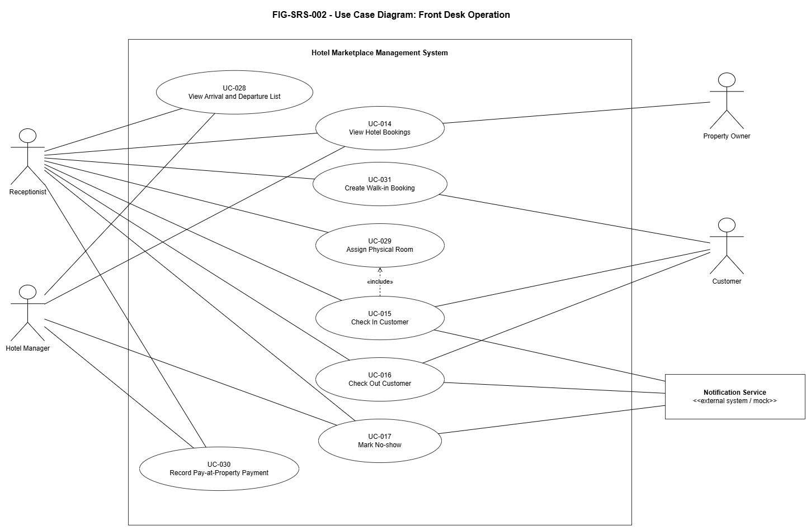

**Figure 2-4: Use Case Diagram of Front Desk Operation**

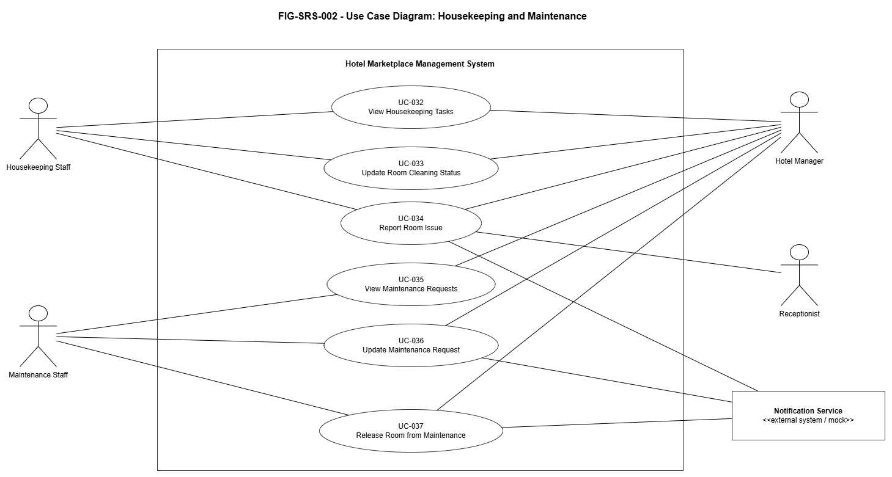

**Figure 2-5: Use Case Diagram of Housekeeping and Maintenance**

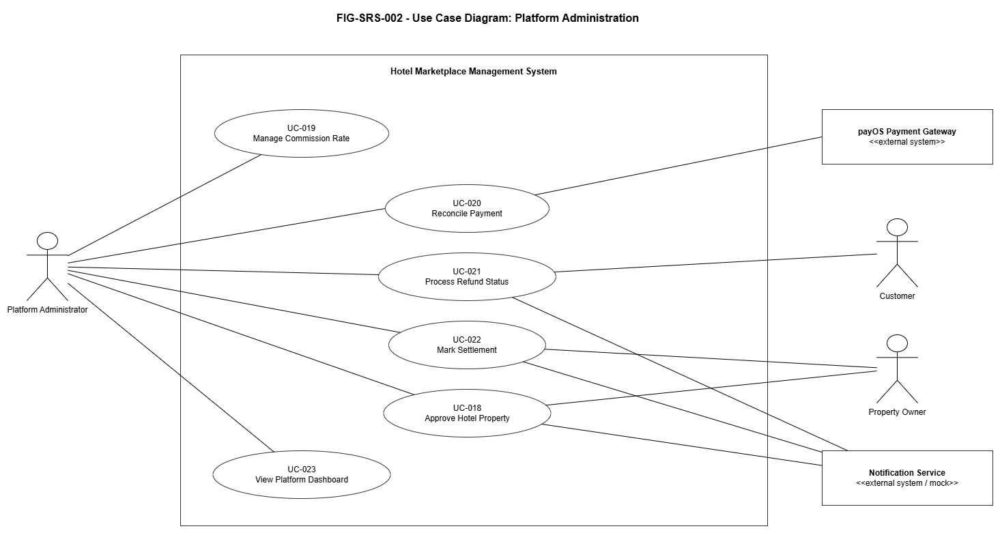

**Figure 2-6: Use Case Diagram of Platform Administration**

#### Activity Diagrams for Complex Use Cases and Non-Screen Behavior

Activity diagrams are split by complex business flow. They show actor/system behavior at SRS level and intentionally exclude controllers, services, repositories, SQL, and internal locking details.

| **Figure** | **Diagram ID** | **Flow** | **Primary Coverage** |
| --- | --- | --- | --- |
| Figure 2-7 | FIG-SRS-006 | Create Booking | Booking input, validation, availability check, amount calculation, payment-mode selection, booking creation, and notification. |
| Figure 2-8 | FIG-SRS-006 | Cancel Booking | Cancellation request, policy validation, availability release, refund record creation where required, and status feedback. |
| Figure 2-9 | FIG-SRS-006 | Check In Customer | Booking verification, identity information capture, physical room assignment, room status update, and notification. |
| Figure 2-10 | FIG-SRS-006 | Check Out Customer | Folio/receipt review, pay-at-property collection where required, checkout, dirty-room transition, housekeeping task creation, and notification. |
| Figure 2-11 | FIG-SRS-006 | Automated Notification | Event/schedule trigger, notification record creation, notification delivery or recording result, and audit outcome. |

**Figure 2-7: Activity Diagram of Create Booking**

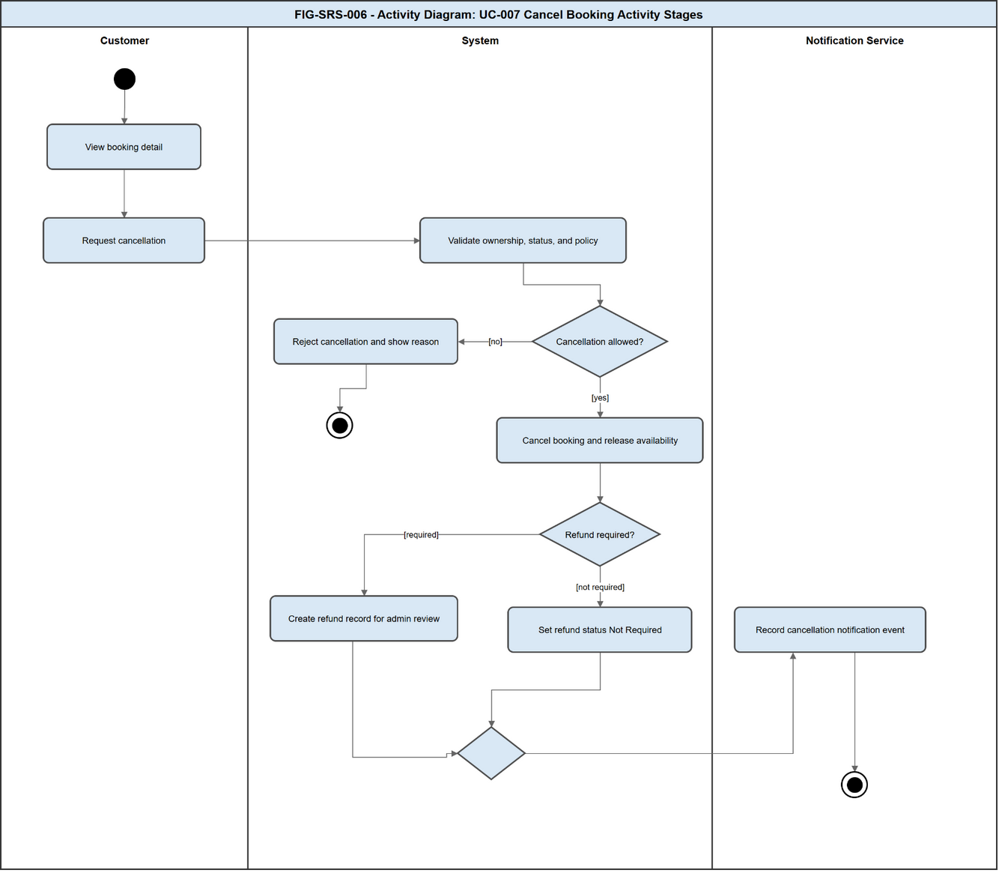

**Figure 2-8: Activity Diagram of Cancel Booking**

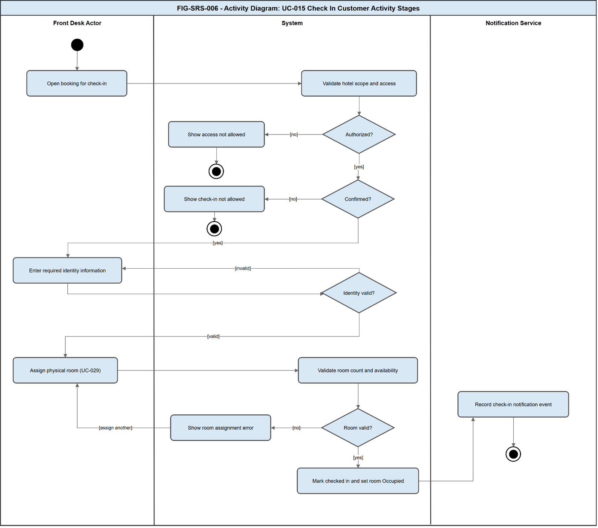

**Figure 2-9: Activity Diagram of Check In Customer**

**Figure 2-10: Activity Diagram of Check Out Customer**

**Figure 2-11: Activity Diagram of Automated Notification**

### 2.2.2 Use Case List

| **ID** | **Group Function** | **Use Case** | **Primary Actor** | **Secondary Actor(s)** | **Brief Description** |
| --- | --- | --- | --- | --- | --- |
| UC-001 | Marketplace | Search Hotels | Guest, Customer | None | Search approved hotels by destination, dates, guest count, and filters. |
| UC-002 | Marketplace | View Hotel Detail | Guest, Customer | None | View hotel details, room types, amenities, price, policy, and availability. |
| UC-003 | Account | Register Account | Guest | Notification Service | Register a Customer or Property Owner account. |
| UC-004 | Account | Login | Customer, Property Owner, Hotel Manager, Receptionist, Housekeeping Staff, Maintenance Staff, Platform Administrator | None | Authenticate user and access role-specific functions. |
| UC-005 | Customer Booking | Create Booking | Customer | Notification Service | Create an instant booking after availability validation. |
| UC-006 | Payment | Pay Online | Customer | payOS Payment Gateway, Notification Service | Pay booking amount through payOS for Platform Collect bookings. |
| UC-007 | Customer Booking | Cancel Booking | Customer | Notification Service | Cancel own booking according to policy and initiate refund status if applicable. |
| UC-008 | Customer Booking | View My Bookings | Customer | None | View customer booking list, status, payment status, and booking detail. |
| UC-009 | Hotel Setup | Register Hotel Property | Property Owner | Platform Administrator, Notification Service | Create a hotel profile and submit it for platform approval. |
| UC-010 | Hotel Setup | Manage Hotel Profile | Property Owner, Hotel Manager | None | Update owned or assigned hotel information, images, amenities, and policies. |
| UC-011 | Room Inventory | Manage Room Type | Property Owner, Hotel Manager | None | Create and update private room types, base price, capacity, and facilities. |
| UC-012 | Room Inventory | Manage Physical Room | Property Owner, Hotel Manager | None | Create and update individual private rooms under room types. |
| UC-013 | Room Inventory | Manage Room Availability | Property Owner, Hotel Manager, Receptionist | None | Open, close, block, or unblock room availability by date range, according to role permissions. |
| UC-014 | Front Desk | View Hotel Bookings | Property Owner, Hotel Manager, Receptionist | None | View bookings for owned or assigned hotels. |
| UC-015 | Front Desk | Check In Customer | Receptionist, Hotel Manager, Property Owner | Notification Service | Verify confirmed booking, assign physical room if needed, and mark check-in. |
| UC-016 | Front Desk | Check Out Customer | Receptionist, Hotel Manager, Property Owner | Notification Service | Finalize stay, confirm pay-at-property collection if needed, generate basic invoice/folio, and release room to housekeeping. |
| UC-017 | Front Desk | Mark No-show | Receptionist, Hotel Manager, Property Owner | Notification Service | Mark confirmed booking as no-show when customer does not arrive within allowed operational window. |
| UC-018 | Platform Approval | Approve Hotel Property | Platform Administrator | Notification Service | Approve or reject submitted hotel properties. |
| UC-019 | Platform Finance | Manage Commission Rate | Platform Administrator | None | Set commission rate per approved hotel. |
| UC-020 | Platform Finance | Reconcile Payment | Platform Administrator | payOS Payment Gateway | Review payment transaction status and mark reconciliation result. |
| UC-021 | Platform Finance | Process Refund Status | Platform Administrator | Customer, Notification Service | Record manual refund decision and refund status. |
| UC-022 | Platform Finance | Mark Settlement | Platform Administrator | Property Owner, Notification Service | Mark hotel payable settlement or commission collection as completed. |
| UC-023 | Reporting | View Platform Dashboard | Platform Administrator | None | View platform booking, revenue, commission, payment, refund, and settlement metrics. |
| UC-024 | Automation | Expire Unpaid Booking | System Scheduler | Notification Service | Expire pending-payment bookings when payment timeout is reached. |
| UC-025 | Account | Manage Own Profile | Customer, Property Owner, Hotel Manager, Receptionist, Housekeeping Staff, Maintenance Staff, Platform Administrator | None | View and update own basic profile where allowed. |
| UC-026 | Staff Management | Manage Hotel Staff Accounts | Property Owner, Hotel Manager | Notification Service | Invite, create, update, deactivate, and view staff accounts for assigned hotels. |
| UC-027 | Staff Management | Assign Staff Roles and Permissions | Property Owner, Hotel Manager | None | Assign hotel-scoped staff roles and permissions. |
| UC-028 | Front Desk | View Arrival and Departure List | Receptionist, Hotel Manager, Property Owner | None | View today/upcoming arrivals, departures, no-show candidates, and operational status. |
| UC-029 | Front Desk | Assign Physical Room | Receptionist, Hotel Manager, Property Owner | None | Assign or change physical room for a confirmed booking before or during check-in. |
| UC-030 | Front Desk | Record Pay-at-Property Payment | Receptionist, Hotel Manager, Property Owner | None | Record amount collected directly at hotel for Pay at Property booking. |
| UC-031 | Front Desk | Create Walk-in Booking | Receptionist, Hotel Manager, Property Owner | Customer, Notification Service | Create booking for guest arriving directly at hotel if room is available. |
| UC-032 | Housekeeping | View Housekeeping Tasks | Housekeeping Staff, Hotel Manager | None | View assigned or hotel-level housekeeping tasks by room, date, priority, and status. |
| UC-033 | Housekeeping | Update Room Cleaning Status | Housekeeping Staff, Hotel Manager | Notification Service | Update cleaning task and room cleaning status. |
| UC-034 | Housekeeping | Report Room Issue | Housekeeping Staff, Receptionist, Hotel Manager | Maintenance Staff, Notification Service | Report room issue and create maintenance request. |
| UC-035 | Maintenance | View Maintenance Requests | Maintenance Staff, Hotel Manager | None | View open, assigned, and resolved maintenance requests for assigned hotels. |
| UC-036 | Maintenance | Update Maintenance Request | Maintenance Staff, Hotel Manager | Notification Service | Update diagnosis, work status, note, and completion result. |
| UC-037 | Maintenance | Release Room from Maintenance | Maintenance Staff, Hotel Manager | Housekeeping Staff, Notification Service | Mark maintenance completed and return room to cleaning/available path according to room status rule. |

---

# 3. Software Features

## 3.1 Functional Overview

The feature model is reorganized by business capability instead of by broad user type. This avoids overlap between payment, administration, stay operation, housekeeping, and maintenance.

| **Feature ID** | **Feature Name** | **Description** | **Related UCs** | **Main Screens / Functions** | **Main Entities** |
| --- | --- | --- | --- | --- | --- |
| FEAT-AUTH | Authentication and Account Management | Supports registration, login, own profile, role-based access, and hotel-scoped staff authorization. | UC-003, UC-004, UC-025 | SCR-001, SCR-002, SCR-003 | ENT-001, ENT-002, ENT-003, ENT-004 |
| FEAT-MKT | Hotel Marketplace | Supports public hotel search, filtering, hotel detail browsing, and availability display. | UC-001, UC-002 | SCR-004, SCR-005, SCR-006 | ENT-005, ENT-006, ENT-007, ENT-008, ENT-009, ENT-010, ENT-011, ENT-012 |
| FEAT-CUST-BOOK | Customer Booking Creation and Online Payment | Supports instant booking, Platform Collect payment, Pay at Property booking confirmation, and payment result handling. | UC-005, UC-006 | SCR-007, SCR-008, SCR-011, SCR-012, NSF-001 | ENT-013, ENT-014, ENT-016, ENT-020 |
| FEAT-CUST-MYBOOK | Customer Booking Management | Supports customer booking list, booking detail, cancellation, and customer refund visibility. | UC-007, UC-008 | SCR-009, SCR-010, SCR-013 | ENT-013, ENT-018 |
| FEAT-HOTEL-SETUP | Hotel Profile and Configuration | Supports hotel registration, hotel profile update, images, amenities, and cancellation policy. | UC-009, UC-010 | SCR-014, SCR-015, SCR-016 | ENT-005, ENT-006, ENT-007, ENT-008, ENT-009 |
| FEAT-ROOM-INV | Room Inventory and Availability | Supports room type, physical room, room availability, and room status board. | UC-011, UC-012, UC-013 | SCR-017, SCR-018, SCR-019, SCR-035 | ENT-010, ENT-011, ENT-012, ENT-027 |
| FEAT-STAFF | Hotel Staff Management | Supports hotel-scoped staff account and role assignment management. | UC-026, UC-027 | SCR-028, SCR-029 | ENT-001, ENT-002, ENT-003, ENT-004 |
| FEAT-FRONTDESK | Front Desk Operation | Supports hotel booking list, arrival/departure list, booking detail, room assignment, check-in, checkout, payment collection, no-show, and walk-in booking. | UC-014, UC-015, UC-016, UC-017, UC-028, UC-029, UC-030, UC-031 | SCR-020, SCR-021, SCR-022, SCR-023, SCR-024, SCR-025, SCR-026, SCR-027 | ENT-013, ENT-014, ENT-015, ENT-016, ENT-017, ENT-025, ENT-027, ENT-028 |
| FEAT-HOUSEKEEPING | Housekeeping Operation | Supports housekeeping task list, task status updates, room cleaning workflow, and issue reporting. | UC-032, UC-033, UC-034 | SCR-030, SCR-031, SCR-032, SCR-035 | ENT-025, ENT-026, ENT-027 |
| FEAT-MAINTENANCE | Maintenance Operation | Supports maintenance request list, request updates, and room release from maintenance. | UC-035, UC-036, UC-037 | SCR-033, SCR-034, SCR-035 | ENT-026, ENT-027 |
| FEAT-ADMIN-APPROVAL | Platform Hotel Approval | Supports platform review and approval/rejection of submitted hotel properties. | UC-018 | SCR-037 | ENT-005, ENT-024 |
| FEAT-ADMIN-FINANCE | Platform Finance Administration | Supports commission rate, reconciliation, refund status, and settlement/collection tracking. | UC-019, UC-020, UC-021, UC-022 | SCR-038, SCR-039, SCR-040, SCR-041, NSF-004, NSF-005, NSF-006 | ENT-016, ENT-018, ENT-020, ENT-021, ENT-022, ENT-024 |
| FEAT-ADMIN-REPORT | Platform Reporting | Supports platform-level dashboard metrics. | UC-023 | SCR-036, NSF-007 | ENT-013, ENT-016, ENT-020, ENT-021, ENT-022 |
| FEAT-AUTO-NOTI | Automation and Notification | Supports unpaid booking expiration and event notification recording/dispatch. | UC-024 | NSF-002, NSF-003, NSF-008, NSF-009 | ENT-023 |

## 3.1.1 Screen Flow Diagrams

Screen flows are intentionally split by business workflow. This prevents one large unreadable diagram and keeps navigation traceable to a business capability.

| **Figure** | **Diagram ID** | **Workflow** | **Primary Coverage** |
| --- | --- | --- | --- |
| Figure 3-1 | FIG-SRS-003 | Customer Search, Booking, Payment, and Cancellation | Marketplace search, hotel detail, authentication, booking form, confirmation, payment, result, booking detail, booking list, and refund status. |
| Figure 3-2 | FIG-SRS-003 | Owner / Manager Hotel Setup | Owner/manager dashboard, hotel registration/profile, room type, physical room, availability, staff management, role assignment, and room status board. |
| Figure 3-3 | FIG-SRS-003 | Front Desk Operation | Front desk dashboard, arrival/departure list, booking list/detail, room assignment, check-in, check-out/payment collection, walk-in booking, and room status board. |
| Figure 3-4 | FIG-SRS-003 | Housekeeping Operation | Housekeeping dashboard, task list, task detail, room issue reporting, and room status board. |
| Figure 3-5 | FIG-SRS-003 | Maintenance Operation | Maintenance request list/detail, maintenance status update, room release, and room status board. |
| Figure 3-6 | FIG-SRS-003 | Platform Administration | Admin dashboard, hotel approval, commission management, payment reconciliation, refund management, and settlement management. |

Screen flow boundaries:

- Diagrams show user-visible screen navigation only.

- Role-specific diagrams must not expose screens or data outside that role's authorization boundary.

- Controllers, services, repositories, database tables, API endpoints, and implementation classes are intentionally excluded.

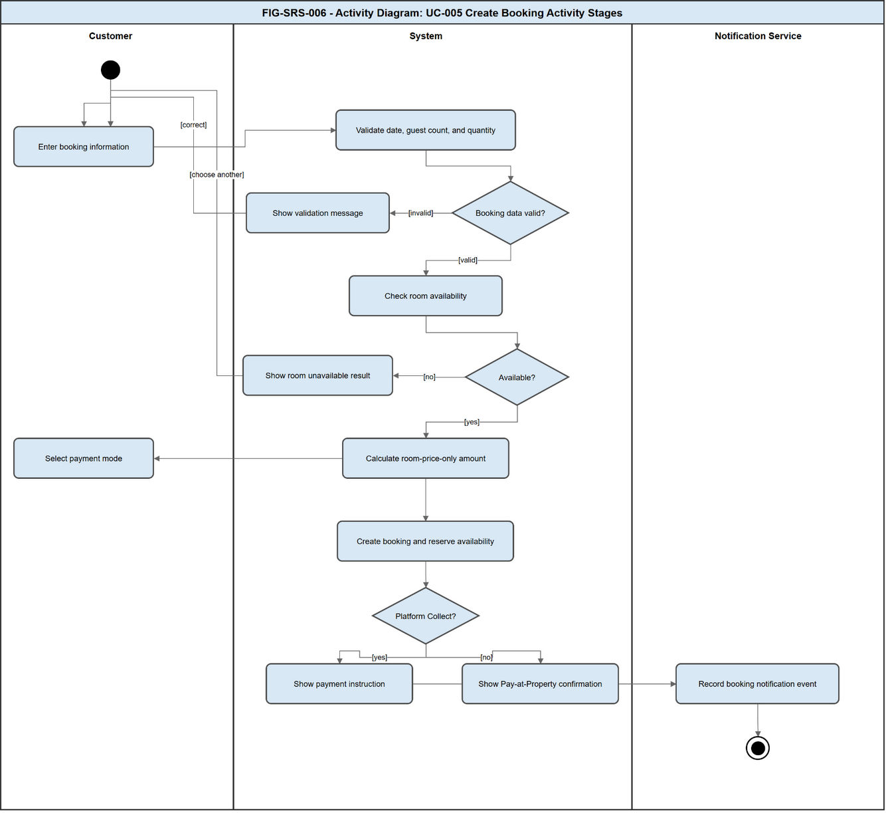

**Figure 3-1: Screen Flow of Customer Search, Booking, Payment, and Cancellation**

**Figure 3-2: Screen Flow of Owner / Manager Hotel Setup**

**Figure 3-3: Screen Flow of Front Desk Operation**

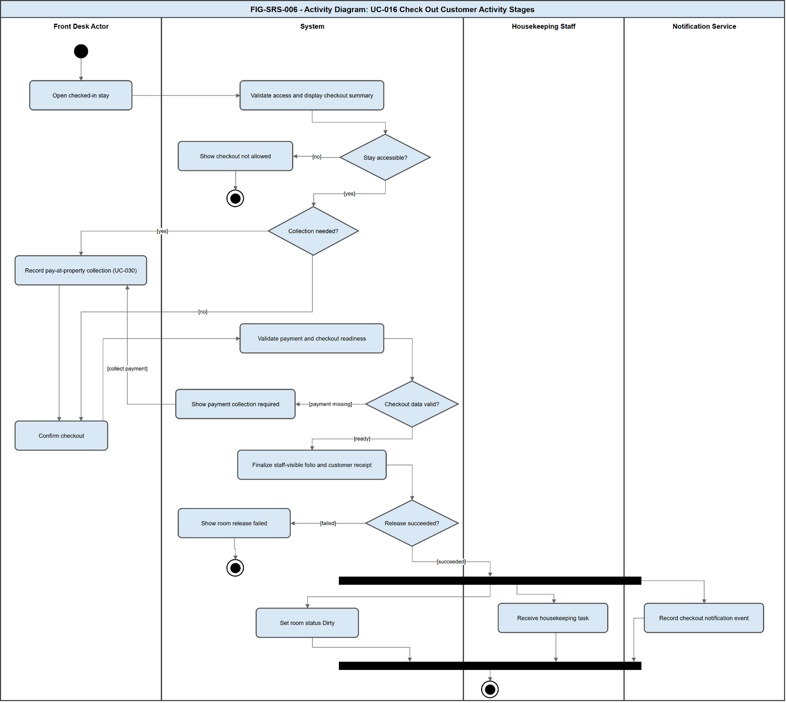

**Figure 3-4: Screen Flow of Housekeeping Operation**

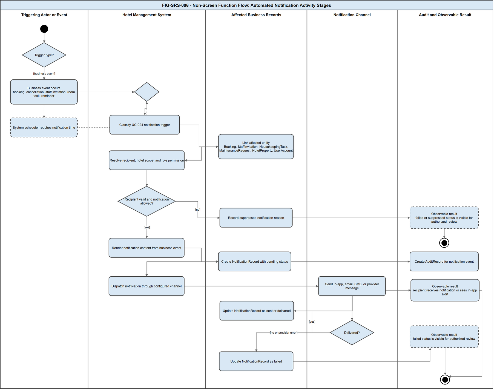

**Figure 3-5: Screen Flow of Maintenance Operation**

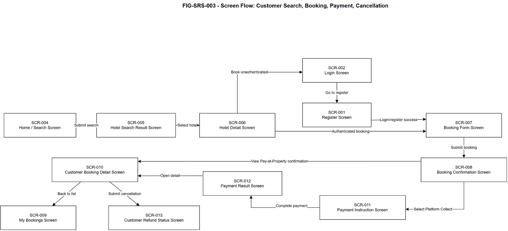

**Figure 3-6: Screen Flow of Platform Administration**

## 3.1.2 Screen Descriptions

| **Screen ID** | **Feature** | **Screen Name** | **Description** | **Related Use Cases** |
| --- | --- | --- | --- | --- |
| SCR-001 | FEAT-AUTH | Register Screen | Allows Guest to register as Customer or Property Owner. Hotel staff accounts are created/invited by Property Owner or Hotel Manager. | UC-003 |
| SCR-002 | FEAT-AUTH | Login Screen | Allows Customer, Property Owner, Hotel Manager, Receptionist, Housekeeping Staff, Maintenance Staff, and Platform Administrator to log in. | UC-004 |
| SCR-003 | FEAT-AUTH | User Profile Screen | Allows authenticated user to view and update own basic profile. | UC-025 |
| SCR-004 | FEAT-MKT | Home / Search Screen | Allows Guest/Customer to enter destination, check-in date, check-out date, guest count, and filters. | UC-001 |
| SCR-005 | FEAT-MKT | Hotel Search Result Screen | Displays hotels matching search criteria and valid availability. | UC-001 |
| SCR-006 | FEAT-MKT | Hotel Detail Screen | Displays hotel details, images, amenities, room types, prices, availability, and policies. | UC-002 |
| SCR-007 | FEAT-CUST-BOOK | Booking Form Screen | Allows Customer to enter booking information and choose payment mode. | UC-005 |
| SCR-008 | FEAT-CUST-BOOK | Booking Confirmation Screen | Displays booking confirmation, pending payment, or Pay at Property confirmation. | UC-005, UC-006 |
| SCR-009 | FEAT-CUST-MYBOOK | My Bookings Screen | Displays customer booking list and statuses. | UC-008 |
| SCR-010 | FEAT-CUST-MYBOOK | Customer Booking Detail Screen | Displays booking detail and customer actions such as payment retry or cancellation. | UC-007, UC-008 |
| SCR-011 | FEAT-CUST-BOOK | Payment Instruction Screen | Displays online payment instruction or gateway redirection information. | UC-006 |
| SCR-012 | FEAT-CUST-BOOK | Payment Result Screen | Displays payment result after payOS return/cancel or final payment notification. | UC-006 |
| SCR-013 | FEAT-CUST-MYBOOK | Customer Refund Status Screen | Displays customer-visible refund eligibility and refund status. | UC-007 |
| SCR-014 | FEAT-HOTEL-SETUP | Owner/Manager Dashboard | Displays hotel setup, staff, room, availability, booking, housekeeping, maintenance, and operation summaries for assigned hotels. | UC-010, UC-026 |
| SCR-015 | FEAT-HOTEL-SETUP | Hotel Registration Screen | Allows Property Owner to create hotel profile and submit approval request. | UC-009 |
| SCR-016 | FEAT-HOTEL-SETUP | Hotel Profile Management Screen | Allows Property Owner or authorized Hotel Manager to update hotel details, images, amenities, and policies. | UC-010 |
| SCR-017 | FEAT-ROOM-INV | Room Type Management Screen | Allows Property Owner or authorized Hotel Manager to manage private room types and base prices. | UC-011 |
| SCR-018 | FEAT-ROOM-INV | Physical Room Management Screen | Allows Property Owner or authorized Hotel Manager to manage individual private rooms. | UC-012 |
| SCR-019 | FEAT-ROOM-INV | Availability Calendar Screen | Allows Property Owner, Hotel Manager, and limited Receptionist role to manage availability according to permission. | UC-013 |
| SCR-020 | FEAT-FRONTDESK | Hotel Booking List Screen | Displays bookings for owned or assigned hotels. | UC-014 |
| SCR-021 | FEAT-FRONTDESK | Hotel Booking Detail Screen | Displays hotel-side booking detail and allowed operational actions. | UC-014, UC-015, UC-016, UC-017, UC-029, UC-030 |
| SCR-022 | FEAT-FRONTDESK | Front Desk Dashboard | Displays arrivals, in-house stays, departures, no-show candidates, and room status summary. | UC-028 |
| SCR-023 | FEAT-FRONTDESK | Arrival / Departure List Screen | Displays arrivals, departures, in-house stays, and no-show candidates by date. | UC-028 |
| SCR-024 | FEAT-FRONTDESK | Room Assignment Board | Allows assignment or change of physical rooms for eligible bookings. | UC-029 |
| SCR-025 | FEAT-FRONTDESK | Check-in Screen | Allows Receptionist or authorized manager/owner to verify booking and mark check-in. | UC-015, UC-029 |
| SCR-026 | FEAT-FRONTDESK | Check-out / Payment Collection Screen | Allows checkout, basic invoice/folio finalization, and Pay at Property collection recording. | UC-016, UC-030 |
| SCR-027 | FEAT-FRONTDESK | Walk-in Booking Screen | Allows an authorized hotel-side actor to create a direct hotel booking when enabled. | UC-031 |
| SCR-028 | FEAT-STAFF | Staff Management Screen | Allows Property Owner or Hotel Manager to create, invite, update, deactivate, and view hotel staff. | UC-026 |
| SCR-029 | FEAT-STAFF | Staff Role Assignment Screen | Allows role and hotel-scope assignment for staff. | UC-027 |
| SCR-030 | FEAT-HOUSEKEEPING | Housekeeping Dashboard | Displays housekeeping workload summary for assigned hotel/rooms. | UC-032 |
| SCR-031 | FEAT-HOUSEKEEPING | Housekeeping Task List Screen | Displays assigned or hotel-level cleaning tasks according to role. | UC-032 |
| SCR-032 | FEAT-HOUSEKEEPING | Housekeeping Task Detail Screen | Allows update of cleaning status, checklist, notes, and issue reporting. | UC-033, UC-034 |
| SCR-033 | FEAT-MAINTENANCE | Maintenance Request List Screen | Displays maintenance requests by room, status, severity, priority, and assignee. | UC-035 |
| SCR-034 | FEAT-MAINTENANCE | Maintenance Request Detail Screen | Allows update of maintenance status, notes, assignee, and room release. | UC-036, UC-037 |
| SCR-035 | FEAT-ROOM-INV | Room Status Board | Displays operational room states such as Available, Occupied, Dirty, Cleaning, Inspection Required, Maintenance, and Out of Service. | UC-013, UC-028, UC-033, UC-037 |
| SCR-036 | FEAT-ADMIN-REPORT | Admin Dashboard | Displays platform-level booking, revenue, commission, refund, settlement, approval, and exception metrics. | UC-023 |
| SCR-037 | FEAT-ADMIN-APPROVAL | Hotel Approval Screen | Allows Platform Administrator to approve or reject submitted hotels. | UC-018 |
| SCR-038 | FEAT-ADMIN-FINANCE | Commission Management Screen | Allows Platform Administrator to configure commission rate per hotel. | UC-019 |
| SCR-039 | FEAT-ADMIN-FINANCE | Payment Reconciliation Screen | Allows Platform Administrator to review and mark payment reconciliation status. | UC-020 |
| SCR-040 | FEAT-ADMIN-FINANCE | Refund Management Screen | Allows Platform Administrator to approve, reject, or mark manual refund processing status. | UC-021 |
| SCR-041 | FEAT-ADMIN-FINANCE | Settlement Management Screen | Allows Platform Administrator to mark hotel settlement or commission collection. | UC-022 |

## 3.1.3 Screen Authorization

Legend: X = allowed; L = limited by hotel assignment and permission; blank = not allowed.

| **#** | **Screen / Action** | **Guest** | **Customer** | **Property Owner** | **Hotel Manager** | **Receptionist** | **Housekeeping Staff** | **Maintenance Staff** | **Platform Administrator** |
| --- | --- | --- | --- | --- | --- | --- | --- | --- | --- |
| 1 | Search Hotels - View | X | X | X | X | X |  |  | X |
| 2 | Hotel Detail - View | X | X | X | X | X |  |  | X |
| 3 | Register Account | X |  |  |  |  |  |  |  |
| 4 | Login | X | X | X | X | X | X | X | X |
| 5 | User Profile - View/Update Own |  | X | X | X | X | X | X | X |
| 6 | Create Customer Booking |  | X |  |  |  |  |  |  |
| 7 | Pay Online for Own Booking |  | X |  |  |  |  |  |  |
| 8 | View / Cancel Own Booking |  | X |  |  |  |  |  |  |
| 9 | Register Hotel Property |  |  | X |  |  |  |  |  |
| 10 | Manage Hotel Profile |  |  | X | L |  |  |  |  |
| 11 | Manage Room Types |  |  | X | L |  |  |  |  |
| 12 | Manage Physical Rooms |  |  | X | L |  |  |  |  |
| 13 | Manage Availability |  |  | X | L | L |  |  |  |
| 14 | Manage Hotel Staff Accounts |  |  | X | L |  |  |  |  |
| 15 | Assign Staff Roles / Hotels |  |  | X | L |  |  |  |  |
| 16 | View Hotel Bookings |  |  | X | L | L |  |  |  |
| 17 | View Arrival / Departure List |  |  | X | L | L |  |  |  |
| 18 | Assign Physical Room |  |  | X | L | L |  |  |  |
| 19 | Check In Customer |  |  | X | L | L |  |  |  |
| 20 | Check Out Customer |  |  | X | L | L |  |  |  |
| 21 | Mark No-show |  |  | X | L | L |  |  |  |
| 22 | Record Pay-at-Property Payment |  |  | X | L | L |  |  |  |
| 23 | Create Walk-in Booking |  |  | X | L | L |  |  |  |
| 24 | View Housekeeping Tasks |  |  | X | L |  | L |  |  |
| 25 | Update Cleaning Status |  |  |  | L |  | L |  |  |
| 26 | Report Room Issue |  |  |  | L | L | L |  |  |
| 27 | View Maintenance Requests |  |  | X | L |  |  | L |  |
| 28 | Update Maintenance Request |  |  |  | L |  |  | L |  |
| 29 | Release Room from Maintenance |  |  |  | L |  |  | L |  |
| 30 | View Platform Dashboard |  |  |  |  |  |  |  | X |
| 31 | Approve / Reject Hotel Property |  |  |  |  |  |  |  | X |
| 32 | Configure Commission Rate |  |  |  |  |  |  |  | X |
| 33 | Reconcile Payment |  |  |  |  |  |  |  | X |
| 34 | Process Refund Status |  |  |  |  |  |  |  | X |
| 35 | Mark Settlement / Commission Collection |  |  |  |  |  |  |  | X |

## 3.1.4 Non-Screen Functions

| **ID** | **Feature** | **System Function** | **Trigger** | **Input** | **Output** | **Description** | **Related Rules** |
| --- | --- | --- | --- | --- | --- | --- | --- |
| NSF-001 | FEAT-CUST-BOOK | Receive Payment Result Notification | payOS sends result notification | Payment result data, booking/payment reference | Updated payment and booking status | Records final payment result and updates booking state where applicable. | BR-PAY-001, BR-PAY-003, BR-BOOK-006 |
| NSF-002 | FEAT-AUTO-NOTI | Expire Unpaid Booking | Payment timeout reached | Pending Payment booking | Expired booking and released availability | Marks unpaid pending bookings as expired and releases availability. | BR-BOOK-006, BR-BOOK-007 |
| NSF-003 | FEAT-AUTO-NOTI | Send or Record Notification | Important business event occurs | Recipient, event type, event data | Notification record and/or send result | Sends or records notifications for registration, booking, payment, cancellation, approval, stay, housekeeping, maintenance, refund, and settlement events. | BR-NOTI-001 |
| NSF-004 | FEAT-ADMIN-FINANCE | Calculate Commission | Booking confirmed or finance recalculation required | Booking amount, commission snapshot | Commission amount | Calculates platform commission for successful bookings. | BR-FIN-001 |
| NSF-005 | FEAT-ADMIN-FINANCE | Calculate Hotel Payable | Booking completed or refund/settlement changed | Paid amount, refund amount, commission amount | Hotel payable amount | Calculates amount payable to hotel for Platform Collect bookings. | BR-FIN-002 |
| NSF-006 | FEAT-ADMIN-FINANCE | Calculate Commission Receivable | Pay at Property booking confirmed | Booking amount, commission snapshot | Commission receivable amount | Records commission owed by hotel for Pay at Property bookings. | BR-FIN-003 |
| NSF-007 | FEAT-ADMIN-REPORT | Generate Dashboard Metrics | Admin opens or refreshes dashboard | Date range, hotel filter | Metric summary | Summarizes bookings, revenue, commission, refunds, settlement, and exceptions. | BR-ADMIN-004 |
| NSF-008 | FEAT-HOUSEKEEPING | Auto-create Housekeeping Task after Checkout | Booking checkout completed | Checked-out booking and assigned room | Housekeeping task and room status update | Creates cleaning task and marks room Dirty or Cleaning Required after checkout. | BR-HK-001, BR-HK-002 |
| NSF-009 | FEAT-MAINTENANCE | Notify Maintenance Assignment | Maintenance request created/assigned | Maintenance request data | Notification record | Notifies Maintenance Staff and/or Hotel Manager of new or updated maintenance request. | BR-MAINT-001, BR-NOTI-001 |

## 3.1.5 Entity Relationship Diagram

The logical ERD is maintained as one canonical model plus six readable module views. FIG-SRS-005 is the canonical all-entity logical ERD. FIG-SRS-005A to FIG-SRS-005F are module views derived from the same entity set; they improve readability but do not redefine or override the canonical relationships.

| **Figure** | **Diagram ID** | **Module View** | **Primary Coverage** |
| --- | --- | --- | --- |
| Figure 3-7 | FIG-SRS-005 | Canonical Logical ERD | Account, hotel, inventory, booking, finance, operations, notification, and audit entities. |
| Figure 3-8 | FIG-SRS-005A | Logical ERD Overview | High-level logical entity groups and cross-module relationships. |
| Figure 3-9 | FIG-SRS-005B | Account and Staff | User accounts, roles, property ownership, hotel-scoped staff assignment, and invitations. |
| Figure 3-10 | FIG-SRS-005C | Hotel Setup and Inventory | Hotel property profile, images, amenities, cancellation policy, room types, physical rooms, availability, and room status history. |
| Figure 3-11 | FIG-SRS-005D | Booking and Stay | Customer booking, booked room type, physical-room assignment, and guest stay record. |
| Figure 3-12 | FIG-SRS-005E | Finance | Payment transactions, payment collection, refunds, invoices, commissions, settlements, and settlement items. |
| Figure 3-13 | FIG-SRS-005F | Operations, Notification, and Audit | Housekeeping tasks, maintenance requests, room status history, notifications, and audit records. |

Design boundaries:

- Entity names and cardinalities must remain consistent between the canonical ERD and module views.

- Cross-module relationships must be visible in the canonical ERD or the overview module view.

- Technical cache tables, ORM implementation fields, indexes, repositories, packages, service classes, and controller classes are intentionally excluded from the SRS ERD.

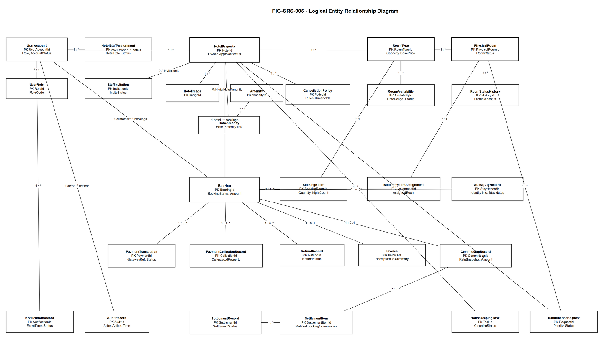

**Figure 3-7: Logical Entity Relationship Diagram**

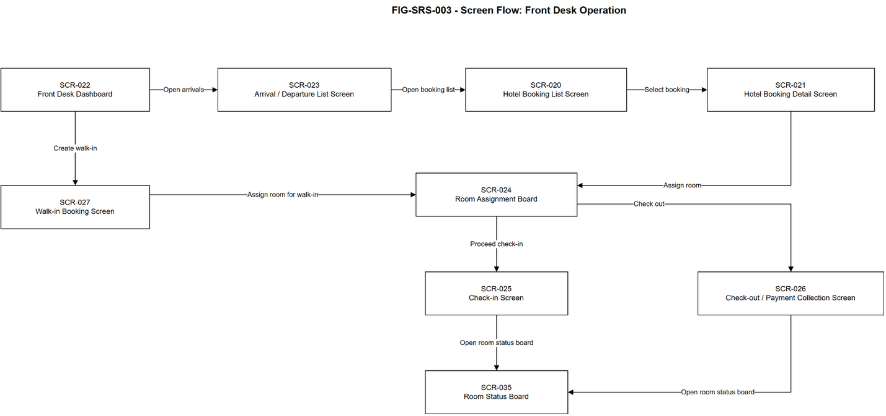

**Figure 3-8: Logical ERD Overview**

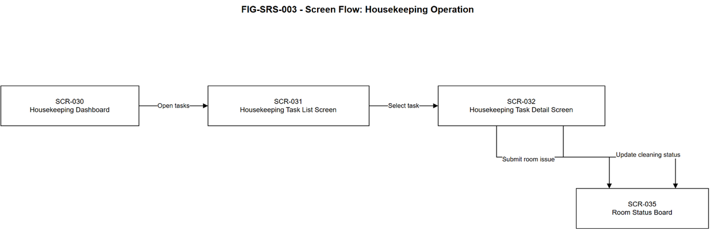

**Figure 3-9: Logical ERD of Account and Staff**

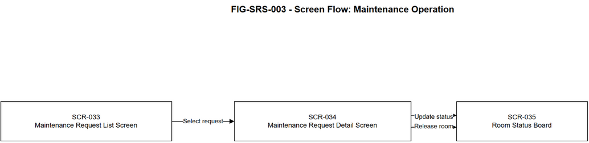

**Figure 3-10: Logical ERD of Hotel Setup and Inventory**

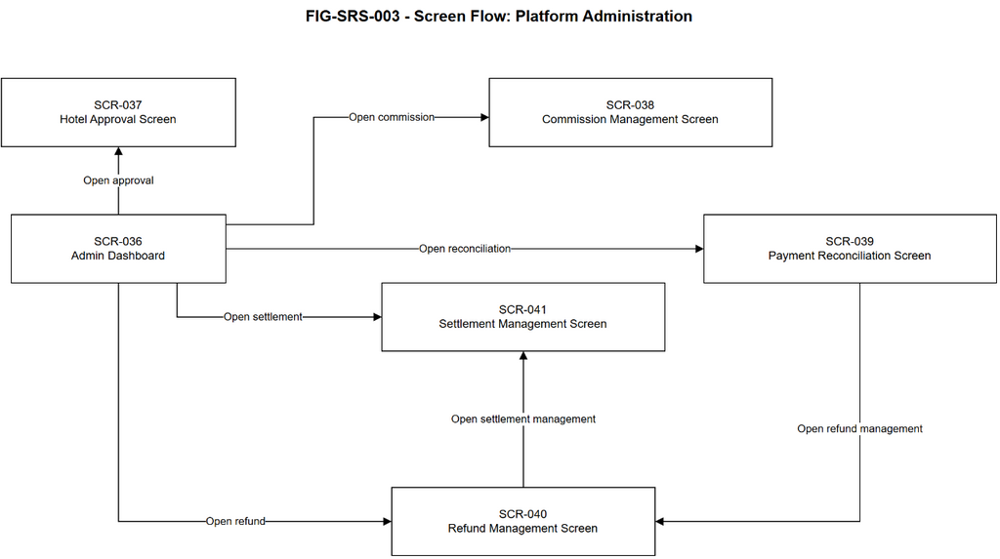

**Figure 3-11: Logical ERD of Booking and Stay**

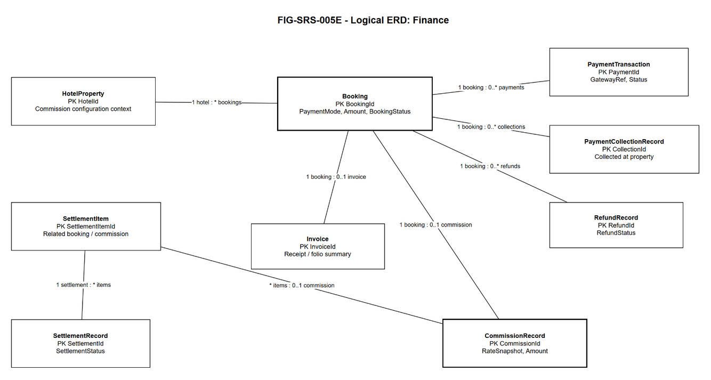

**Figure 3-12: Logical ERD of Finance**

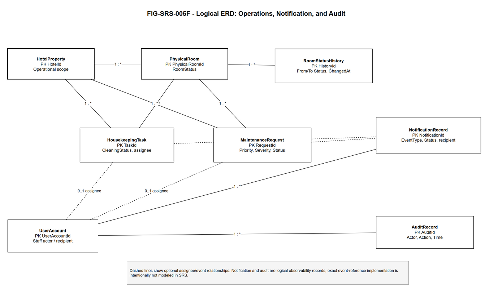

**Figure 3-13: Logical ERD of Operations, Notification, and Audit**

## 3.1.6 Entity Details

| **Entity ID** | **Entity** | **Description** | **Key Attributes** | **Related Features** | **Origin / Evidence** |
| --- | --- | --- | --- | --- | --- |
| ENT-001 | UserAccount | Registered account for Customer, Property Owner, Hotel Manager, Receptionist, Housekeeping Staff, Maintenance Staff, or Platform Administrator. | UserAccountId, FullName, Email, PhoneNumber, PasswordCredential, AccountStatus, CreatedAt, UpdatedAt | FEAT-AUTH, FEAT-STAFF | UC-003, UC-004, UC-025, UC-026 |
| ENT-002 | UserRole | Role definition for platform or hotel-scoped access. | RoleId, RoleCode, RoleName, RoleScope, Description | FEAT-AUTH, FEAT-STAFF | UC-004, UC-027 |
| ENT-003 | HotelStaffAssignment | Mapping between a staff user, hotel, and hotel-scoped role. | StaffAssignmentId, UserAccountId, HotelId, RoleId, AssignmentStatus, AssignedAt, AssignedByUserAccountId | FEAT-STAFF | UC-026, UC-027, UC-028 to UC-037 |
| ENT-004 | StaffInvitation | Optional invitation record for staff onboarding. | StaffInvitationId, HotelId, Email, PhoneNumber, RoleId, InvitationStatus, InvitedByUserAccountId, ExpiresAt | FEAT-STAFF | UC-026 |
| ENT-005 | HotelProperty | Hotel listed and managed on the platform. | HotelId, OwnerUserAccountId, HotelName, Address, CityOrDestination, Description, ContactPhone, ContactEmail, ApprovalStatus, PublicationStatus, CreatedAt | FEAT-MKT, FEAT-HOTEL-SETUP | UC-009, UC-010, UC-018 |
| ENT-006 | HotelImage | Image record for hotel gallery. | HotelImageId, HotelId, ImageUrl, DisplayOrder, ImageStatus | FEAT-MKT, FEAT-HOTEL-SETUP | UC-002, UC-009, UC-010 |
| ENT-007 | Amenity | Amenity master data. | AmenityId, AmenityName, AmenityType, Status | FEAT-MKT, FEAT-HOTEL-SETUP | UC-001, UC-002, UC-010 |
| ENT-008 | HotelAmenity | Association between hotel and amenity. | HotelAmenityId, HotelId, AmenityId | FEAT-MKT, FEAT-HOTEL-SETUP | UC-002, UC-010 |
| ENT-009 | CancellationPolicy | Hotel-level cancellation policy used for booking and refund eligibility. | CancellationPolicyId, HotelId, PolicyName, FreeCancelBeforeHours, RefundPercentage, Description, Status | FEAT-CUST-BOOK, FEAT-CUST-MYBOOK | UC-005, UC-007 |
| ENT-010 | RoomType | Private room type/category within a hotel. | RoomTypeId, HotelId, RoomTypeName, Description, CapacityAdults, CapacityChildren, BasePricePerNight, Facilities, Status | FEAT-MKT, FEAT-ROOM-INV | UC-002, UC-011, UC-005 |
| ENT-011 | PhysicalRoom | Individual private hotel room under a room type. | PhysicalRoomId, HotelId, RoomTypeId, RoomNumber, Floor, RoomStatus, Notes | FEAT-ROOM-INV, FEAT-FRONTDESK | UC-012, UC-015, UC-029, UC-033, UC-037 |
| ENT-012 | RoomAvailability | Availability/block record by room type or physical room and date range. | AvailabilityId, HotelId, RoomTypeId, PhysicalRoomId, StartDate, EndDate, AvailabilityStatus, Reason | FEAT-MKT, FEAT-ROOM-INV | UC-001, UC-005, UC-013 |
| ENT-013 | Booking | Customer reservation for selected hotel and room/date range. | BookingId, BookingCode, CustomerUserAccountId, HotelId, CheckInDate, CheckOutDate, GuestCount, BookingAmount, PaymentMode, BookingStatus, BookingSource, CancellationReason, CreatedAt | FEAT-CUST-BOOK, FEAT-FRONTDESK | UC-005, UC-007, UC-008, UC-014 to UC-017, UC-031 |
| ENT-014 | BookingRoom | Booking line item representing room type and quantity. | BookingRoomId, BookingId, RoomTypeId, Quantity, UnitPricePerNight, NightCount, LineAmount | FEAT-CUST-BOOK, FEAT-FRONTDESK | UC-005, UC-031 |
| ENT-015 | BookingRoomAssignment | Physical room assignment for booking/stay. | AssignmentId, BookingId, BookingRoomId, PhysicalRoomId, AssignedAt, ReleasedAt, AssignmentStatus | FEAT-FRONTDESK | UC-015, UC-016, UC-029 |
| ENT-016 | PaymentTransaction | Online payment transaction for Platform Collect booking. | PaymentTransactionId, BookingId, Provider, GatewayReference, Amount, PaymentStatus, PaidAt, ReconciliationStatus | FEAT-CUST-BOOK, FEAT-ADMIN-FINANCE | UC-006, UC-020, NSF-001 |
| ENT-017 | PaymentCollectionRecord | Hotel-side collection record for Pay at Property booking. | PaymentCollectionId, BookingId, CollectedByUserAccountId, Amount, Method, CollectionDate, CollectionStatus, Note | FEAT-FRONTDESK | UC-030, UC-016 |
| ENT-018 | RefundRecord | Refund eligibility, decision, and manual processing status. | RefundRecordId, BookingId, RequestedAmount, ApprovedAmount, RefundStatus, Reason, AdminNote, ProcessedAt | FEAT-CUST-MYBOOK, FEAT-ADMIN-FINANCE | UC-007, UC-021 |
| ENT-019 | Invoice | Basic invoice/folio for booking and checkout. | InvoiceId, BookingId, InvoiceCode, RoomChargeAmount, PaidAmount, RefundAmount, BalanceAmount, InvoiceStatus, FinalizedAt | FEAT-FRONTDESK, FEAT-ADMIN-FINANCE | UC-016, UC-030 |
| ENT-020 | CommissionRecord | Platform commission calculated for a booking. | CommissionRecordId, BookingId, CommissionRateSnapshot, CommissionAmount, CommissionStatus | FEAT-ADMIN-FINANCE | UC-005, UC-006, UC-019 |
| ENT-021 | SettlementRecord | Manual hotel settlement or commission collection header. | SettlementRecordId, HotelId, SettlementType, ExpectedAmount, SettledAmount, SettlementStatus, SettlementDate, AdminNote | FEAT-ADMIN-FINANCE | UC-022 |
| ENT-022 | SettlementItem | Line item linking settlement to booking/commission/payment records. | SettlementItemId, SettlementRecordId, BookingId, CommissionRecordId, PaymentTransactionId, Amount, ItemStatus | FEAT-ADMIN-FINANCE | UC-022 |
| ENT-023 | NotificationRecord | Notification event sent or recorded. | NotificationId, RecipientUserAccountId, NotificationType, RelatedEntityType, RelatedEntityId, Content, NotificationStatus, CreatedAt | FEAT-AUTO-NOTI | UC-003, UC-005, UC-007, UC-015, UC-016, UC-018, UC-021, UC-022, UC-024, UC-033, UC-034, UC-037 |
| ENT-024 | AuditRecord | Administrative, financial, staff, booking, room, housekeeping, and maintenance action audit record. | AuditRecordId, ActorUserAccountId, ActionType, TargetEntityType, TargetEntityId, ActionTimestamp, Summary | All protected features | NFR-AUD-001, BR-AUDIT-001 |
| ENT-025 | HousekeepingTask | Cleaning or inspection task for a physical room. | HousekeepingTaskId, HotelId, PhysicalRoomId, BookingId, AssignedToUserAccountId, TaskType, TaskStatus, Priority, DueDate, Notes | FEAT-HOUSEKEEPING | UC-032, UC-033, NSF-008 |
| ENT-026 | MaintenanceRequest | Room maintenance issue/request. | MaintenanceRequestId, HotelId, PhysicalRoomId, ReportedByUserAccountId, AssignedToUserAccountId, IssueType, Severity, RequestStatus, Description, ResolutionNote | FEAT-MAINTENANCE | UC-034, UC-035, UC-036, UC-037 |
| ENT-027 | RoomStatusHistory | History of room operational status changes. | RoomStatusHistoryId, PhysicalRoomId, OldStatus, NewStatus, ChangedByUserAccountId, ChangedAt, Reason | FEAT-ROOM-INV, FEAT-HOUSEKEEPING, FEAT-MAINTENANCE | UC-015, UC-016, UC-033, UC-037 |
| ENT-028 | GuestStayRecord | Operational stay record from check-in to check-out. | GuestStayRecordId, BookingId, CheckInAt, CheckOutAt, CheckedInByUserAccountId, CheckedOutByUserAccountId, StayStatus | FEAT-FRONTDESK | UC-015, UC-016, UC-017 |

## 3.1.7 Entity Origin Traceability

| **Entity** | **Originating Use Case / Rule** | **Reason Entity Exists** | **Hallucination Check** |
| --- | --- | --- | --- |
| UserAccount, UserRole | UC-003, UC-004, UC-025, UC-026, UC-027 | Accounts, login, role assignment. | Directly traceable. |
| HotelStaffAssignment | UC-026, UC-027, BR-STAFF-002 | Staff roles are hotel-scoped; global role alone is insufficient. | Added due to accepted staff scope. |
| StaffInvitation | UC-026 | Staff onboarding may require invitation. | Optional but marked as support entity. |
| HotelProperty, HotelImage, Amenity, HotelAmenity, CancellationPolicy | UC-002, UC-009, UC-010, UC-005, UC-007 | Hotel detail, gallery, amenities, and policy are displayed/managed. | Corrects previous dangling HotelImage/Amenity/CancellationPolicy references. |
| RoomType, PhysicalRoom, RoomAvailability | UC-001, UC-002, UC-005, UC-011, UC-012, UC-013 | Search, booking, room inventory, and availability require these entities. | Directly traceable. |
| Booking, BookingRoom | UC-005, UC-007, UC-008, UC-014, UC-031 | Booking header and room line quantity. | Directly traceable. |
| BookingRoomAssignment | UC-015, UC-016, UC-029 | Physical room assignment cannot be represented by BookingRoom alone when quantity > 1. | Corrects prior missing assignment entity. |
| PaymentTransaction | UC-006, UC-020, NSF-001 | Online payment and reconciliation. | Directly traceable. |
| PaymentCollectionRecord | UC-016, UC-030 | Pay at Property collection by hotel staff. | Added due to staff front desk scope. |
| RefundRecord | UC-007, UC-021 | Cancellation and manual refund status. | Directly traceable. |
| Invoice | UC-016 | Checkout/final folio. | Assumption retained; still open for final validation. |
| CommissionRecord | UC-005, UC-006, UC-019 | Commission snapshot and platform revenue. | Directly traceable. |
| SettlementRecord, SettlementItem | UC-022 | Settlement can cover multiple booking/commission records. | Corrects weak list-of-booking-IDs attribute. |
| NotificationRecord | Notification events across UCs and NSF-003 | Record/send notifications. | Explicit assumption. |
| AuditRecord | BR-AUDIT-001, NFR-AUD-001 | Trace protected/financial/staff actions. | Security/audit requirement. |
| HousekeepingTask | UC-032, UC-033, NSF-008 | Housekeeping actor needs actual tasks. | Added due to accepted housekeeping scope. |
| MaintenanceRequest | UC-034, UC-035, UC-036, UC-037 | Maintenance actor needs actual requests. | Added due to accepted maintenance scope. |
| RoomStatusHistory | Room status lifecycle rules | Room status changes must be traceable. | Added due to status lifecycle. |
| GuestStayRecord | UC-015, UC-016, UC-017 | Check-in/check-out operational record. | Directly traceable to stay operation. |

## 3.1.8 State Machine Diagrams

State machine diagrams are split by lifecycle to keep booking, room operation, and finance status rules readable. These diagrams define business-visible states and transitions only; implementation methods, classes, queues, and database-level details are excluded.

| **Figure** | **Diagram ID** | **Lifecycle** | **Primary Coverage** |
| --- | --- | --- | --- |
| Figure 3-14 | FIG-SRS-007 | Booking Lifecycle | Pending Payment, Confirmed, Checked In, Checked Out, Cancelled, Expired, and No-show. |
| Figure 3-15 | FIG-SRS-007 | Physical Room Operational Lifecycle | Available, Assigned, Occupied, Dirty, Cleaning, Inspection Required, Maintenance, Out of Service, Blocked, and Inactive. |
| Figure 3-16 | FIG-SRS-007 | Finance Lifecycle | Payment, reconciliation, refund, settlement, commission, and payment collection states. |

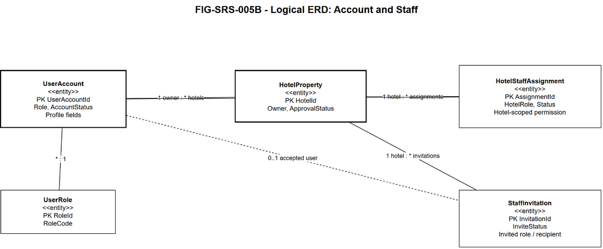

**Figure 3-14: State Machine Diagram of Booking Lifecycle**

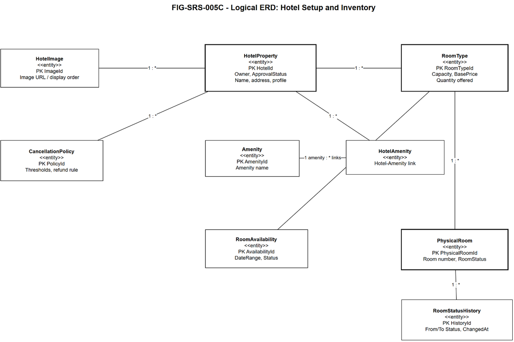

**Figure 3-15: State Machine Diagram of Physical Room Operational Lifecycle**

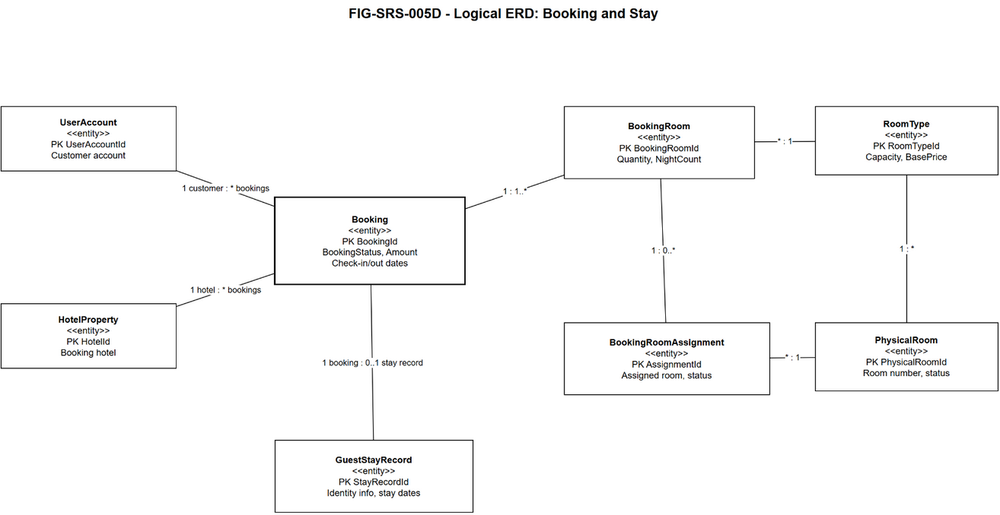

**Figure 3-16: State Machine Diagram of Finance Lifecycle**

## 3.2 Feature Details

### 3.2.1 FEAT-AUTH - Authentication and Account Management

#### Purpose

This feature allows users to register, log in, manage their own basic profile, and access role-specific functions according to role and hotel-scoped staff assignment.

#### Screen Mock-up and Screen Definition

##### SCR-001 - Register Screen

**Purpose:** Allows guests to register as Customer or Property Owner. Hotel staff accounts are created/invited by the Property Owner or sHotel Manager.

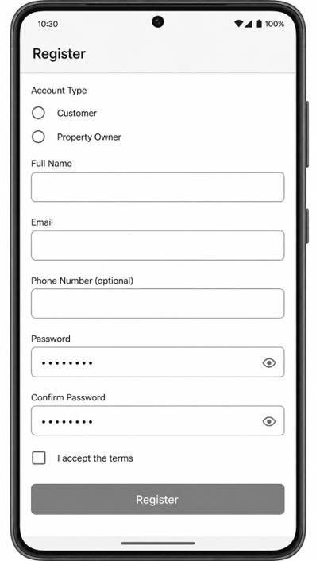F

**Figure 3-17: Mobile Flutter Screen Design of Register Screen**

| **#** | **Field / Component Name** | **Type** | **Mandatory** | **Max Length** | **Description** |
| --- | --- | --- | --- | --- | --- |
| 1 | Account Type | Radio/Dropdown | Yes | N/A | Customer or Property Owner registration type |
| 2 | Full Name | Text | Yes | 100 | Registrant full name |
| 3 | Email | Text | Yes | 150 | Unique email address |
| 4 | Phone Number | Text | No | 20 | Unique phone number if provided |
| 5 | Password | Password | Yes | 64 | Password following policy |
| 6 | Confirm Password | Password | Yes | 64 | Must match password |
| 7 | Terms Confirmation | Checkbox | Yes | N/A | Accept terms if enabled |
| 8 | Register Button | Button | Yes | N/A | Submit registration |

**Table 3-1: Screen Definition of Register Screen**

##### SCR-002 - Login Screen

**Purpose:** Allows Customer, Property Owner, Hotel Manager, Receptionist, Housekeeping Staff, Maintenance Staff, and Platform Administrator to log in.

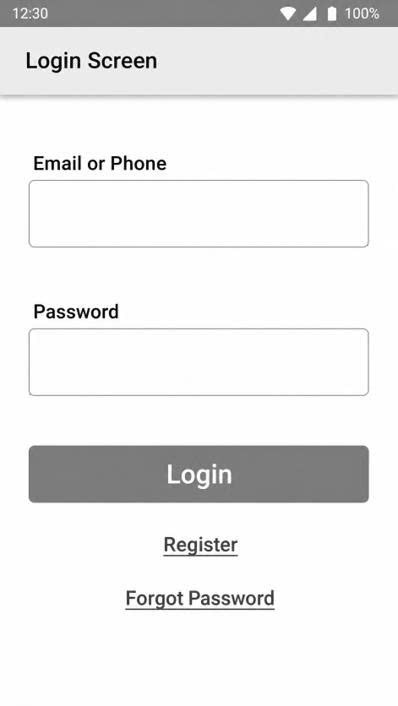

**Figure 3-18: Mobile Flutter Screen Design of Login Screen**

| **#** | **Field / Component Name** | **Type** | **Mandatory** | **Max Length** | **Description** |
| --- | --- | --- | --- | --- | --- |
| 1 | Email or Phone | Text | Yes | 150 | Login identifier |
| 2 | Password | Password | Yes | 64 | User password masked on screen |
| 3 | Login Button | Button | Yes | N/A | Submit login request |
| 4 | Register Link | Navigation | No | N/A | Navigate to registration |
| 5 | Forgot Password Link | Navigation | No | N/A | Future reset flow placeholder |

**Table 3-2: Screen Definition of Login Screen**

##### SCR-003 - User Profile Screen

**Purpose:** Allows authenticated users to view and update their own basic profile.

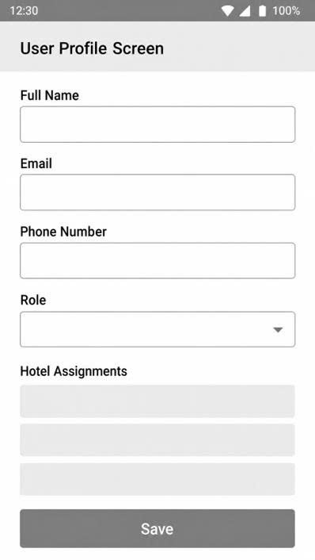

**Figure 3-19: Mobile Flutter Screen Design of User Profile Screen**

| **#** | **Field / Component Name** | **Type** | **Mandatory** | **Max Length** | **Description** |
| --- | --- | --- | --- | --- | --- |
| 1 | Full Name | Text | Yes | 100 | Editable own profile name |
| 2 | Email | Text/Read-only | Yes | 150 | Email; editable only if uniqueness validation is supported |
| 3 | Phone Number | Text | No | 20 | Editable phone number |
| 4 | Role | Label | Yes | N/A | Read-only role summary |
| 5 | Hotel Assignments | Label/List | No | N/A | Read-only assigned hotel scope |
| 6 | Save Button | Button | Yes | N/A | Save own profile changes |

**Table 3-3: Screen Definition of User Profile Screen**

#### Use Case Description

##### Use Case Description - UC-003 Register Account

| **Use Case ID** | | **UC-003** | **Use Case Name** | | **Register Account** | |
| --- | --- | --- | --- | --- | --- | --- |
| **Author** | | BA Documentation Assistant | **Version** | 1.2 | **Date** | 2026-06-29 |
| **Actor** | | Guest | | | | |
| **Secondary Actor(s)** | | Notification Service | | **Feature / Group Function** | Account | |
| **Description** | | Register a Customer or Property Owner account. | | | | |
| **Precondition** | | Guest is not authenticated. | | | | |
| **Trigger** | | Guest selects Register. | | | | |
| **Post-Condition** | | POS-01: A Customer or Property Owner account is created after valid registration, or registration is rejected with a clear reason. | | | | |
| **Main flows** | | | | | | |
| **Step** | **Actor** | **Action** | | | | |
| 1 | Guest | opens Register Screen. | | | | |
| 2 | System | displays account type, full name, email, phone, password, confirmation, and terms fields. | | | | |
| 3 | Guest | enters required information. | | | | |
| 4 | System | validates mandatory fields, format, password confirmation, and uniqueness. | | | | |
| 5 | System | creates account with selected role. | | | | |
| 6 | System | sends or records registration notification. | | | | |
| 7 | System | displays registration success message. | | | | |
| **Alternative flows** | | | | | | |
| **Alternative ID** | | AT-UC003-04A | | **Branch from Main Step** | 4 | |
| **Condition** | | Duplicate email/phone | | | | |
| **Sub step** | **Actor** | **Action** | | | | |
| 4.1 | System | Displays MSG-AUTH-003. | | | | |
| 4.2 | System | Keeps submitted data unchanged and returns the actor to main flow step 3 for correction. | | | | |
| **Alternative ID** | | AT-UC003-04B | | **Branch from Main Step** | 4 | |
| **Condition** | | Invalid data | | | | |
| **Sub step** | **Actor** | **Action** | | | | |
| 4.1 | System | Displays relevant validation message and allows correction. | | | | |
| 4.2 | System | Keeps submitted data unchanged and returns the actor to main flow step 3 for correction. | | | | |
| **Business Rules** | | | | | | |
| **#** | **Rule Description** | | | | | |
| BR-AUTH-001 | A Guest must register or log in before creating a booking. | | | | | |
| BR-AUTH-002 | A user account may have one or more roles; hotel staff roles shall be scoped to assigned hotel(s); platform roles shall not grant hotel tenant permissions unless explicitly assigned. | | | | | |
| BR-AUTH-003 | Inactive or blocked accounts shall not be authenticated. | | | | | |

**Related Application Messages:** MSG-AUTH-003, MSG-AUTH-004, MSG-AUTH-005

##### Use Case Description - UC-004 Login

| **Use Case ID** | | **UC-004** | **Use Case Name** | | **Login** | |
| --- | --- | --- | --- | --- | --- | --- |
| **Author** | | BA Documentation Assistant | **Version** | 1.2 | **Date** | 2026-06-29 |
| **Actor** | | Customer, Property Owner, Hotel Manager, Receptionist, Housekeeping Staff, Maintenance Staff, Platform Administrator | | | | |
| **Secondary Actor(s)** | | None | | **Feature / Group Function** | Account | |
| **Description** | | Authenticate user and access role-specific functions. | | | | |
| **Precondition** | | Actor has an account that can be validated. | | | | |
| **Trigger** | | Actor submits login credentials. | | | | |
| **Post-Condition** | | POS-01: The actor is authenticated and routed to the role-specific landing area. | | | | |
| **Main flows** | | | | | | |
| **Step** | **Actor** | **Action** | | | | |
| 1 | **Actor** | opens Login Screen. | | | | |
| 2 | System | displays email/phone and password fields. | | | | |
| 3 | **Actor** | enters credentials and submits login. | | | | |
| 4 | System | validates credentials and account status. | | | | |
| 5 | System | authenticates actor. | | | | |
| 6 | System | displays appropriate landing screen according to role and hotel assignment. | | | | |
| **Alternative flows** | | | | | | |
| **Alternative ID** | | AT-UC004-04A | | **Branch from Main Step** | 4 | |
| **Condition** | | Invalid credentials | | | | |
| **Sub step** | **Actor** | **Action** | | | | |
| 4.1 | System | Displays MSG-AUTH-001. | | | | |
| 4.2 | System | Keeps the actor unauthenticated and returns the actor to main flow step 3 for credential correction. | | | | |
| **Alternative ID** | | AT-UC004-04B | | **Branch from Main Step** | 4 | |
| **Condition** | | Inactive/blocked account | | | | |
| **Sub step** | **Actor** | **Action** | | | | |
| 4.1 | System | Displays MSG-AUTH-006. | | | | |
| 4.2 | System | Keeps the actor unauthenticated and terminates login; actor must contact an authorized administrator. | | | | |
| **Alternative ID** | | AT-UC004-06A | | **Branch from Main Step** | 6 | |
| **Condition** | | Staff has no active hotel assignment | | | | |
| **Sub step** | **Actor** | **Action** | | | | |
| 6.1 | System | Displays MSG-AUTH-008. | | | | |
| 6.2 | System | Keeps hotel-scoped workspace access closed and directs the staff actor to contact an authorized hotel manager or owner. | | | | |
| **Business Rules** | | | | | | |
| **#** | **Rule Description** | | | | | |
| BR-AUTH-002 | A user account may have one or more roles; hotel staff roles shall be scoped to assigned hotel(s); platform roles shall not grant hotel tenant permissions unless explicitly assigned. | | | | | |
| BR-AUTH-003 | Inactive or blocked accounts shall not be authenticated. | | | | | |
| BR-STAFF-002 | Hotel staff may access only hotel(s) to which they are assigned. | | | | | |

**Related Application Messages:** MSG-AUTH-001, MSG-AUTH-006, MSG-AUTH-008

##### Use Case Description - UC-025 Manage Own Profile

| **Use Case ID** | | **UC-025** | **Use Case Name** | | **Manage Own Profile** | |
| --- | --- | --- | --- | --- | --- | --- |
| **Author** | | BA Documentation Assistant | **Version** | 1.2 | **Date** | 2026-06-29 |
| **Actor** | | Customer, Property Owner, Hotel Manager, Receptionist, Housekeeping Staff, Maintenance Staff, Platform Administrator | | | | |
| **Secondary Actor(s)** | | None | | **Feature / Group Function** | Account | |
| **Description** | | View and update own basic profile where allowed. | | | | |
| **Precondition** | | Actor authenticated. | | | | |
| **Trigger** | | Actor opens User Profile. | | | | |
| **Post-Condition** | | POS-01: Actor own profile is updated after validation, or rejected with a clear reason. | | | | |
| **Main flows** | | | | | | |
| **Step** | **Actor** | **Action** | | | | |
| 1 | **Actor** | opens User Profile Screen. | | | | |
| 2 | System | validates own-profile access and displays own profile fields with read-only role/assignment information. | | | | |
| 3 | **Actor** | updates editable profile information. | | | | |
| 4 | System | validates formats and uniqueness if changed. | | | | |
| 5 | System | records updated profile information. | | | | |
| 6 | System | displays update success. | | | | |
| **Alternative flows** | | | | | | |
| **Alternative ID** | | AT-UC025-04A | | **Branch from Main Step** | 4 | |
| **Condition** | | Duplicate email/phone | | | | |
| **Sub step** | **Actor** | **Action** | | | | |
| 4.1 | System | Displays MSG-AUTH-003. | | | | |
| 4.2 | System | Keeps submitted data unchanged and returns the actor to main flow step 3 for correction. | | | | |
| **Alternative ID** | | AT-UC025-01A | | **Branch from Main Step** | 1 | |
| **Condition** | | Unauthorized profile access | | | | |
| **Sub step** | **Actor** | **Action** | | | | |
| 1.1 | System | Displays MSG-AUTH-007. | | | | |
| 1.2 | System | Keeps data unchanged and terminates the use case for this actor. | | | | |
| **Business Rules** | | | | | | |
| **#** | **Rule Description** | | | | | |
| BR-AUTH-004 | A user may view and update only his or her own basic profile unless an authorized administrator function exists. | | | | | |
| BR-STAFF-002 | Hotel staff may access only hotel(s) to which they are assigned. | | | | | |

**Related Application Messages:** MSG-AUTH-003, MSG-AUTH-007, MSG-AUTH-009

### 3.2.2 FEAT-MKT - Hotel Marketplace

#### Purpose

This feature enables public discovery of approved hotels and available private room types before booking.

#### Screen Mock-up and Screen Definition

##### SCR-004 - Home / Search Screen

**Purpose:** Allows Guest/Customer to enter destination, check-in date, check-out date, guest count, and filters.

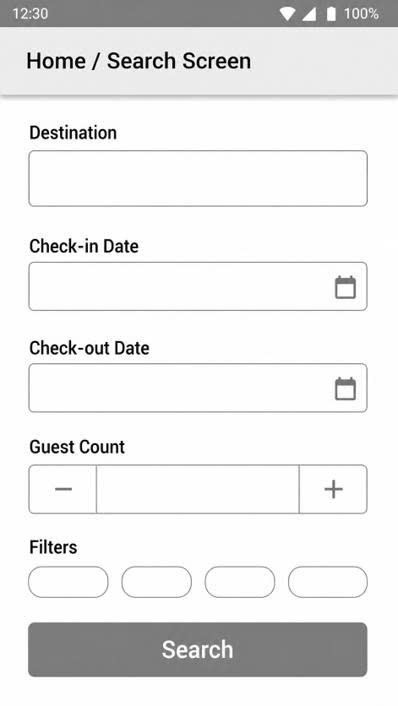

**Figure 3-20: Mobile Flutter Screen Design of Home / Search Screen**

| **#** | **Field / Component Name** | **Type** | **Mandatory** | **Max Length** | **Description** |
| --- | --- | --- | --- | --- | --- |
| 1 | Destination | Text/Search | Yes | 100 | City, destination, or hotel keyword |
| 2 | Check-in Date | Date | Yes | N/A | Arrival date |
| 3 | Check-out Date | Date | Yes | N/A | Departure date later than check-in |
| 4 | Guest Count | Number | Yes | N/A | Number of guests |
| 5 | Filters | Component | No | N/A | Price range, amenity, availability filters |
| 6 | Search Button | Button | Yes | N/A | Submit search |

**Table 3-4: Screen Definition of Home / Search Screen**

##### SCR-005 - Hotel Search Result Screen

**Purpose:** Displays hotels matching search criteria and valid availability.

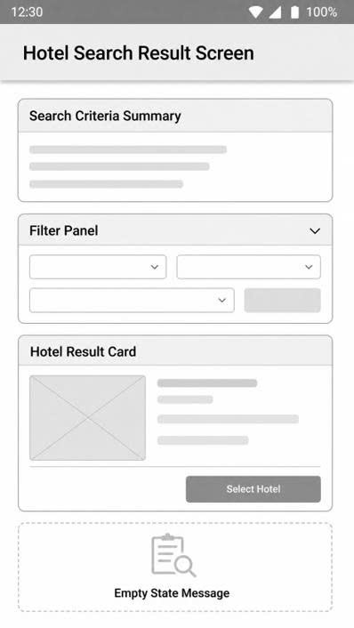

**Figure 3-21: Mobile Flutter Screen Design of Hotel Search Result Screen**

| **#** | **Field / Component Name** | **Type** | **Mandatory** | **Max Length** | **Description** |
| --- | --- | --- | --- | --- | --- |
| 1 | Search Criteria Summary | Component | Yes | N/A | Current destination/date/guest criteria |
| 2 | Filter Panel | Component | No | N/A | Price, amenities, availability filters |
| 3 | Hotel Result Card | Repeating Card | Yes | N/A | Hotel image, name, location, room price summary, availability |
| 4 | Empty State Message | Message Area | No | N/A | Shown when no results found |
| 5 | Select Hotel Action | Navigation | Yes | N/A | Open selected hotel detail |

**Table 3-5: Screen Definition of Hotel Search Result Screen**

##### SCR-006 - Hotel Detail Screen

**Purpose:** Displays hotel details, images, amenities, room types, prices, availability, and policies.

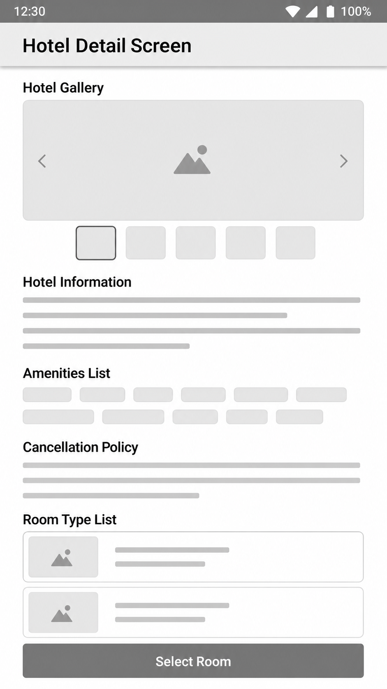

**Figure 3-22: Mobile Flutter Screen Design of Hotel Detail Screen**

| **#** | **Field / Component Name** | **Type** | **Mandatory** | **Max Length** | **Description** |
| --- | --- | --- | --- | --- | --- |
| 1 | Hotel Gallery | Component | Yes | N/A | Hotel images |
| 2 | Hotel Information | Component | Yes | N/A | Name, address, description, contact summary |
| 3 | Amenities List | Component | No | N/A | Available hotel amenities |
| 4 | Cancellation Policy | Component | Yes | N/A | Hotel-configurable cancellation policy summary |
| 5 | Room Type List | Repeating Section | Yes | N/A | Room type, capacity, base price, availability |
| 6 | Select Room Button | Button | Conditional | N/A | Available for authenticated booking flow or guides Guest to login |

**Table 3-6: Screen Definition of Hotel Detail Screen**

#### Use Case Description

##### Use Case Description - UC-001 Search Hotels

| **Use Case ID** | | **UC-001** | **Use Case Name** | | **Search Hotels** | |
| --- | --- | --- | --- | --- | --- | --- |
| **Author** | | BA Documentation Assistant | **Version** | 1.2 | **Date** | 2026-06-29 |
| **Actor** | | Guest, Customer | | | | |
| **Secondary Actor(s)** | | None | | **Feature / Group Function** | Marketplace | |
| **Description** | | Search approved hotels by destination, dates, guest count, and filters. | | | | |
| **Precondition** | | Marketplace is available; public search is enabled. | | | | |
| **Trigger** | | Guest/Customer opens Home/Search Screen. | | | | |
| **Post-Condition** | | POS-01: Matching hotel results or an empty-state message are displayed. | | | | |
| **Main flows** | | | | | | |
| **Step** | **Actor** | **Action** | | | | |
| 1 | **Actor** | opens Home/Search Screen. | | | | |
| 2 | System | displays destination, dates, guest count, and filters. | | | | |
| 3 | **Actor** | enters search criteria and submits search. | | | | |
| 4 | System | validates criteria. | | | | |
| 5 | System | determines approved active hotels with available private room types. | | | | |
| 6 | System | displays matching hotels with image, name, location, price summary, availability, and amenities. | | | | |
| 7 | **Actor** | selects hotel or modifies criteria. | | | | |
| **Alternative flows** | | | | | | |
| **Alternative ID** | | AT-UC001-04A | | **Branch from Main Step** | 4 | |
| **Condition** | | Invalid date range | | | | |
| **Sub step** | **Actor** | **Action** | | | | |
| 4.1 | System | Displays MSG-BOOK-001 and allows correction. | | | | |
| 4.2 | System | Keeps submitted data unchanged and returns the actor to main flow step 3 for correction. | | | | |
| **Alternative ID** | | AT-UC001-05A | | **Branch from Main Step** | 5 | |
| **Condition** | | No matching hotels | | | | |
| **Sub step** | **Actor** | **Action** | | | | |
| 5.1 | System | Displays MSG-MKT-001 and allows criteria update. | | | | |
| 5.2 | System | Returns the actor to main flow step 3 to update search criteria; no booking data is created. | | | | |
| **Business Rules** | | | | | | |
| **#** | **Rule Description** | | | | | |
| BR-MKT-001 | Only approved, active, and publicly available hotels shall appear in marketplace search results and hotel detail pages. | | | | | |
| BR-BOOK-001 | Check-out date must be later than check-in date. | | | | | |
| BR-ROOM-002 | Blocked, inactive, occupied, dirty, cleaning, inspection-required, maintenance, or out-of-service rooms shall not be counted as available for new assignment unless a permitted status transition makes them available. | | | | | |

**Related Application Messages:** MSG-MKT-001, MSG-BOOK-001

##### Use Case Description - UC-002 View Hotel Detail

| **Use Case ID** | | **UC-002** | **Use Case Name** | | **View Hotel Detail** | |
| --- | --- | --- | --- | --- | --- | --- |
| **Author** | | BA Documentation Assistant | **Version** | 1.2 | **Date** | 2026-06-29 |
| **Actor** | | Guest, Customer | | | | |
| **Secondary Actor(s)** | | None | | **Feature / Group Function** | Marketplace | |
| **Description** | | View hotel details, room types, amenities, price, policy, and availability. | | | | |
| **Precondition** | | Hotel is approved and active. | | | | |
| **Trigger** | | Actor selects hotel from result/listing. | | | | |
| **Post-Condition** | | POS-01: Hotel detail and available room type information are displayed; booking may proceed only for authenticated Customer. | | | | |
| **Main flows** | | | | | | |
| **Step** | **Actor** | **Action** | | | | |
| 1 | **Actor** | selects approved hotel. | | | | |
| 2 | System | displays hotel name, address, description, images, amenities, cancellation policy, and contact information. | | | | |
| 3 | System | displays room types, capacity, base price, and availability for selected dates if provided. | | | | |
| 4 | **Actor** | reviews hotel/room information. | | | | |
| 5 | Customer | selects available room type to proceed to booking. | | | | |
| **Alternative flows** | | | | | | |
| **Alternative ID** | | AT-UC002-02A | | **Branch from Main Step** | 2 | |
| **Condition** | | Hotel no longer available | | | | |
| **Sub step** | **Actor** | **Action** | | | | |
| 2.1 | System | Displays MSG-MKT-002 and returns to search. | | | | |
| 2.2 | System | Returns the actor to UC-001 Search Hotels; no booking data is created. | | | | |
| **Alternative ID** | | AT-UC002-05A | | **Branch from Main Step** | 5 | |
| **Condition** | | Guest selects booking | | | | |
| **Sub step** | **Actor** | **Action** | | | | |
| 5.1 | System | Displays login/register guidance before booking. | | | | |
| 5.2 | System | Requires the Guest to complete UC-003 or UC-004 before resuming booking from this selection. | | | | |
| **Business Rules** | | | | | | |
| **#** | **Rule Description** | | | | | |
| BR-MKT-001 | Only approved, active, and publicly available hotels shall appear in marketplace search results and hotel detail pages. | | | | | |
| BR-AUTH-001 | A Guest must register or log in before creating a booking. | | | | | |
| BR-ROOM-002 | Blocked, inactive, occupied, dirty, cleaning, inspection-required, maintenance, or out-of-service rooms shall not be counted as available for new assignment unless a permitted status transition makes them available. | | | | | |

**Related Application Messages:** MSG-MKT-002, MSG-AUTH-002

### 3.2.3 FEAT-CUST-BOOK - Customer Booking Creation and Online Payment

#### Purpose

This feature supports instant booking creation, Platform Collect online payment, Pay at Property confirmation, and payment result display.

#### Screen Mock-up and Screen Definition

##### SCR-007 - Booking Form Screen

**Purpose:** Allows customers to enter booking information and choose payment mode.

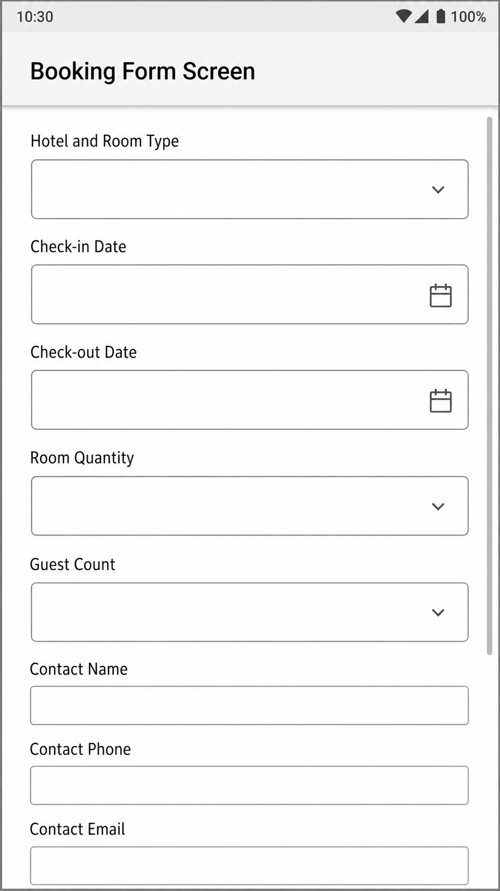

**Figure 3-23: Mobile Flutter Screen Design of Booking Form Screen**

| **#** | **Field / Component Name** | **Type** | **Mandatory** | **Max Length** | **Description** |
| --- | --- | --- | --- | --- | --- |
| 1 | Hotel and Room Type | Read-only Section | Yes | N/A | Selected hotel and one selected room type |
| 2 | Check-in Date | Date | Yes | N/A | Arrival date |
| 3 | Check-out Date | Date | Yes | N/A | Departure date |
| 4 | Room Quantity | Number | Yes | N/A | Quantity for selected room type |
| 5 | Guest Count | Number | Yes | N/A | Number of guests |
| 6 | Contact Name | Text | Yes | 100 | Booking contact name |
| 7 | Contact Phone | Text | Yes | 20 | Booking contact phone |
| 8 | Contact Email | Text | No | 150 | Booking contact email |
| 9 | Payment Mode | Radio | Yes | N/A | Platform Collect or Pay at Property |
| 10 | Price Summary | Read-only | Yes | N/A | Room-price-only amount |
| 11 | Confirm Booking Button | Button | Yes | N/A | Submit booking |

**Table 3-7: Screen Definition of Booking Form Screen**

##### SCR-008 - Booking Confirmation Screen

**Purpose:** Displays booking confirmation, pending payment, or Pay at Property confirmation.

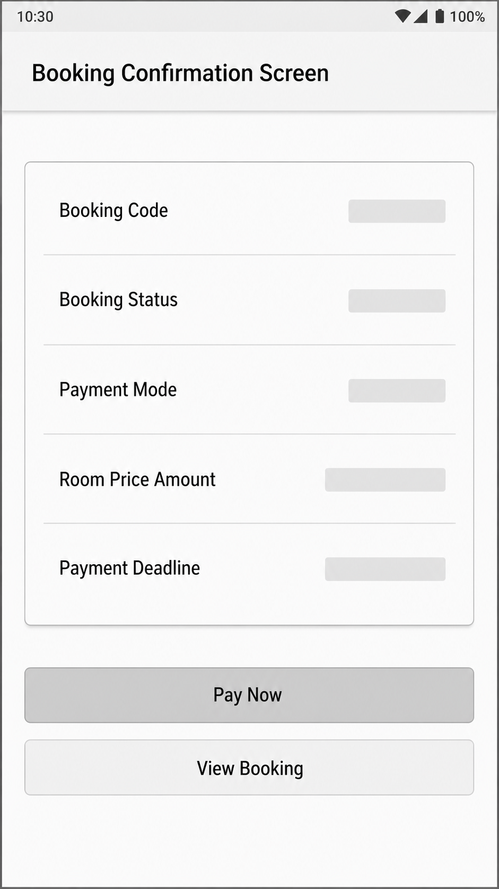

**Figure 3-24: Mobile Flutter Screen Design of Booking Confirmation Screen**

| **#** | **Field / Component Name** | **Type** | **Mandatory** | **Max Length** | **Description** |
| --- | --- | --- | --- | --- | --- |
| 1 | Booking Code | Label | Yes | N/A | Generated booking code |
| 2 | Booking Status | Label | Yes | N/A | Pending Payment or Confirmed |
| 3 | Payment Mode | Label | Yes | N/A | Selected payment mode |
| 4 | Room Price Amount | Label | Yes | N/A | Room price only |
| 5 | Payment Deadline | Label | Conditional | N/A | 15 minutes for pending online payment |
| 6 | Pay Now Button | Button | Conditional | N/A | Displayed for Pending Payment booking |
| 7 | View Booking Button | Button | Yes | N/A | Open booking detail |

**Table 3-8: Screen Definition of Booking Confirmation Screen**

##### SCR-011 - Payment Instruction Screen

**Purpose:** Displays online payment instruction or gateway redirection information.

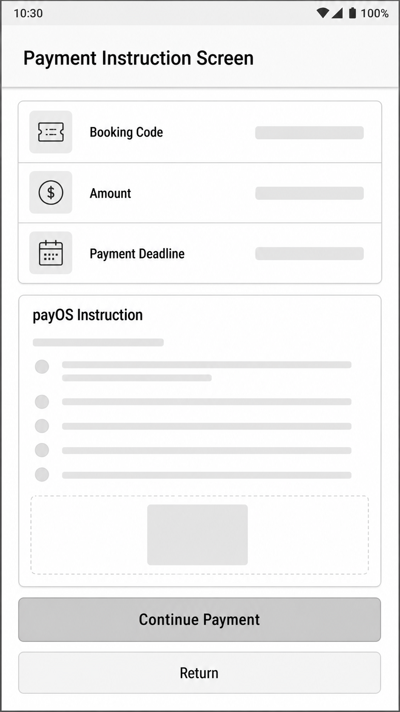

**Figure 3-25: Mobile Flutter Screen Design of Payment Instruction Screen**

| **#** | **Field / Component Name** | **Type** | **Mandatory** | **Max Length** | **Description** |
| --- | --- | --- | --- | --- | --- |
| 1 | Booking Code | Label | Yes | N/A | Pending payment booking |
| 2 | Amount | Label | Yes | N/A | Room-price-only amount |
| 3 | Payment Deadline | Label | Yes | N/A | 15-minute default deadline |
| 4 | payOS Instruction | Component | Yes | N/A | Gateway payment instruction or redirect |
| 5 | Continue Payment Button | Button | Yes | N/A | Proceed to payOS |
| 6 | Return Button | Button | No | N/A | Return to booking detail |

**Table 3-9: Screen Definition of Payment Instruction Screen**

##### SCR-012 - Payment Result Screen

**Purpose:** Displays payment result after payOS return/cancel or final payment notification.

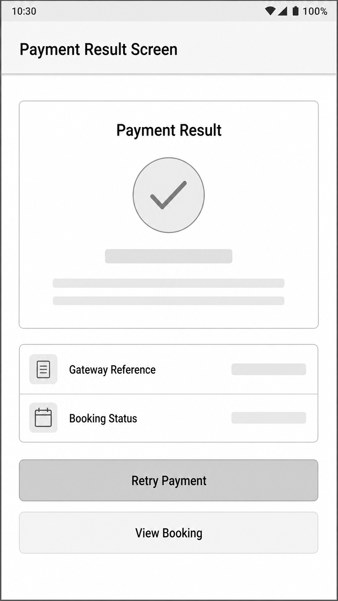

**Figure 3-26: Mobile Flutter Screen Design of Payment Result Screen**

| **#** | **Field / Component Name** | **Type** | **Mandatory** | **Max Length** | **Description** |
| --- | --- | --- | --- | --- | --- |
| 1 | Payment Result | Status Panel | Yes | N/A | Success, failed, cancelled, or processing |
| 2 | Gateway Reference | Label | Conditional | N/A | payOS reference if available |
| 3 | Booking Status | Label | Yes | N/A | Updated booking status |
| 4 | Retry Payment Button | Button | Conditional | N/A | Available while booking is still pending and not expired |
| 5 | View Booking Button | Button | Yes | N/A | Open booking detail |

**Table 3-10: Screen Definition of Payment Result Screen**

#### Use Case Description

##### Use Case Description - UC-005 Create Booking

| **Use Case ID** | | **UC-005** | **Use Case Name** | | **Create Booking** | |
| --- | --- | --- | --- | --- | --- | --- |
| **Author** | | BA Documentation Assistant | **Version** | 1.2 | **Date** | 2026-06-29 |
| **Actor** | | Customer | | | | |
| **Secondary Actor(s)** | | Notification Service | | **Feature / Group Function** | Customer Booking | |
| **Description** | | Create an instant booking after availability validation. | | | | |
| **Precondition** | | Customer is authenticated; hotel approved/active; selected room type active. | | | | |
| **Trigger** | | Customer submits booking information. | | | | |
| **Post-Condition** | | POS-01: A booking is created for one room type with quantity; availability is reserved according to payment mode; booking amount uses room price only. | | | | |
| **Main flows** | | | | | | |
| **Step** | **Actor** | **Action** | | | | |
| 1 | Customer | selects approved hotel and available private room type. | | | | |
| 2 | System | displays Booking Form with dates, guest count, room quantity, guest contact, price summary, policy, and payment modes. | | | | |
| 3 | Customer | enters booking information and selects payment mode. | | | | |
| 4 | System | validates booking information, dates, guest count, quantity, and payment mode. | | | | |
| 5 | System | atomically validates availability and reserves requested room type quantity for the date range. | | | | |
| 6 | System | branches by selected payment mode and creates the booking with the correct initial status. | | | | |
| 7 | System | captures commission rate snapshot; commission posting occurs only when booking becomes Confirmed. | | | | |
| 8 | System | sends/records booking notification for Customer and hotel operation roles. | | | | |
| 9 | Customer | views booking confirmation or payment instruction. | | | | |
| **Alternative flows** | | | | | | |
| **Alternative ID** | | AT-UC005-04A | | **Branch from Main Step** | 4 | |
| **Condition** | | Invalid booking info | | | | |
| **Sub step** | **Actor** | **Action** | | | | |
| 4.1 | System | Displays validation message. | | | | |
| 4.2 | System | Keeps submitted data unchanged and returns the actor to main flow step 3 for correction. | | | | |
| **Alternative ID** | | AT-UC005-05A | | **Branch from Main Step** | 5 | |
| **Condition** | | Room unavailable | | | | |
| **Sub step** | **Actor** | **Action** | | | | |
| 5.1 | System | Displays MSG-BOOK-002 and does not create booking. | | | | |
| 5.2 | System | Keeps booking data uncommitted and returns the Customer to main flow step 3 to choose another date, quantity, or room type. | | | | |
| **Alternative ID** | | AT-UC005-06A | | **Branch from Main Step** | 6 | |
| **Condition** | | Platform Collect | | | | |
| **Sub step** | **Actor** | **Action** | | | | |
| 6.1 | System | Creates a Pending Payment booking tied to the reserved availability and displays payment instruction. | | | | |
| 6.2 | System | Continues to UC-006 Pay Online after payment instruction is shown. | | | | |
| **Alternative ID** | | AT-UC005-06B | | **Branch from Main Step** | 6 | |
| **Condition** | | Pay at Property | | | | |
| **Sub step** | **Actor** | **Action** | | | | |
| 6.1 | System | Creates a Confirmed booking and records commission receivable. | | | | |
| 6.2 | System | Skips UC-006 and resumes at main flow step 7. | | | | |
| **Business Rules** | | | | | | |
| **#** | **Rule Description** | | | | | |
| BR-AUTH-001 | A Guest must register or log in before creating a booking. | | | | | |
| BR-BOOK-001 | Check-out date must be later than check-in date. | | | | | |
| BR-BOOK-005 | A Pay at Property booking shall be Confirmed immediately after successful availability validation. | | | | | |
| BR-BOOK-013 | Availability check and reservation shall be atomic for the selected hotel, room type, date range, and quantity to prevent overbooking across customer and walk-in channels. | | | | | |
| BR-FIN-001 | Commission amount shall be calculated from the booking amount and commission rate snapshot captured at booking confirmation. | | | | | |
| BR-FIN-003 | Pay at Property booking shall create commission receivable owed by hotel to platform. | | | | | |
| BR-BOOK-011 | One booking shall contain exactly one room type and a quantity of private rooms in MVP+Staff v1.2. | | | | | |
| BR-BOOK-012 | Booking amount in MVP+Staff v1.2 shall be calculated from room price only: unit price per night x room quantity x night count. | | | | | |

**Related Application Messages:** MSG-BOOK-001, MSG-BOOK-002, MSG-BOOK-003, MSG-PAY-004

##### Use Case Description - UC-006 Pay Online

| **Use Case ID** | | **UC-006** | **Use Case Name** | | **Pay Online** | |
| --- | --- | --- | --- | --- | --- | --- |
| **Author** | | BA Documentation Assistant | **Version** | 1.2 | **Date** | 2026-06-29 |
| **Actor** | | Customer | | | | |
| **Secondary Actor(s)** | | payOS Payment Gateway, Notification Service | | **Feature / Group Function** | Payment | |
| **Description** | | Pay booking amount through payOS for Platform Collect bookings. | | | | |
| **Precondition** | | Customer is authenticated; a Pending Payment booking exists and belongs to the Customer. | | | | |
| **Trigger** | | Customer proceeds to online payment. | | | | |
| **Post-Condition** | | POS-01: Payment status and booking status are updated according to payOS result or 15-minute timeout. | | | | |
| **Main flows** | | | | | | |
| **Step** | **Actor** | **Action** | | | | |
| 1 | Customer | selects payment for Pending Payment booking. | | | | |
| 2 | System | validates customer ownership, Pending Payment status, and payment deadline before displaying payment details. | | | | |
| 3 | System | displays payment summary and deadline. | | | | |
| 4 | Customer | confirms online payment. | | | | |
| 5 | System | presents payOS payment instruction/redirection. | | | | |
| 6 | Customer | completes payment through payOS. | | | | |
| 7 | payOS Payment Gateway | returns or sends payment result. | | | | |
| 8 | System | idempotently records payment result if booking is still Pending Payment and no processed successful result exists. | | | | |
| 9 | System | If payment succeeds, updates payment to Paid and booking to Confirmed. | | | | |
| 10 | System | calculates commission and hotel payable for the confirmed booking. | | | | |
| 11 | System | displays payment result and sends/records notification. | | | | |
| **Alternative flows** | | | | | | |
| **Alternative ID** | | AT-UC006-08A | | **Branch from Main Step** | 8 | |
| **Condition** | | Payment failed/cancelled | | | | |
| **Sub step** | **Actor** | **Action** | | | | |
| 8.1 | System | Records status, keeps booking Pending Payment until timeout, displays MSG-PAY-002. | | | | |
| 8.2 | System | Returns the Customer to main flow step 4 to retry or stop payment before timeout. | | | | |
| **Alternative ID** | | AT-UC006-08B | | **Branch from Main Step** | 8 | |
| **Condition** | | Delayed result | | | | |
| **Sub step** | **Actor** | **Action** | | | | |
| 8.1 | System | Displays MSG-PAY-003. | | | | |
| 8.2 | System | Keeps the booking Pending Payment and resumes at main flow step 8 when the provider result is received before timeout. | | | | |
| **Alternative ID** | | AT-UC006-02A | | **Branch from Main Step** | 2 | |
| **Condition** | | Booking expired | | | | |
| **Sub step** | **Actor** | **Action** | | | | |
| 2.1 | System | Marks Expired and releases availability. | | | | |
| 2.2 | System | Terminates the payment attempt and prevents payment resubmission for the expired booking. | | | | |
| **Alternative ID** | | AT-UC006-08C | | **Branch from Main Step** | 8 | |
| **Condition** | | Duplicate or late callback | | | | |
| **Sub step** | **Actor** | **Action** | | | | |
| 8.1 | System | Detects an already processed successful result or booking already Expired/Cancelled. | | | | |
| 8.2 | System | Records the provider event for audit only and does not duplicate payment, commission, booking confirmation, or availability reservation. | | | | |
| **Business Rules** | | | | | | |
| **#** | **Rule Description** | | | | | |
| BR-PAY-001 | Online payment result shall update PaymentTransaction and Booking status consistently. | | | | | |
| BR-PAY-003 | Duplicate payment notifications shall not create duplicate successful payment or commission records. | | | | | |
| BR-PAY-005 | The first atomic transition to either Confirmed by successful payment or Expired by timeout wins; later callbacks shall be audit-only unless an authorized exception process is defined. | | | | | |
| BR-BOOK-006 | A Platform Collect booking shall remain Pending Payment until successful payment is recorded or payment timeout occurs. | | | | | |
| BR-BOOK-007 | Pending Payment bookings shall expire after 15 minutes if payment is not completed; the value may be configurable by platform setting but the MVP default is 15 minutes. | | | | | |
| BR-FIN-001 | Commission amount shall be calculated from the booking amount and commission rate snapshot captured at booking confirmation. | | | | | |
| BR-FIN-002 | Platform Collect hotel payable shall consider paid amount, refund amount, and commission amount. | | | | | |

**Related Application Messages:** MSG-PAY-001, MSG-PAY-002, MSG-PAY-003, MSG-BOOK-006

### 3.2.4 FEAT-CUST-MYBOOK - Customer Booking Management

#### Purpose

This feature allows Customers to view their own bookings, cancel eligible bookings, and track customer-visible refund status.

#### Screen Mock-up and Screen Definition

##### SCR-009 - My Bookings Screen

**Purpose:** Displays customer booking list and statuses.

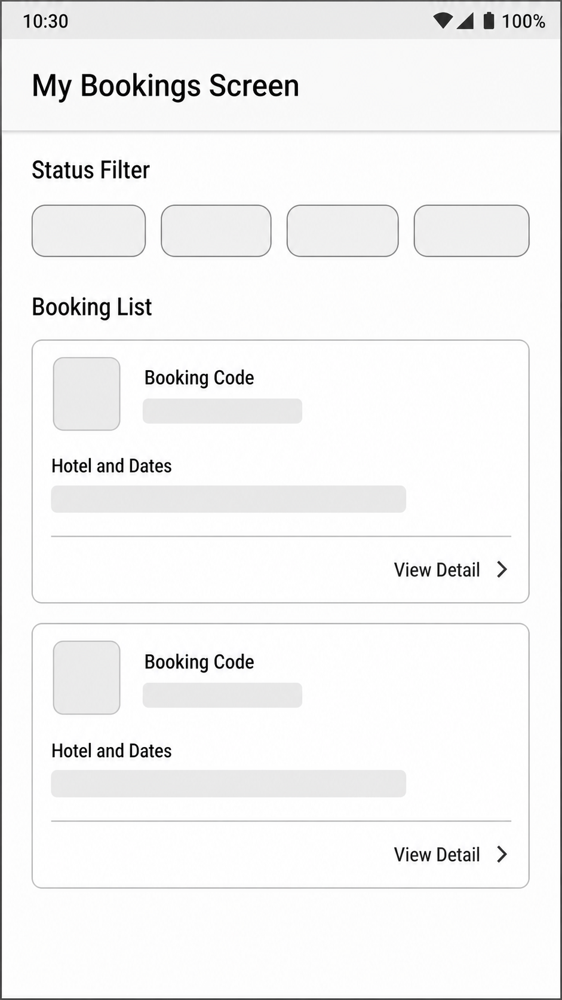

**Figure 3-27: Mobile Flutter Screen Design of My Bookings Screen**

| **#** | **Field / Component Name** | **Type** | **Mandatory** | **Max Length** | **Description** |
| --- | --- | --- | --- | --- | --- |
| 1 | Booking List | Repeating Table/Card | Yes | N/A | Own bookings only |
| 2 | Status Filter | Filter | No | N/A | Filter by booking/payment/refund status |
| 3 | Booking Code | Column/Label | Yes | N/A | Booking identifier |
| 4 | Hotel and Dates | Column/Label | Yes | N/A | Booked hotel and stay dates |
| 5 | View Detail Action | Button | Yes | N/A | Open own booking detail |

**Table 3-11: Screen Definition of My Bookings Screen**

##### SCR-010 - Customer Booking Detail Screen

**Purpose:** Displays booking details and customer actions such as payment retry or cancellation.

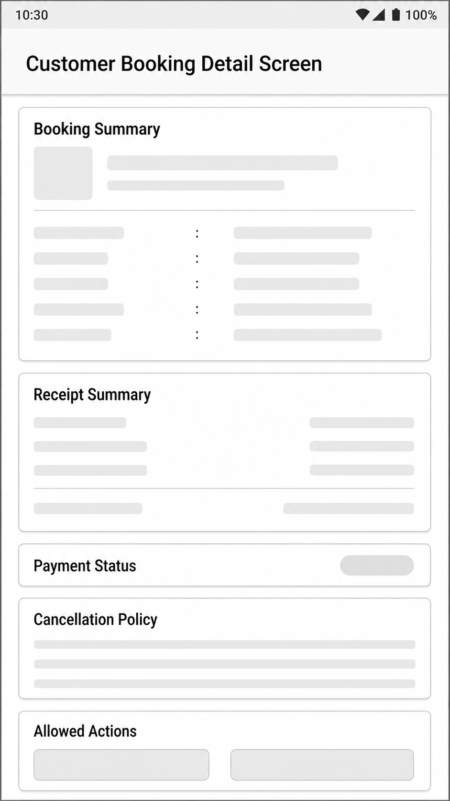

**Figure 3-28: Mobile Flutter Screen Design of Customer Booking Detail Screen**

| **#** | **Field / Component Name** | **Type** | **Mandatory** | **Max Length** | **Description** |
| --- | --- | --- | --- | --- | --- |
| 1 | Booking Summary | Component | Yes | N/A | Hotel, room, dates, status |
| 2 | Receipt Summary | Component | Yes | N/A | Customer-visible receipt/payment summary only |
| 3 | Payment Status | Component | Yes | N/A | Payment mode and status |
| 4 | Cancellation Policy | Component | Yes | N/A | Hotel-configurable cancellation policy |
| 5 | Allowed Actions | Action Area | Conditional | N/A | Pay retry or cancel according to status/policy |

**Table 3-12: Screen Definition of Customer Booking Detail Screen**

##### SCR-013 - Customer Refund Status Screen

**Purpose:** Displays customer-visible refund eligibility and refund status.

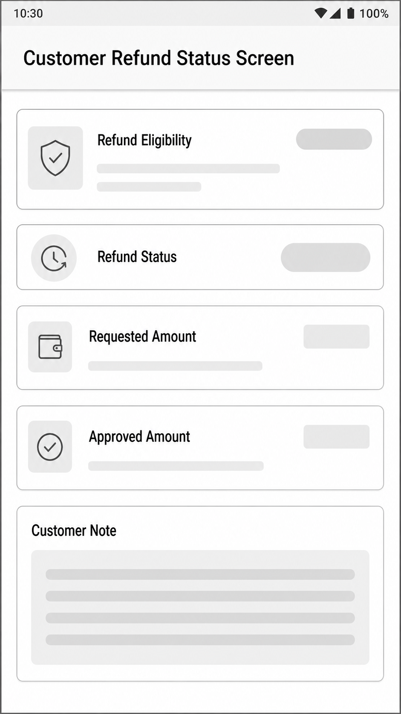

**Figure 3-29: Mobile Flutter Screen Design of Customer Refund Status Screen**

| **#** | **Field / Component Name** | **Type** | **Mandatory** | **Max Length** | **Description** |
| --- | --- | --- | --- | --- | --- |
| 1 | Refund Eligibility | Label | Yes | N/A | Whether refund is eligible |
| 2 | Refund Status | Label | Yes | N/A | Customer-visible refund status |
| 3 | Requested Amount | Label | Conditional | N/A | Requested refund amount if applicable |
| 4 | Approved Amount | Label | Conditional | N/A | Approved refund amount if applicable |
| 5 | Customer Note | Message Area | No | N/A | Non-technical refund explanation |

**Table 3-13: Screen Definition of Customer Refund Status Screen**

#### Use Case Description

##### Use Case Description - UC-007 Cancel Booking

| **Use Case ID** | | **UC-007** | **Use Case Name** | | **Cancel Booking** | |
| --- | --- | --- | --- | --- | --- | --- |
| **Author** | | BA Documentation Assistant | **Version** | 1.2 | **Date** | 2026-06-29 |
| **Actor** | | Customer | | | | |
| **Secondary Actor(s)** | | Notification Service | | **Feature / Group Function** | Customer Booking | |
| **Description** | | Cancel own booking according to policy and initiate refund status if applicable. | | | | |
| **Precondition** | | Customer authenticated; booking exists and belongs to customer. | | | | |
| **Trigger** | | Customer selects Cancel Booking. | | | | |
| **Post-Condition** | | POS-01: Eligible booking is cancelled; reserved availability is released; refund status is recorded if applicable. | | | | |
| **Main flows** | | | | | | |
| **Step** | **Actor** | **Action** | | | | |
| 1 | Customer | opens own Booking Detail. | | | | |
| 2 | System | displays booking status, policy, refund eligibility, and cancel action if allowed. | | | | |
| 3 | Customer | selects Cancel Booking and enters reason if required. | | | | |
| 4 | System | validates ownership, status, and policy. | | | | |
| 5 | System | cancels booking and releases reserved availability if applicable. | | | | |
| 6 | System | determines refund eligibility. | | | | |
| 7 | System | creates/updates RefundRecord if review is required. | | | | |
| 8 | System | sends/records cancellation notification. | | | | |
| 9 | System | displays cancellation result and refund status. | | | | |
| **Alternative flows** | | | | | | |
| **Alternative ID** | | AT-UC007-04A | | **Branch from Main Step** | 4 | |
| **Condition** | | Cancellation not allowed | | | | |
| **Sub step** | **Actor** | **Action** | | | | |
| 4.1 | System | Displays MSG-BOOK-007 and keeps booking unchanged. | | | | |
| 4.2 | System | Keeps the booking unchanged and terminates the cancel action. | | | | |
| **Alternative ID** | | AT-UC007-06A | | **Branch from Main Step** | 6 | |
| **Condition** | | Refund not required | | | | |
| **Sub step** | **Actor** | **Action** | | | | |
| 6.1 | System | Marks refund Not Required. | | | | |
| 6.2 | System | Skips refund request creation and resumes at main flow step 8. | | | | |
| **Alternative ID** | | AT-UC007-06B | | **Branch from Main Step** | 6 | |
| **Condition** | | Refund review required | | | | |
| **Sub step** | **Actor** | **Action** | | | | |
| 6.1 | System | Creates RefundRecord with Requested status. | | | | |
| 6.2 | System | Resumes at main flow step 8 after refund request creation. | | | | |
| **Business Rules** | | | | | | |
| **#** | **Rule Description** | | | | | |
| BR-BOOK-008 | A Customer may view and cancel only his or her own booking. | | | | | |
| BR-REF-001 | Refund eligibility shall be determined based on booking status, payment status, payment mode, and cancellation policy. | | | | | |
| BR-REF-002 | Manual refund processing status shall be recorded by Platform Administrator in MVP+Staff scope. | | | | | |
| BR-FIN-002 | Platform Collect hotel payable shall consider paid amount, refund amount, and commission amount. | | | | | |
| BR-REF-003 | Cancellation policy shall be hotel-configurable and may define free-cancellation threshold, refund percentage, and non-refundable conditions. | | | | | |

**Related Application Messages:** MSG-BOOK-005, MSG-BOOK-007, MSG-REF-002

##### Use Case Description - UC-008 View My Bookings

| **Use Case ID** | | **UC-008** | **Use Case Name** | | **View My Bookings** | |
| --- | --- | --- | --- | --- | --- | --- |
| **Author** | | BA Documentation Assistant | **Version** | 1.2 | **Date** | 2026-06-29 |
| **Actor** | | Customer | | | | |
| **Secondary Actor(s)** | | None | | **Feature / Group Function** | Customer Booking | |
| **Description** | | View customer booking list, status, payment status, and booking detail. | | | | |
| **Precondition** | | Customer is authenticated. | | | | |
| **Trigger** | | Customer opens My Bookings. | | | | |
| **Post-Condition** | | POS-01: Customer sees own booking list/detail only. | | | | |
| **Main flows** | | | | | | |
| **Step** | **Actor** | **Action** | | | | |
| 1 | Customer | opens My Bookings Screen. | | | | |
| 2 | System | displays its own booking list with booking code, hotel, dates, booking status, payment status, and main actions. | | | | |
| 3 | Customer | filters or selects booking. | | | | |
| 4 | System | displays booking details including room, guest count, payment mode, price, refund status, and allowed actions. | | | | |
| **Alternative flows** | | | | | | |
| **Alternative ID** | | AT-UC008-02A | | **Branch from Main Step** | 2 | |
| **Condition** | | No bookings | | | | |
| **Sub step** | **Actor** | **Action** | | | | |
| 2.1 | System | Displays MSG-BOOK-008 and offers search navigation. | | | | |
| 2.2 | System | Allows the Customer to open hotel search or leave the screen; no booking data is changed. | | | | |
| **Business Rules** | | | | | | |
| **#** | **Rule Description** | | | | | |
| BR-BOOK-008 | A Customer may view and cancel only his or her own booking. | | | | | |

**Related Application Messages:** MSG-BOOK-008

### 3.2.5 FEAT-HOTEL-SETUP - Hotel Profile and Configuration

#### Purpose

This feature supports hotel onboarding, profile management, images, amenities, and hotel-configurable cancellation policy.

#### Screen Mock-up and Screen Definition

##### SCR-014 - Owner/Manager Dashboard

**Purpose:** Displays hotel setup, staff, room, availability, booking, housekeeping, maintenance, and operation summaries for assigned hotels.

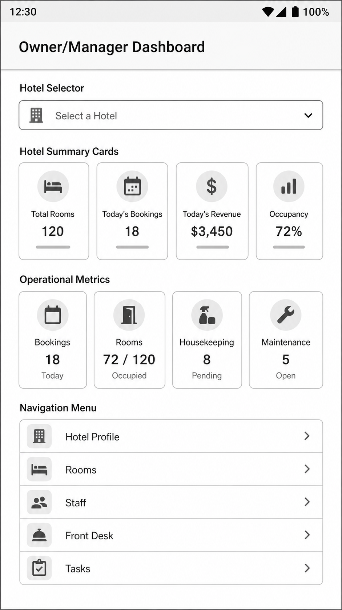

**Figure 3-30: Mobile Flutter Screen Design of Owner/Manager Dashboard**

| **#** | **Field / Component Name** | **Type** | **Mandatory** | **Max Length** | **Description** |
| --- | --- | --- | --- | --- | --- |
| 1 | Hotel Summary Cards | Component | Yes | N/A | Owned/assigned hotel overview |
| 2 | Operational Metrics | Component | No | N/A | Bookings, rooms, housekeeping, maintenance summary |
| 3 | Navigation Menu | Component | Yes | N/A | Hotel profile, rooms, staff, front desk, tasks |
| 4 | Hotel Selector | Filter | Conditional | N/A | For users assigned to multiple hotels |

**Table 3-14: Screen Definition of Owner/Manager Dashboard**

##### SCR-015 - Hotel Registration Screen

**Purpose:** Allows Property Owner to create hotel profile and submit approval request.

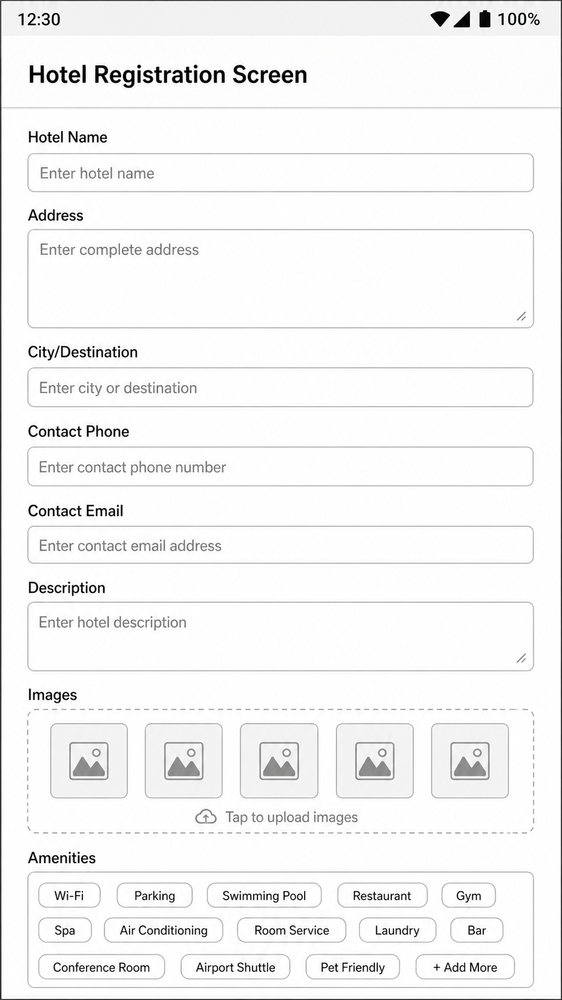

**Figure 3-31: Mobile Flutter Screen Design of Hotel Registration Screen**

| **#** | **Field / Component Name** | **Type** | **Mandatory** | **Max Length** | **Description** |
| --- | --- | --- | --- | --- | --- |
| 1 | Hotel Name | Text | Yes | 150 | Hotel name |
| 2 | Address | Text Area | Yes | 255 | Hotel address |
| 3 | City/Destination | Text | Yes | 100 | Searchable destination |
| 4 | Contact Phone | Text | Yes | 20 | Hotel contact phone |
| 5 | Contact Email | Text | No | 150 | Hotel contact email |
| 6 | Description | Text Area | Yes | 1000 | Public hotel description |
| 7 | Images | Upload | Yes | N/A | Hotel image gallery |
| 8 | Amenities | Multi-select | No | N/A | Hotel amenities |
| 9 | Cancellation Policy | Form Section | Yes | N/A | Hotel-configurable policy |
| 10 | Submit for Approval | Button | Yes | N/A | Submit hotel |

**Table 3-15: Screen Definition of Hotel Registration Screen**

##### SCR-016 - Hotel Profile Management Screen

**Purpose:** Allows Property Owner or authorized Hotel Manager to update hotel details, images, amenities, and policies.

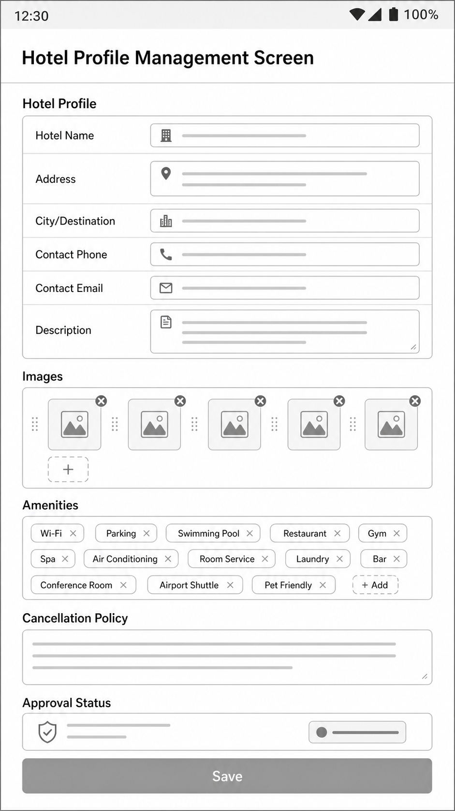

**Figure 3-32: Mobile Flutter Screen Design of Hotel Profile Management Screen**

| **#** | **Field / Component Name** | **Type** | **Mandatory** | **Max Length** | **Description** |
| --- | --- | --- | --- | --- | --- |
| 1 | Hotel Profile | Form Section | Yes | N/A | Editable hotel data |
| 2 | Images | Gallery Manager | No | N/A | Add/remove/reorder images |
| 3 | Amenities | Multi-select | No | N/A | Manage amenities |
| 4 | Cancellation Policy | Form Section | Yes | N/A | Configure free-cancel threshold/refund percentage |
| 5 | Approval Status | Read-only | Yes | N/A | Current approval/publication status |
| 6 | Save Button | Button | Yes | N/A | Save changes |

**Table 3-16: Screen Definition of Hotel Profile Management Screen**

#### Use Case Description

##### Use Case Description - UC-009 Register Hotel Property

| **Use Case ID** | | **UC-009** | **Use Case Name** | | **Register Hotel Property** | |
| --- | --- | --- | --- | --- | --- | --- |
| **Author** | | BA Documentation Assistant | **Version** | 1.2 | **Date** | 2026-06-29 |
| **Actor** | | Property Owner | | | | |
| **Secondary Actor(s)** | | Platform Administrator, Notification Service | | **Feature / Group Function** | Hotel Setup | |
| **Description** | | Create a hotel profile and submit it for platform approval. | | | | |
| **Precondition** | | The Property Owner is authenticated. | | | | |
| **Trigger** | | Property Owner selects Register Hotel Property. | | | | |
| **Post-Condition** | | POS-01: Hotel profile is created with Pending Approval status and submitted to platform review. | | | | |
| **Main flows** | | | | | | |
| **Step** | **Actor** | **Action** | | | | |
| 1 | Property Owner | opens the Hotel Registration Screen. | | | | |
| 2 | System | displays hotel profile, address, contact, images, amenities, and policy fields. | | | | |
| 3 | Property Owner | enters hotel information and uploads required content. | | | | |
| 4 | System | validates mandatory fields and format. | | | | |
| 5 | System | creates a hotel profile with Pending Approval status. | | | | |
| 6 | System | notifies/records notification for Platform Administrator. | | | | |
| 7 | System | displays submission success messages. | | | | |
| **Alternative flows** | | | | | | |
| **Alternative ID** | | AT-UC009-04A | | **Branch from Main Step** | 4 | |
| **Condition** | | Missing required fields | | | | |
| **Sub step** | **Actor** | **Action** | | | | |
| 4.1 | System | Displays validation message. | | | | |
| 4.2 | System | Keeps submitted data unchanged and returns the actor to main flow step 3 for correction. | | | | |
| **Alternative ID** | | AT-UC009-04B | | **Branch from Main Step** | 4 | |
| **Condition** | | Invalid image | | | | |
| **Sub step** | **Actor** | **Action** | | | | |
| 4.1 | System | Displays MSG-OWNER-003. | | | | |
| 4.2 | System | Keeps submitted data unchanged and returns the actor to main flow step 3 for correction. | | | | |
| **Business Rules** | | | | | | |
| **#** | **Rule Description** | | | | | |
| BR-MKT-001 | Only approved, active, and publicly available hotels shall appear in marketplace search results and hotel detail pages. | | | | | |
| BR-OWNER-001 | A Property Owner may manage only hotels, rooms, staff, bookings, and operations belonging to owned hotels. | | | | | |

**Related Application Messages:** MSG-OWNER-001, MSG-OWNER-003, MSG-OWNER-005

##### Use Case Description - UC-010 Manage Hotel Profile

| **Use Case ID** | | **UC-010** | **Use Case Name** | | **Manage Hotel Profile** | |
| --- | --- | --- | --- | --- | --- | --- |
| **Author** | | BA Documentation Assistant | **Version** | 1.2 | **Date** | 2026-06-29 |
| **Actor** | | Property Owner, Hotel Manager | | | | |
| **Secondary Actor(s)** | | None | | **Feature / Group Function** | Hotel Setup | |
| **Description** | | Update owned or assigned hotel information, images, amenities, and policies. | | | | |
| **Precondition** | | Actor authenticated; selected hotel access can be validated before hotel profile data is displayed. | | | | |
| **Trigger** | | Actor opens Hotel Profile Management. | | | | |
| **Post-Condition** | | POS-01: Hotel profile, images, amenities, or policy information is updated according to permission and approval rules. | | | | |
| **Main flows** | | | | | | |
| **Step** | **Actor** | **Action** | | | | |
| 1 | **Actor** | selects owned/assigned hotel. | | | | |
| 2 | System | validates selected hotel access and displays hotel profile and approval/publication status. | | | | |
| 3 | **Actor** | updates editable hotel information, images, amenities, or policies. | | | | |
| 4 | System | validates updates. | | | | |
| 5 | System | records changes. | | | | |
| 6 | System | displays success message. | | | | |
| **Alternative flows** | | | | | | |
| **Alternative ID** | | AT-UC010-01A | | **Branch from Main Step** | 1 | |
| **Condition** | | Unauthorized hotel | | | | |
| **Sub step** | **Actor** | **Action** | | | | |
| 1.1 | System | Displays MSG-OWNER-002. | | | | |
| 1.2 | System | Keeps data unchanged and terminates the use case for this actor. | | | | |
| **Alternative ID** | | AT-UC010-05A | | **Branch from Main Step** | 5 | |
| **Condition** | | Sensitive change requires review | | | | |
| **Sub step** | **Actor** | **Action** | | | | |
| 5.1 | System | Records change and sets Pending Review if configured. | | | | |
| 5.2 | System | Routes the change to review before public display and resumes at main flow step 6. | | | | |
| **Business Rules** | | | | | | |
| **#** | **Rule Description** | | | | | |
| BR-OWNER-001 | A Property Owner may manage only hotels, rooms, staff, bookings, and operations belonging to owned hotels. | | | | | |
| BR-STAFF-002 | Hotel staff may access only hotel(s) to which they are assigned. | | | | | |
| BR-MKT-001 | Only approved, active, and publicly available hotels shall appear in marketplace search results and hotel detail pages. | | | | | |

**Related Application Messages:** MSG-OWNER-002, MSG-OWNER-004, MSG-OWNER-006

### 3.2.6 FEAT-ROOM-INV - Room Inventory and Availability

#### Purpose

This feature supports room type management, physical room management, availability calendar, and room status board.

#### Screen Mock-up and Screen Definition

##### SCR-017 - Room Type Management Screen

**Purpose:** Allows Property Owner or authorized Hotel Manager to manage private room types and base prices.

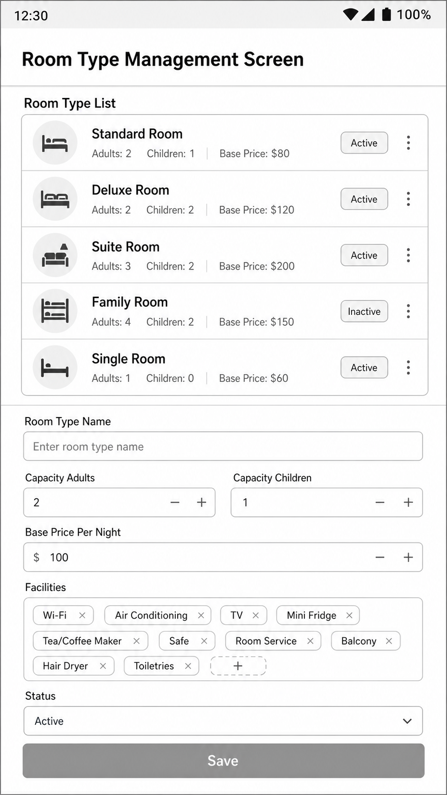

**Figure 3-33: Mobile Flutter Screen Design of Room Type Management Screen**

| **#** | **Field / Component Name** | **Type** | **Mandatory** | **Max Length** | **Description** |
| --- | --- | --- | --- | --- | --- |
| 1 | Room Type List | Table | Yes | N/A | Existing room types |
| 2 | Room Type Name | Text | Yes | 100 | Private room type name |
| 3 | Capacity Adults | Number | Yes | N/A | Adult capacity |
| 4 | Capacity Children | Number | No | N/A | Child capacity |
| 5 | Base Price Per Night | Currency | Yes | N/A | Room price only base amount |
| 6 | Facilities | Text/Multi-select | No | N/A | Room facilities |
| 7 | Status | Dropdown | Yes | N/A | Active/inactive |
| 8 | Save Button | Button | Yes | N/A | Save room type |

**Table 3-17: Screen Definition of Room Type Management Screen**

##### SCR-018 - Physical Room Management Screen

**Purpose:** Allows Property Owner or authorized Hotel Manager to manage individual private rooms.

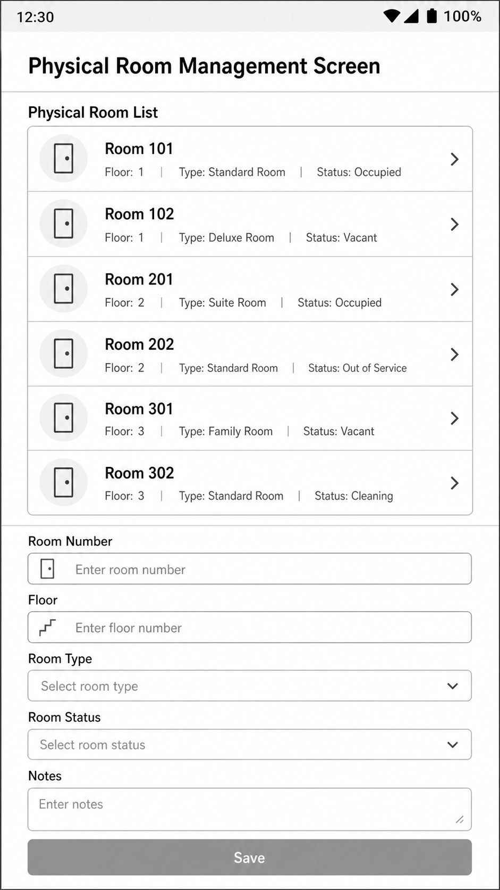

**Figure 3-34: Mobile Flutter Screen Design of Physical Room Management Screen**

| **#** | **Field / Component Name** | **Type** | **Mandatory** | **Max Length** | **Description** |
| --- | --- | --- | --- | --- | --- |
| 1 | Physical Room List | Table | Yes | N/A | Rooms under selected room type |
| 2 | Room Number | Text | Yes | 50 | Unique room number within hotel |
| 3 | Floor | Text/Number | No | 20 | Room floor |
| 4 | Room Type | Dropdown | Yes | N/A | Associated room type |
| 5 | Lifecycle Status | Read-only/Controlled | Yes | N/A | Current operational status; direct status edits are not allowed outside lifecycle workflows |
| 6 | Notes | Text Area | No | 500 | Operational notes |
| 7 | Save Button | Button | Yes | N/A | Save physical room |
| 8 | Lifecycle Action | Controlled Action | Conditional | N/A | Allowed only for explicit administrative status transitions with audit and conflict validation |

**Table 3-18: Screen Definition of Physical Room Management Screen**

##### SCR-019 - Availability Calendar Screen

**Purpose:** Allows Property Owner, Hotel Manager, and limited Receptionist role to manage availability according to permission.

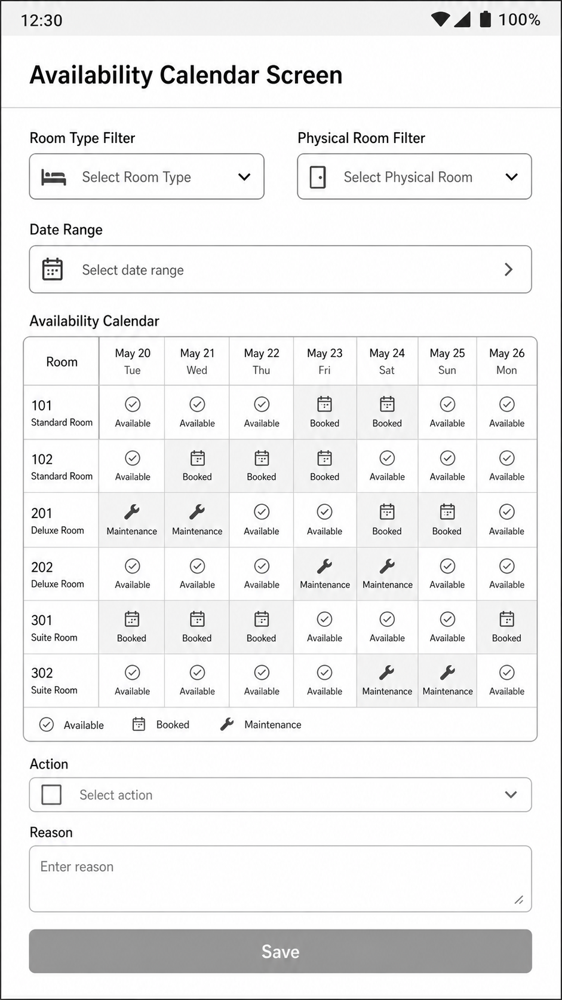

**Figure 3-35: Mobile Flutter Screen Design of Availability Calendar Screen**

| **#** | **Field / Component Name** | **Type** | **Mandatory** | **Max Length** | **Description** |
| --- | --- | --- | --- | --- | --- |
| 1 | Availability Calendar | Calendar/Grid | Yes | N/A | Date range availability/status |
| 2 | Room Type Filter | Filter | No | N/A | Filter by room type |
| 3 | Physical Room Filter | Filter | No | N/A | Filter by physical room |
| 4 | Date Range | Date Range | Yes | N/A | Target date range |
| 5 | Action | Dropdown | Yes | N/A | Open, close, block, unblock |
| 6 | Reason | Text Area | Conditional | 500 | Required for block/close |
| 7 | Save Button | Button | Yes | N/A | Apply availability change |

**Table 3-19: Screen Definition of Availability Calendar Screen**

##### SCR-035 - Room Status Board

**Purpose:** Displays operational room states such as Available, Occupied, Dirty, Cleaning, Inspection Required, Maintenance, and Out of Service.

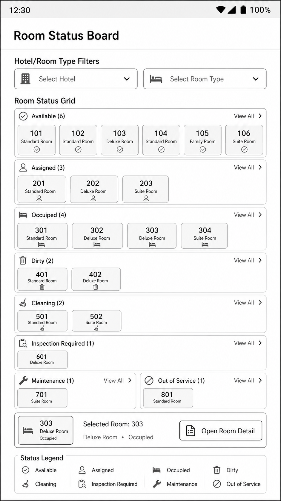

**Figure 3-36: Mobile Flutter Screen Design of Room Status Board**

| **#** | **Field / Component Name** | **Type** | **Mandatory** | **Max Length** | **Description** |
| --- | --- | --- | --- | --- | --- |
| 1 | Room Status Grid | Grid | Yes | N/A | Rooms grouped by status |
| 2 | Hotel/Room Type Filters | Filters | No | N/A | Filter room status view |
| 3 | Status Legend | Component | Yes | N/A | Available, Assigned, Occupied, Dirty, Cleaning, Inspection Required, Maintenance, Out of Service, Blocked, Inactive |
| 4 | Open Room Detail Action | Button | No | N/A | Open room/status detail if allowed |

**Table 3-20: Screen Definition of Room Status Board**

#### Use Case Description

##### Use Case Description - UC-011 Manage Room Type

| **Use Case ID** | | **UC-011** | **Use Case Name** | | **Manage Room Type** | |
| --- | --- | --- | --- | --- | --- | --- |
| **Author** | | BA Documentation Assistant | **Version** | 1.2 | **Date** | 2026-06-29 |
| **Actor** | | Property Owner, Hotel Manager | | | | |
| **Secondary Actor(s)** | | None | | **Feature / Group Function** | Room Inventory | |
| **Description** | | Create and update private room types, base price, capacity, and facilities. | | | | |
| **Precondition** | | Actor authenticated; hotel owned or assigned. | | | | |
| **Trigger** | | Actor opens Room Type Management. | | | | |
| **Post-Condition** | | POS-01: Room type information is created or updated for an owned/assigned hotel. | | | | |
| **Main flows** | | | | | | |
| **Step** | **Actor** | **Action** | | | | |
| 1 | **Actor** | selects hotel and opens Room Type Management. | | | | |
| 2 | System | displays room types and actions. | | | | |
| 3 | **Actor** | creates/updates room type information. | | | | |
| 4 | System | validates name, capacity, base price, and status. | | | | |
| 5 | System | records room type. | | | | |
| 6 | System | displays success message. | | | | |
| **Alternative flows** | | | | | | |
| **Alternative ID** | | AT-UC011-04A | | **Branch from Main Step** | 4 | |
| **Condition** | | Invalid room type | | | | |
| **Sub step** | **Actor** | **Action** | | | | |
| 4.1 | System | Displays MSG-ROOM-001. | | | | |
| 4.2 | System | Keeps submitted data unchanged and returns the actor to main flow step 3 for correction. | | | | |
| **Alternative ID** | | AT-UC011-04B | | **Branch from Main Step** | 4 | |
| **Condition** | | Deactivation conflict | | | | |
| **Sub step** | **Actor** | **Action** | | | | |
| 4.1 | System | Displays MSG-ROOM-002. | | | | |
| 4.2 | System | Keeps the room type active until dependent availability or booking conflicts are resolved. | | | | |
| **Business Rules** | | | | | | |
| **#** | **Rule Description** | | | | | |
| BR-ROOM-003 | Room capacity must be greater than zero. | | | | | |
| BR-ROOM-004 | Base price per night must be zero or greater. | | | | | |
| BR-OWNER-001 | A Property Owner may manage only hotels, rooms, staff, bookings, and operations belonging to owned hotels. | | | | | |
| BR-STAFF-002 | Hotel staff may access only hotel(s) to which they are assigned. | | | | | |

**Related Application Messages:** MSG-ROOM-001, MSG-ROOM-002, MSG-ROOM-005

##### Use Case Description - UC-012 Manage Physical Room

| **Use Case ID** | | **UC-012** | **Use Case Name** | | **Manage Physical Room** | |
| --- | --- | --- | --- | --- | --- | --- |
| **Author** | | BA Documentation Assistant | **Version** | 1.2 | **Date** | 2026-06-29 |
| **Actor** | | Property Owner, Hotel Manager | | | | |
| **Secondary Actor(s)** | | None | | **Feature / Group Function** | Room Inventory | |
| **Description** | | Create and update individual private rooms under room types. | | | | |
| **Precondition** | | Actor authenticated; hotel/room type owned or assigned. | | | | |
| **Trigger** | | The actor opens Physical Room Management. | | | | |
| **Post-Condition** | | POS-01: Physical room information is created or updated for an owned/assigned hotel. | | | | |
| **Main flows** | | | | | | |
| **Step** | **Actor** | **Action** | | | | |
| 1 | **Actor** | selects hotel and room type. | | | | |
| 2 | System | validates actor permission for the selected hotel and room type before displaying room data. | | | | |
| 3 | System | displays physical rooms, lifecycle status, and allowed actions. | | | | |
| 4 | **Actor** | creates/updates room number/name, floor, notes, or requests an allowed lifecycle action. | | | | |
| 5 | System | validates duplicate room number, room data, lifecycle transition, and active booking conflicts. | | | | |
| 6 | System | records physical room changes and RoomStatusHistory when lifecycle status changes. | | | | |
| 7 | System | displays a success message. | | | | |
| **Alternative flows** | | | | | | |
| **Alternative ID** | | AT-UC012-05A | | **Branch from Main Step** | 5 | |
| **Condition** | | Duplicate room number | | | | |
| **Sub step** | **Actor** | **Action** | | | | |
| 5.1 | System | Displays MSG-ROOM-003. | | | | |
| 5.2 | System | Keeps submitted data unchanged and returns the actor to main flow step 4 for correction. | | | | |
| **Alternative ID** | | AT-UC012-05B | | **Branch from Main Step** | 5 | |
| **Condition** | | Inactivate occupied room | | | | |
| **Sub step** | **Actor** | **Action** | | | | |
| 5.1 | System | Displays MSG-ROOM-004. | | | | |
| 5.2 | System | Keeps the physical room status unchanged until active occupancy is cleared. | | | | |
| **Alternative ID** | | AT-UC012-02A | | **Branch from Main Step** | 2 | |
| **Condition** | | Unauthorized hotel or room type | | | | |
| **Sub step** | **Actor** | **Action** | | | | |
| 2.1 | System | Displays MSG-AUTH-007. | | | | |
| 2.2 | System | Rejects access before physical room data is displayed. | | | | |
| **Business Rules** | | | | | | |
| **#** | **Rule Description** | | | | | |
| BR-ROOM-001 | A physical room cannot be assigned to more than one active stay for overlapping dates. | | | | | |
| BR-ROOM-005 | Room numbers must be unique within the same hotel. | | | | | |
| BR-ROOM-006 | Physical room lifecycle status shall not be directly edited; status changes must use allowed lifecycle actions, conflict validation, audit, and RoomStatusHistory. | | | | | |
| BR-OWNER-001 | A Property Owner may manage only hotels, rooms, staff, bookings, and operations belonging to owned hotels. | | | | | |
| BR-STAFF-002 | Hotel staff may access only hotel(s) to which they are assigned. | | | | | |

**Related Application Messages:** MSG-ROOM-003, MSG-ROOM-004, MSG-ROOM-006, MSG-AUTH-007

##### Use Case Description - UC-013 Manage Room Availability

| **Use Case ID** | | **UC-013** | **Use Case Name** | | **Manage Room Availability** | |
| --- | --- | --- | --- | --- | --- | --- |
| **Author** | | BA Documentation Assistant | **Version** | 1.2 | **Date** | 2026-06-29 |
| **Actor** | | Property Owner, Hotel Manager, Receptionist | | | | |
| **Secondary Actor(s)** | | None | | **Feature / Group Function** | Room Inventory | |
| **Description** | | Open, close, block, or unblock room availability by date range, according to role permissions. | | | | |
| **Precondition** | | Actor authenticated and permitted for hotel. | | | | |
| **Trigger** | | Actor opens Availability Calendar. | | | | |
| **Post-Condition** | | POS-01: Availability or block record is updated and marketplace availability is refreshed accordingly. | | | | |
| **Main flows** | | | | | | |
| **Step** | **Actor** | **Action** | | | | |
| 1 | **Actor** | opens Availability Calendar. | | | | |
| 2 | System | validates actor hotel scope and allowed availability actions before displaying availability data. | | | | |
| 3 | System | displays room type availability, physical room status, existing bookings, and blocked dates within permitted scope. | | | | |
| 4 | **Actor** | selects room/date range. | | | | |
| 5 | **Actor** | chooses open/close/block/unblock and enters reason if required. | | | | |
| 6 | System | validates date range, required reason, permission, and conflicts. | | | | |
| 7 | System | records change. | | | | |
| 8 | System | updates marketplace availability display. | | | | |
| **Alternative flows** | | | | | | |
| **Alternative ID** | | AT-UC013-06A | | **Branch from Main Step** | 6 | |
| **Condition** | | Invalid date | | | | |
| **Sub step** | **Actor** | **Action** | | | | |
| 6.1 | System | Displays MSG-BOOK-001. | | | | |
| 6.2 | System | Keeps submitted data unchanged and returns the actor to main flow step 5 for correction. | | | | |
| **Alternative ID** | | AT-UC013-06B | | **Branch from Main Step** | 6 | |
| **Condition** | | Conflict with active booking | | | | |
| **Sub step** | **Actor** | **Action** | | | | |
| 6.1 | System | Displays MSG-AVAIL-001. | | | | |
| 6.2 | System | Keeps availability unchanged and returns the actor to main flow step 4 to choose another room or date range. | | | | |
| **Alternative ID** | | AT-UC013-02A | | **Branch from Main Step** | 2 | |
| **Condition** | | Receptionist attempts restricted change | | | | |
| **Sub step** | **Actor** | **Action** | | | | |
| 2.1 | System | Displays MSG-AUTH-007. | | | | |
| 2.2 | System | Rejects the restricted action before operational availability data is displayed. | | | | |
| **Alternative ID** | | AT-UC013-06C | | **Branch from Main Step** | 6 | |
| **Condition** | | Missing required reason | | | | |
| **Sub step** | **Actor** | **Action** | | | | |
| 6.1 | System | Displays relevant validation message for required reason. | | | | |
| 6.2 | System | Keeps availability unchanged and returns the actor to main flow step 5 for correction. | | | | |
| **Business Rules** | | | | | | |
| **#** | **Rule Description** | | | | | |
| BR-BOOK-001 | The check-out date must be later than the check-in date. | | | | | |
| BR-ROOM-002 | Blocked, inactive, occupied, dirty, cleaning, inspection-required, maintenance, or out-of-service rooms shall not be counted as available for new assignment unless a permitted status transition makes them available. | | | | | |
| BR-AVAIL-001 | A room or room type cannot be blocked for dates that conflict with active bookings unless a controlled exception process is used. | | | | | |
| BR-AVAIL-002 | Availability changes shall affect public marketplace availability after they are saved. | | | | | |
| BR-STAFF-003 | Receptionists may view and operate bookings only for assigned hotels. | | | | | |

**Related Application Messages:** MSG-BOOK-001, MSG-AVAIL-001, MSG-AVAIL-002, MSG-AUTH-007

### 3.2.7 FEAT-STAFF - Hotel Staff Management

#### Purpose

This feature supports hotel-scoped staff account management and role/permission assignment by Property Owner or authorized Hotel Manager.

#### Screen Mock-up and Screen Definition

##### SCR-028 - Staff Management Screen

**Purpose:** Allows Property Owner or Hotel Manager to create, invite, update, deactivate, and view hotel staff.

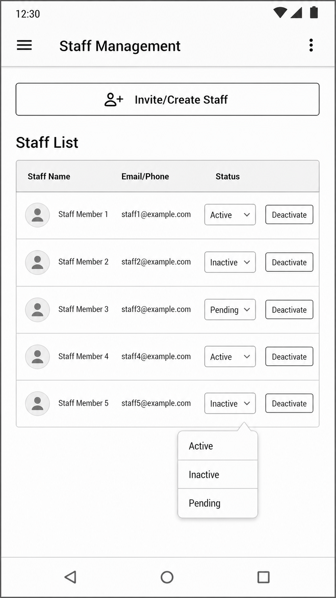

**Figure 3-37: Mobile Flutter Screen Design of Staff Management Screen**

| **#** | **Field / Component Name** | **Type** | **Mandatory** | **Max Length** | **Description** |
| --- | --- | --- | --- | --- | --- |
| 1 | Staff List | Table | Yes | N/A | Staff accounts and assignments |
| 2 | Invite/Create Staff Action | Button | Yes | N/A | Create or invite staff |
| 3 | Staff Name | Text | Conditional | 100 | Staff profile name |
| 4 | Email/Phone | Text | Conditional | 150 | Staff contact |
| 5 | Status | Dropdown | Yes | N/A | Active/inactive/pending invitation |
| 6 | Deactivate Action | Button | Conditional | N/A | Deactivate staff assignment |

**Table 3-21: Screen Definition of Staff Management Screen**

##### SCR-029 - Staff Role Assignment Screen

**Purpose:** Allows role and hotel-scope assignment for staff.

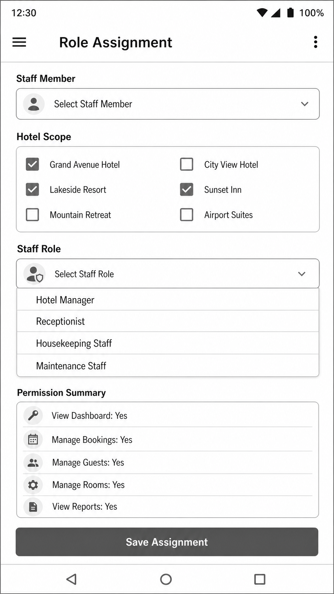

**Figure 3-38: Mobile Flutter Screen Design of Staff Role Assignment Screen**

| **#** | **Field / Component Name** | **Type** | **Mandatory** | **Max Length** | **Description** |
| --- | --- | --- | --- | --- | --- |
| 1 | Staff Member | Selector | Yes | N/A | Selected staff account |
| 2 | Hotel Scope | Multi-select | Yes | N/A | Assigned hotel(s) |
| 3 | Staff Role | Dropdown | Yes | N/A | Hotel Manager, Receptionist, Housekeeping Staff, Maintenance Staff; options hidden/disabled when above actor authority |
| 4 | Permission Summary | Read-only | Yes | N/A | Actions allowed by role |
| 5 | Save Assignment Button | Button | Yes | N/A | Save staff role assignment |

**Table 3-22: Screen Definition of Staff Role Assignment Screen**

#### Use Case Description

##### Use Case Description - UC-026 Manage Hotel Staff Accounts

| **Use Case ID** | | **UC-026** | **Use Case Name** | | **Manage Hotel Staff Accounts** | |
| --- | --- | --- | --- | --- | --- | --- |
| **Author** | | BA Documentation Assistant | **Version** | 1.2 | **Date** | 2026-06-29 |
| **Actor** | | Property Owner, Hotel Manager | | | | |
| **Secondary Actor(s)** | | Notification Service | | **Feature / Group Function** | Staff Management | |
| **Description** | | Invite, create, update, deactivate, and view staff accounts for assigned hotels. | | | | |
| **Precondition** | | Actor authenticated; staff management authority can be validated for selected hotel scope. | | | | |
| **Trigger** | | Actor opens Staff Management. | | | | |
| **Post-Condition** | | POS-01: Staff account and hotel assignment are created, updated, invited, or deactivated according to permission. | | | | |
| **Main flows** | | | | | | |
| **Step** | **Actor** | **Action** | | | | |
| 1 | **Actor** | opens Staff Management for selected hotel scope. | | | | |
| 2 | System | validates actor staff-management authority for selected hotel scope before displaying staff data. | | | | |
| 3 | System | displays staff list, roles, assignment status, and actions allowed by actor authority. | | | | |
| 4 | **Actor** | creates, invites, updates, or deactivates staff account. | | | | |
| 5 | System | validates staff data, duplicate email/phone, hotel permission, role availability, and manager authority limits. | | | | |
| 6 | System | creates/updates staff account and assignment. | | | | |
| 7 | System | records audit and sends/records notification. | | | | |
| 8 | System | displays success. | | | | |
| **Alternative flows** | | | | | | |
| **Alternative ID** | | AT-UC026-05A | | **Branch from Main Step** | 5 | |
| **Condition** | | Duplicate staff email/phone | | | | |
| **Sub step** | **Actor** | **Action** | | | | |
| 5.1 | System | Displays MSG-AUTH-003. | | | | |
| 5.2 | System | Keeps submitted data unchanged and returns the actor to main flow step 4 for correction. | | | | |
| **Alternative ID** | | AT-UC026-02A | | **Branch from Main Step** | 2 | |
| **Condition** | | No permission | | | | |
| **Sub step** | **Actor** | **Action** | | | | |
| 2.1 | System | Displays MSG-AUTH-007. | | | | |
| 2.2 | System | Rejects access before staff contact or assignment data is displayed. | | | | |
| **Alternative ID** | | AT-UC026-05B | | **Branch from Main Step** | 5 | |
| **Condition** | | Staff has open tasks | | | | |
| **Sub step** | **Actor** | **Action** | | | | |
| 5.1 | System | Displays MSG-STAFF-004 and requires reassignment/confirmation. | | | | |
| 5.2 | System | Requires task reassignment or explicit confirmation before the staff account change resumes at main flow step 4. | | | | |
| **Business Rules** | | | | | | |
| **#** | **Rule Description** | | | | | |
| BR-STAFF-001 | Property Owner or authorized Hotel Manager may create, invite, deactivate, and assign hotel staff roles for hotels under their authority. | | | | | |
| BR-STAFF-002 | Hotel staff may access only hotel(s) to which they are assigned. | | | | | |
| BR-AUTH-002 | A user account may have one or more roles; hotel staff roles shall be scoped to assigned hotel(s); platform roles shall not grant hotel tenant permissions unless explicitly assigned. | | | | | |
| BR-AUDIT-001 | Actions that change protected data, booking status, room assignment, room status, staff assignment, housekeeping task, maintenance request, payment collection, refund, commission, reconciliation, settlement, or hotel approval shall be audited. | | | | | |

**Related Application Messages:** MSG-STAFF-001, MSG-STAFF-004, MSG-AUTH-003, MSG-AUTH-007

##### Use Case Description - UC-027 Assign Staff Roles and Permissions

| **Use Case ID** | | **UC-027** | **Use Case Name** | | **Assign Staff Roles and Permissions** | |
| --- | --- | --- | --- | --- | --- | --- |
| **Author** | | BA Documentation Assistant | **Version** | 1.2 | **Date** | 2026-06-29 |
| **Actor** | | Property Owner, Hotel Manager | | | | |
| **Secondary Actor(s)** | | None | | **Feature / Group Function** | Staff Management | |
| **Description** | | Assign hotel-scoped staff roles and permissions. | | | | |
| **Precondition** | | Actor authenticated; staff account exists; actor has role management permission. | | | | |
| **Trigger** | | Actor opens Staff Role Assignment. | | | | |
| **Post-Condition** | | POS-01: Hotel-scoped staff role and permission assignment is updated and audited. | | | | |
| **Main flows** | | | | | | |
| **Step** | **Actor** | **Action** | | | | |
| 1 | **Actor** | selects staff members. | | | | |
| 2 | System | validates actor authority over the selected staff member and hotel scope before displaying assignments. | | | | |
| 3 | System | displays current hotel assignments, role permissions, and only role options allowed by actor authority. | | | | |
| 4 | **Actor** | selects/changes staff role and hotel scope. | | | | |
| 5 | System | validates role, hotel assignment, and actor authority. | | | | |
| 6 | System | updates hotel-scoped staff role assignment. | | | | |
| 7 | System | records audit and displays success. | | | | |
| **Alternative flows** | | | | | | |
| **Alternative ID** | | AT-UC027-05A | | **Branch from Main Step** | 5 | |
| **Condition** | | Invalid role | | | | |
| **Sub step** | **Actor** | **Action** | | | | |
| 5.1 | System | Displays MSG-STAFF-002. | | | | |
| 5.2 | System | Keeps submitted data unchanged and returns the actor to main flow step 4 for correction. | | | | |
| **Alternative ID** | | AT-UC027-05B | | **Branch from Main Step** | 5 | |
| **Condition** | | Staff not assigned to hotel | | | | |
| **Sub step** | **Actor** | **Action** | | | | |
| 5.1 | System | Displays MSG-STAFF-003. | | | | |
| 5.2 | System | Keeps data unchanged and terminates the use case for this actor. | | | | |
| **Business Rules** | | | | | | |
| **#** | **Rule Description** | | | | | |
| BR-STAFF-001 | Property Owner or authorized Hotel Manager may create, invite, deactivate, and assign hotel staff roles for hotels under their authority. | | | | | |
| BR-STAFF-002 | Hotel staff may access only hotel(s) to which they are assigned. | | | | | |
| BR-AUTH-002 | A user account may have one or more roles; hotel staff roles shall be scoped to assigned hotel(s); platform roles shall not grant hotel tenant permissions unless explicitly assigned. | | | | | |
| BR-AUDIT-001 | Actions that change protected data, booking status, room assignment, room status, staff assignment, housekeeping task, maintenance request, payment collection, refund, commission, reconciliation, settlement, or hotel approval shall be audited. | | | | | |

**Related Application Messages:** MSG-STAFF-002, MSG-STAFF-003, MSG-STAFF-005

### 3.2.8 FEAT-FRONTDESK - Front Desk Operation

#### Purpose

This feature supports day-to-day front desk work: booking list, arrivals/departures, room assignment, check-in, checkout, pay-at-property collection, no-show, and walk-in booking.

#### Screen Mock-up and Screen Definition

##### SCR-020 - Hotel Booking List Screen

**Purpose:** Displays bookings for owned or assigned hotels.

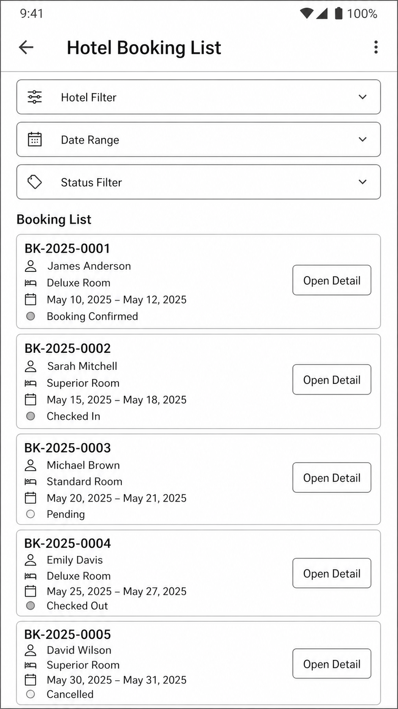

**Figure 3-39: Mobile Flutter Screen Design of Hotel Booking List Screen**

| **#** | **Field / Component Name** | **Type** | **Mandatory** | **Max Length** | **Description** |
| --- | --- | --- | --- | --- | --- |
| 1 | Hotel Filter | Filter | Conditional | N/A | Owned/assigned hotels |
| 2 | Date Range | Filter | No | N/A | Filter bookings by stay dates |
| 3 | Status Filter | Filter | No | N/A | Filter by booking/stay status |
| 4 | Booking List | Table | Yes | N/A | Hotel-scoped booking list |
| 5 | Open Detail Action | Button | Yes | N/A | Open selected booking |

**Table 3-23: Screen Definition of Hotel Booking List Screen**

##### SCR-021 - Hotel Booking Detail Screen

**Purpose:** Displays hotel-side booking detail and allows operational actions.

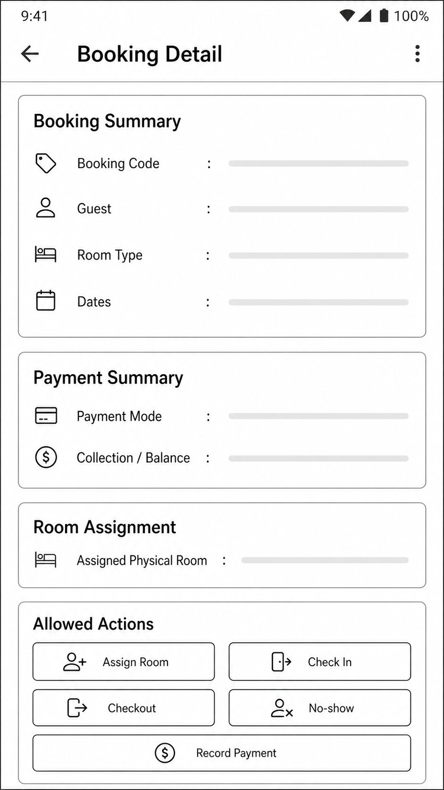

**Figure 3-40: Mobile Flutter Screen Design of Hotel Booking Detail Screen**

| **#** | **Field / Component Name** | **Type** | **Mandatory** | **Max Length** | **Description** |
| --- | --- | --- | --- | --- | --- |
| 1 | Booking Summary | Component | Yes | N/A | Booking code, customer minimal info, room type, dates |
| 2 | Payment Summary | Component | Role-based | N/A | Payment mode and hotel-visible collection/balance info |
| 3 | Room Assignment | Component | Conditional | N/A | Assigned physical rooms |
| 4 | No-show Eligibility | Label | Conditional | N/A | Indicates whether booking can be marked no-show |
| 5 | No-show Policy Summary | Label | Conditional | N/A | Hotel policy summary for no-show decision |
| 6 | No-show Reason | Text Area | Conditional | 500 | Required when marking no-show |
| 7 | Allowed Actions | Action Area | Conditional | N/A | Assign room, check in, checkout, no-show, record payment |

**Table 3-24: Screen Definition of Hotel Booking Detail Screen**

##### SCR-022 - Front Desk Dashboard

**Purpose:** Displays arrivals, in-house stays, departures, no-show candidates, and room status summary.

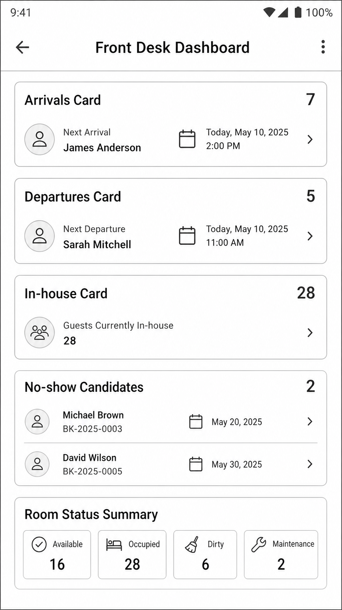

**Figure 3-41: Mobile Flutter Screen Design of Front Desk Dashboard**

| **#** | **Field / Component Name** | **Type** | **Mandatory** | **Max Length** | **Description** |
| --- | --- | --- | --- | --- | --- |
| 1 | Arrivals Card | Metric Card | Yes | N/A | Today arrivals |
| 2 | Departures Card | Metric Card | Yes | N/A | Today departures |
| 3 | In-house Card | Metric Card | Yes | N/A | Current checked-in stays |
| 4 | No-show Candidates | List | No | N/A | Bookings eligible for no-show review |
| 5 | Room Status Summary | Component | Yes | N/A | Available/occupied/dirty/maintenance counts |

**Table 3-25: Screen Definition of Front Desk Dashboard**

##### SCR-023 - Arrival / Departure List Screen

**Purpose:** Displays arrivals, departures, in-house stays, and no-show candidates by date.

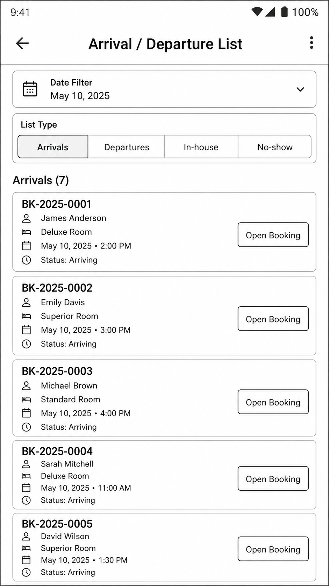

**Figure 3-42: Mobile Flutter Screen Design of Arrival / Departure List Screen**

| **#** | **Field / Component Name** | **Type** | **Mandatory** | **Max Length** | **Description** |
| --- | --- | --- | --- | --- | --- |
| 1 | Date Filter | Date | Yes | N/A | Target operation date |
| 2 | List Type | Tabs | Yes | N/A | Arrivals, departures, in-house, no-show candidates |
| 3 | Booking Row | Repeating Row | Yes | N/A | Booking code, guest display, room type, status |
| 4 | No-show Eligibility Indicator | Label | Conditional | N/A | Shows no-show candidate eligibility in list |
| 5 | Open Booking Action | Button | Yes | N/A | Open booking detail |

**Table 3-26: Screen Definition of Arrival / Departure List Screen**

##### SCR-024 - Room Assignment Board

**Purpose:** Allows assignment or change of physical rooms for eligible bookings.

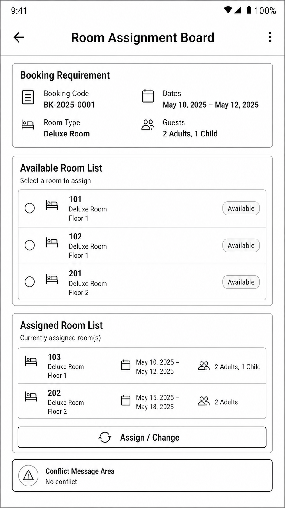

**Figure 3-43: Mobile Flutter Screen Design of Room Assignment Board**

| **#** | **Field / Component Name** | **Type** | **Mandatory** | **Max Length** | **Description** |
| --- | --- | --- | --- | --- | --- |
| 1 | Booking Requirement | Component | Yes | N/A | Room type and quantity required |
| 2 | Available Room List | Table/Grid | Yes | N/A | Available matching physical rooms |
| 3 | Assigned Room List | Table/Grid | No | N/A | Currently assigned rooms |
| 4 | Assign/Change Action | Button | Yes | N/A | Assign selected room |
| 5 | Conflict Message Area | Message Area | No | N/A | Displays overlap or status conflict |

**Table 3-27: Screen Definition of Room Assignment Board**

##### SCR-025 - Check-in Screen

**Purpose:** Allows Receptionist or authorized manager/owner to verify booking and mark check-in.

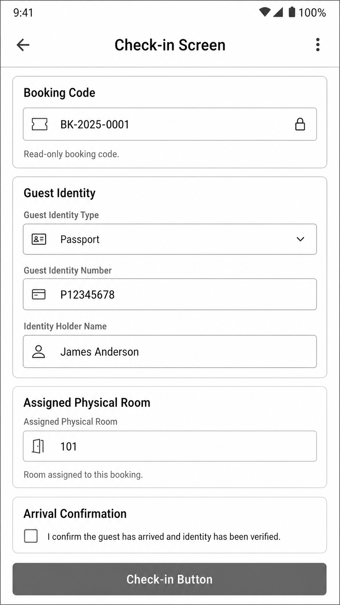

**Figure 3-44: Mobile Flutter Screen Design of Check-in Screen**

| **#** | **Field / Component Name** | **Type** | **Mandatory** | **Max Length** | **Description** |
| --- | --- | --- | --- | --- | --- |
| 1 | Booking Code | Read-only | Yes | N/A | Confirmed booking code |
| 2 | Guest Identity Type | Dropdown | Yes | N/A | ID/passport/other accepted document type |
| 3 | Guest Identity Number | Text | Yes | 50 | Identity document number |
| 4 | Identity Holder Name | Text | Yes | 100 | Name on document |
| 5 | Assigned Physical Rooms | Dropdown/List/Read-only | Yes | N/A | One assigned physical room per booked room quantity before check-in |
| 6 | Arrival Confirmation | Checkbox | Yes | N/A | Confirms guest arrived |
| 7 | Check-in Button | Button | Yes | N/A | Confirm check-in |

**Table 3-28: Screen Definition of Check-in Screen**

##### SCR-026 - Check-out / Payment Collection Screen

**Purpose:** Allows checkout, basic invoice/folio finalization, and Pay at Property collection recording.

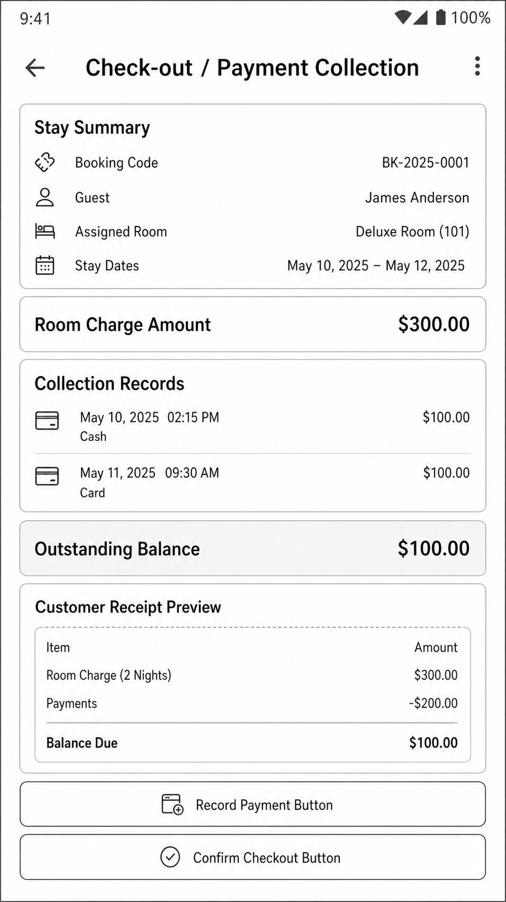

**Figure 3-45: Mobile Flutter Screen Design of Check-out / Payment Collection Screen**

| **#** | **Field / Component Name** | **Type** | **Mandatory** | **Max Length** | **Description** |
| --- | --- | --- | --- | --- | --- |
| 1 | Stay Summary | Component | Yes | N/A | Checked-in booking summary |
| 2 | Room Charge Amount | Label | Yes | N/A | Room-price-only charge |
| 3 | Collection Records | Component | Conditional | N/A | Pay-at-property collection records |
| 4 | Outstanding Balance | Label | Yes | N/A | Balance before checkout |
| 5 | Customer Receipt Preview | Component | Yes | N/A | Customer-visible receipt summary only |
| 6 | Collection Amount | Currency | Conditional | N/A | Amount collected for Pay at Property booking |
| 7 | Collection Method | Dropdown | Conditional | N/A | Cash, bank transfer, card, or hotel-defined method |
| 8 | Collection Date | Date/Time | Conditional | N/A | Date/time of hotel-side collection |
| 9 | Collection Reference | Text | Conditional | 100 | Receipt/reference number for collection |
| 10 | Collection Note | Text Area | No | 500 | Optional payment collection note |
| 11 | Record Payment Button | Button | Conditional | N/A | Record pay-at-property collection |
| 12 | Confirm Checkout Button | Button | Yes | N/A | Finalize checkout and room release |

**Table 3-29: Screen Definition of Check-out / Payment Collection Screen**

##### SCR-027 - Walk-in Booking Screen

**Purpose:** Allows Receptionist to create a direct hotel booking when enabled.

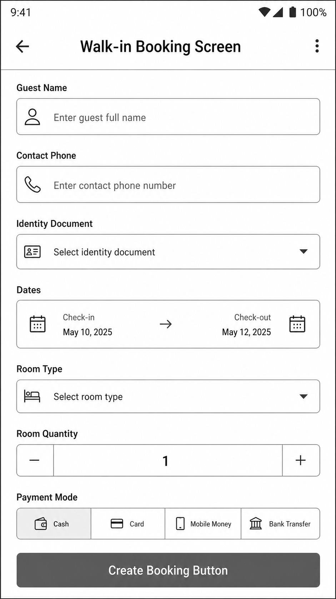

**Figure 3-46: Mobile Flutter Screen Design of Walk-in Booking Screen**

| **#** | **Field / Component Name** | **Type** | **Mandatory** | **Max Length** | **Description** |
| --- | --- | --- | --- | --- | --- |
| 1 | Guest Name | Text | Yes | 100 | Walk-in guest name |
| 2 | Contact Phone | Text | Yes | 20 | Guest contact phone |
| 3 | Identity Document | Text | Conditional | 50 | Identity document if check-in immediately |
| 4 | Dates | Date Range | Yes | N/A | Stay date range |
| 5 | Room Type | Dropdown | Yes | N/A | One room type |
| 6 | Room Quantity | Number | Yes | N/A | Quantity |
| 7 | Payment Mode | Radio | Yes | N/A | Platform Collect if supported or Pay at Property |
| 8 | Create Booking Button | Button | Yes | N/A | Create walk-in booking |

**Table 3-30: Screen Definition of Walk-in Booking Screen**

#### Use Case Description

##### Use Case Description - UC-014 View Hotel Bookings

| **Use Case ID** | | **UC-014** | **Use Case Name** | | **View Hotel Bookings** | |
| --- | --- | --- | --- | --- | --- | --- |
| **Author** | | BA Documentation Assistant | **Version** | 1.2 | **Date** | 2026-06-29 |
| **Actor** | | Property Owner, Hotel Manager, Receptionist | | | | |
| **Secondary Actor(s)** | | None | | **Feature / Group Function** | Front Desk | |
| **Description** | | View bookings for owned or assigned hotels. | | | | |
| **Precondition** | | Actor authenticated and has hotel access. | | | | |
| **Trigger** | | Actor opens Hotel Booking List. | | | | |
| **Post-Condition** | | POS-01: Hotel-scoped booking list or booking detail is displayed according to actor permission. | | | | |
| **Main flows** | | | | | | |
| **Step** | **Actor** | **Action** | | | | |
| 1 | **Actor** | opens Hotel Booking List. | | | | |
| 2 | System | validates actor role and hotel access, then displays hotel selector, filters, and booking list for permitted hotels. | | | | |
| 3 | **Actor** | applies filters or selects booking. | | | | |
| 4 | System | displays booking details and actions allowed for an actor role. | | | | |
| 5 | **Actor** | chooses the next operational action if needed. | | | | |
| **Alternative flows** | | | | | | |
| **Alternative ID** | | AT-UC014-02A | | **Branch from Main Step** | 2 | |
| **Condition** | | No bookings | | | | |
| **Sub step** | **Actor** | **Action** | | | | |
| 2.1 | System | Displays MSG-BOOK-009. | | | | |
| 2.2 | System | Allows the actor to adjust filters or leave the screen; no booking data is changed. | | | | |
| **Alternative ID** | | AT-UC014-04A | | **Branch from Main Step** | 4 | |
| **Condition** | | Unauthorized booking access | | | | |
| **Sub step** | **Actor** | **Action** | | | | |
| 4.1 | System | Displays MSG-OWNER-002. | | | | |
| 4.2 | System | Keeps data unchanged and terminates the use case for this actor. | | | | |
| **Business Rules** | | | | | | |
| **#** | **Rule Description** | | | | | |
| BR-BOOK-009 | A hotel-side actor may view and operate only bookings belonging to owned or assigned hotels. | | | | | |
| BR-OWNER-001 | A Property Owner may manage only hotels, rooms, staff, bookings, and operations belonging to owned hotels. | | | | | |
| BR-STAFF-002 | Hotel staff may access only hotel(s) to which they are assigned. | | | | | |
| BR-STAFF-003 | Receptionists may view and operate bookings only for assigned hotels. | | | | | |

**Related Application Messages:** MSG-BOOK-009, MSG-OWNER-002

##### Use Case Description - UC-015 Check In Customer

| **Use Case ID** | | **UC-015** | **Use Case Name** | | **Check In Customer** | |
| --- | --- | --- | --- | --- | --- | --- |
| **Author** | | BA Documentation Assistant | **Version** | 1.2 | **Date** | 2026-06-29 |
| **Actor** | | Receptionist, Hotel Manager, Property Owner | | | | |
| **Secondary Actor(s)** | | Hotel Manager, Property Owner, Notification Service | | **Feature / Group Function** | Front Desk | |
| **Description** | | Verify confirmed booking, assign physical room if needed, and mark check-in. | | | | |
| **Precondition** | | Actor authenticated; booking exists and hotel scope can be validated before no-show details are displayed. | | | | |
| **Trigger** | | The actor selects Check In. | | | | |
| **Post-Condition** | | POS-01: Booking status becomes Checked In; identity document information is recorded if required; physical room becomes Occupied. | | | | |
| **Main flows** | | | | | | |
| **Step** | **Actor** | **Action** | | | | |
| 1 | **Actor** | opens booking detail for check-in. | | | | |
| 2 | System | validates actor hotel scope before displaying check-in data. | | | | |
| 3 | System | displays booking, guest information needed for check-in, stay dates, room type, booked quantity, and assigned/available physical rooms. | | | | |
| 4 | **Actor** | verifies guest arrival, enters required identity information, and selects/validates one physical room per booked quantity. | | | | |
| 5 | System | validates booking status, date eligibility, identity fields, room count, and room availability. | | | | |
| 6 | System | assigns any missing physical rooms if valid and records assignment history. | | | | |
| 7 | System | updates booking to Checked In and assigned rooms to Occupied atomically. | | | | |
| 8 | System | records audit and sends/records notification. | | | | |
| 9 | System | displays check-in success. | | | | |
| **Alternative flows** | | | | | | |
| **Alternative ID** | | AT-UC015-05A | | **Branch from Main Step** | 5 | |
| **Condition** | | Not Confirmed | | | | |
| **Sub step** | **Actor** | **Action** | | | | |
| 5.1 | System | Displays MSG-STAY-003. | | | | |
| 5.2 | System | Keeps the record unchanged and terminates the attempted action. | | | | |
| **Alternative ID** | | AT-UC015-05B | | **Branch from Main Step** | 5 | |
| **Condition** | | No available room | | | | |
| **Sub step** | **Actor** | **Action** | | | | |
| 5.1 | System | Displays MSG-STAY-004. | | | | |
| 5.2 | System | Keeps the booking Confirmed and returns the actor to main flow step 4 to select enough valid physical rooms or resolve availability. | | | | |
| **Alternative ID** | | AT-UC015-02A | | **Branch from Main Step** | 2 | |
| **Condition** | | Receptionist not assigned | | | | |
| **Sub step** | **Actor** | **Action** | | | | |
| 2.1 | System | Displays MSG-AUTH-007. | | | | |
| 2.2 | System | Rejects access before booking or guest check-in data is displayed. | | | | |
| **Alternative ID** | | AT-UC015-05C | | **Branch from Main Step** | 5 | |
| **Condition** | | Missing or invalid identity information | | | | |
| **Sub step** | **Actor** | **Action** | | | | |
| 5.1 | System | Displays identity validation message. | | | | |
| 5.2 | System | Keeps the booking Confirmed and returns the actor to main flow step 4 for correction. | | | | |
| **Business Rules** | | | | | | |
| **#** | **Rule Description** | | | | | |
| BR-STAY-001 | A confirmed booking may be checked in only when the hotel-side actor has permission, the booking belongs to the owned/assigned hotel, and required room assignment information is valid. | | | | | |
| BR-ROOM-001 | A physical room cannot be assigned to more than one active stay for overlapping dates. | | | | | |
| BR-STAFF-002 | Hotel staff may access only hotel(s) to which they are assigned. | | | | | |
| BR-STAFF-003 | Receptionists may view and operate bookings only for assigned hotels. | | | | | |
| BR-AUDIT-001 | Actions that change protected data, booking status, room assignment, room status, staff assignment, housekeeping task, maintenance request, payment collection, refund, commission, reconciliation, settlement, or hotel approval shall be audited. | | | | | |
| BR-STAY-005 | Check-in shall record required identity document information such as ID/passport number when hotel operation requires it, and such information shall be protected as sensitive operational data. | | | | | |

**Related Application Messages:** MSG-STAY-001, MSG-STAY-003, MSG-STAY-004, MSG-AUTH-007

##### Use Case Description - UC-016 Check Out Customer

| **Use Case ID** | | **UC-016** | **Use Case Name** | | **Check Out Customer** | |
| --- | --- | --- | --- | --- | --- | --- |
| **Author** | | BA Documentation Assistant | **Version** | 1.2 | **Date** | 2026-06-29 |
| **Actor** | | Receptionist, Hotel Manager, Property Owner | | | | |
| **Secondary Actor(s)** | | Hotel Manager, Property Owner, Notification Service | | **Feature / Group Function** | Front Desk | |
| **Description** | | Finalize stay, confirm pay-at-property collection if needed, generate basic invoice/folio, and release room to housekeeping. | | | | |
| **Precondition** | | Actor authenticated; checked-in booking exists for a hotel the actor owns or is assigned to. | | | | |
| **Trigger** | | The actor selects Check Out. | | | | |
| **Post-Condition** | | POS-01: Booking status becomes Checked Out; customer receipt is available; room becomes Dirty/cleaning-required; housekeeping task is created. | | | | |
| **Main flows** | | | | | | |
| **Step** | **Actor** | **Action** | | | | |
| 1 | **Actor** | opens checked-in booking detail. | | | | |
| 2 | System | validates actor hotel scope and booking access before displaying checkout data. | | | | |
| 3 | System | displays stay summary, payment mode/status, room charge, hotel-visible balance, and receipt preview without platform commission details. | | | | |
| 4 | **Actor** | reviews checkout information and confirms checkout. | | | | |
| 5 | System | validates booking status, payment collection requirement, outstanding balance, and room lifecycle readiness. | | | | |
| 6 | System | atomically finalizes staff-visible folio/receipt, updates booking to Checked Out, changes assigned rooms to Dirty, and creates housekeeping task(s). | | | | |
| 7 | System | records audit and sends/records notification. | | | | |
| 8 | System | displays checkout success. | | | | |
| **Alternative flows** | | | | | | |
| **Alternative ID** | | AT-UC016-05A | | **Branch from Main Step** | 5 | |
| **Condition** | | Booking not Checked In | | | | |
| **Sub step** | **Actor** | **Action** | | | | |
| 5.1 | System | Displays MSG-STAY-005. | | | | |
| 5.2 | System | Keeps the record unchanged and terminates the attempted action. | | | | |
| **Alternative ID** | | AT-UC016-05B | | **Branch from Main Step** | 5 | |
| **Condition** | | Pay-at-property balance not recorded | | | | |
| **Sub step** | **Actor** | **Action** | | | | |
| 5.1 | System | Displays MSG-STAY-009 and requires UC-030 or authorized manager/owner override. | | | | |
| 5.2 | System | Keeps submitted data unchanged and returns the actor to main flow step 4 for correction. | | | | |
| **Alternative ID** | | AT-UC016-06A | | **Branch from Main Step** | 6 | |
| **Condition** | | Room release failed | | | | |
| **Sub step** | **Actor** | **Action** | | | | |
| 6.1 | System | Displays MSG-ROOM-008. | | | | |
| 6.2 | System | Rolls back the atomic checkout transaction so booking, assigned room status, and housekeeping task state remain unchanged for authorized follow-up. | | | | |
| **Business Rules** | | | | | | |
| **#** | **Rule Description** | | | | | |
| BR-STAY-002 | A checked-in booking may be checked out only by an authorized hotel-side actor and only after required outstanding balance handling is confirmed. | | | | | |
| BR-STAY-003 | Checkout shall finalize or update the basic invoice/folio and release assigned room according to room lifecycle rules. | | | | | |
| BR-STAY-006 | Checkout status update, room release, and housekeeping task creation shall be atomic; if any part fails, checkout shall not be committed. | | | | | |
| BR-HK-001 | After checkout, an assigned physical room shall become Dirty or Cleaning Required before becoming Available again unless explicitly overridden by policy. | | | | | |
| BR-FIN-002 | Platform Collect hotel payable shall consider paid amount, refund amount, and commission amount. | | | | | |
| BR-FIN-003 | Pay at Property booking shall create commission receivable owed by hotel to platform. | | | | | |
| BR-AUDIT-001 | Actions that change protected data, booking status, room assignment, room status, staff assignment, housekeeping task, maintenance request, payment collection, refund, commission, reconciliation, settlement, or hotel approval shall be audited. | | | | | |
| BR-FIN-006 | Customers shall see a booking receipt/payment summary, while full hotel folio/invoice and platform finance details remain restricted to authorized hotel/platform roles. | | | | | |

**Related Application Messages:** MSG-STAY-002, MSG-STAY-005, MSG-STAY-009, MSG-ROOM-008

##### Use Case Description - UC-017 Mark No-show

| **Use Case ID** | | **UC-017** | **Use Case Name** | | **Mark No-show** | |
| --- | --- | --- | --- | --- | --- | --- |
| **Author** | | BA Documentation Assistant | **Version** | 1.2 | **Date** | 2026-06-29 |
| **Actor** | | Receptionist, Hotel Manager, Property Owner | | | | |
| **Secondary Actor(s)** | | Notification Service | | **Feature / Group Function** | Front Desk | |
| **Description** | | Mark confirmed booking as no-show when the customer does not arrive within the allowed operational window. | | | | |
| **Precondition** | | Actor authenticated; booking exists for a hotel the actor owns or is assigned to. | | | | |
| **Trigger** | | Actor selects Mark No-show. | | | | |
| **Post-Condition** | | POS-01: Booking status becomes No-show and financial traceability is preserved. | | | | |
| **Main flows** | | | | | | |
| **Step** | **Actor** | **Action** | | | | |
| 1 | **Actor** | opens booking detail or no-show candidate action. | | | | |
| 2 | System | validates actor role, hotel scope, and booking access before showing no-show details. | | | | |
| 3 | System | displays no-show eligibility, policy summary, and reason field. | | | | |
| 4 | **Actor** | selects Mark No-show and enters reason. | | | | |
| 5 | System | validates booking status, no-show eligibility, and required reason. | | | | |
| 6 | System | updates booking to No-show. | | | | |
| 7 | System | releases reserved availability, releases any pre-assigned physical room, and keeps finance records according to policy. | | | | |
| 8 | System | records audit and sends/records notification. | | | | |
| 9 | System | displays no-show success. | | | | |
| **Alternative flows** | | | | | | |
| **Alternative ID** | | AT-UC017-05A | | **Branch from Main Step** | 5 | |
| **Condition** | | Too early | | | | |
| **Sub step** | **Actor** | **Action** | | | | |
| 5.1 | System | Displays MSG-STAY-006. | | | | |
| 5.2 | System | Keeps the record unchanged and terminates the attempted action. | | | | |
| **Alternative ID** | | AT-UC017-05B | | **Branch from Main Step** | 5 | |
| **Condition** | | Invalid booking status | | | | |
| **Sub step** | **Actor** | **Action** | | | | |
| 5.1 | System | Displays MSG-STAY-007. | | | | |
| 5.2 | System | Keeps the record unchanged and terminates the attempted action. | | | | |
| **Alternative ID** | | AT-UC017-05C | | **Branch from Main Step** | 5 | |
| **Condition** | | Missing no-show reason | | | | |
| **Sub step** | **Actor** | **Action** | | | | |
| 5.1 | System | Displays required reason validation message. | | | | |
| 5.2 | System | Keeps the booking Confirmed and returns the actor to main flow step 4. | | | | |
| **Alternative ID** | | AT-UC017-02A | | **Branch from Main Step** | 2 | |
| **Condition** | | Unauthorized hotel or booking | | | | |
| **Sub step** | **Actor** | **Action** | | | | |
| 2.1 | System | Displays MSG-AUTH-007. | | | | |
| 2.2 | System | Rejects access before no-show details are displayed and terminates the attempted action. | | | | |
| **Business Rules** | | | | | | |
| **#** | **Rule Description** | | | | | |
| BR-STAY-004 | No-show may be marked only for eligible confirmed bookings after the configured operational no-show window and shall preserve financial traceability. | | | | | |
| BR-BOOK-009 | A hotel-side actor may view and operate only bookings belonging to owned or assigned hotels. | | | | | |
| BR-FIN-004 | No-show handling shall preserve financial traceability for payment, commission, and refund decisions. | | | | | |
| BR-STAY-007 | No-show handling shall release reserved availability and any pre-assigned physical room unless policy explicitly keeps the room blocked for follow-up. | | | | | |
| BR-STAFF-002 | Hotel staff may access only hotel(s) to which they are assigned. | | | | | |
| BR-STAFF-003 | Receptionists may view and operate bookings only for assigned hotels. | | | | | |

**Related Application Messages:** MSG-STAY-006, MSG-STAY-007, MSG-STAY-008, MSG-AUTH-007

##### Use Case Description - UC-028 View Arrival and Departure List

| **Use Case ID** | | **UC-028** | **Use Case Name** | | **View Arrival and Departure List** | |
| --- | --- | --- | --- | --- | --- | --- |
| **Author** | | BA Documentation Assistant | **Version** | 1.2 | **Date** | 2026-06-29 |
| **Actor** | | Receptionist, Hotel Manager, Property Owner | | | | |
| **Secondary Actor(s)** | | None | | **Feature / Group Function** | Front Desk | |
| **Description** | | View today/upcoming arrivals, departures, no-show candidates, and operational status. | | | | |
| **Precondition** | | Actor authenticated; hotel assignment and front desk list visibility can be validated before list display. | | | | |
| **Trigger** | | Actor opens Arrival/Departure List. | | | | |
| **Post-Condition** | | POS-01: Arrival/departure/in-house/no-show candidate list is displayed for assigned hotel scope. | | | | |
| **Main flows** | | | | | | |
| **Step** | **Actor** | **Action** | | | | |
| 1 | **Actor** | opens Arrival/Departure List. | | | | |
| 2 | System | validates actor role, hotel assignment, and front desk list visibility scope. | | | | |
| 3 | System | displays hotel/date filters and lists for arrivals, in-house stays, departures, and no-show candidates. | | | | |
| 4 | **Actor** | filters by date, room type, status, or keyword. | | | | |
| 5 | System | refreshes list. | | | | |
| 6 | **Actor** | selects booking. | | | | |
| 7 | System | validates selected booking access and displays booking detail with allowed actions. | | | | |
| **Alternative flows** | | | | | | |
| **Alternative ID** | | AT-UC028-03A | | **Branch from Main Step** | 3 | |
| **Condition** | | No arrivals/departures | | | | |
| **Sub step** | **Actor** | **Action** | | | | |
| 3.1 | System | Displays MSG-FD-001. | | | | |
| 3.2 | System | Allows the actor to adjust filters or leave the screen; no records are changed. | | | | |
| **Alternative ID** | | AT-UC028-02A | | **Branch from Main Step** | 2 | |
| **Condition** | | Unauthorized hotel | | | | |
| **Sub step** | **Actor** | **Action** | | | | |
| 2.1 | System | Displays MSG-AUTH-007. | | | | |
| 2.2 | System | Keeps data unchanged and terminates the use case for this actor. | | | | |
| **Business Rules** | | | | | | |
| **#** | **Rule Description** | | | | | |
| BR-STAFF-002 | Hotel staff may access only hotel(s) to which they are assigned. | | | | | |
| BR-STAFF-003 | Receptionists may view and operate bookings only for assigned hotels. | | | | | |
| BR-BOOK-009 | A hotel-side actor may view and operate only bookings belonging to owned or assigned hotels. | | | | | |

**Related Application Messages:** MSG-FD-001, MSG-AUTH-007

##### Use Case Description - UC-029 Assign Physical Room

| **Use Case ID** | | **UC-029** | **Use Case Name** | | **Assign Physical Room** | |
| --- | --- | --- | --- | --- | --- | --- |
| **Author** | | BA Documentation Assistant | **Version** | 1.2 | **Date** | 2026-06-29 |
| **Actor** | | Receptionist, Hotel Manager, Property Owner | | | | |
| **Secondary Actor(s)** | | None | | **Feature / Group Function** | Front Desk | |
| **Description** | | Assign or change physical room for a confirmed booking before or during check-in. | | | | |
| **Precondition** | | Actor authenticated; booking exists and assignment permission/status can be validated before room options are displayed. | | | | |
| **Trigger** | | Actor selects Assign Room. | | | | |
| **Post-Condition** | | POS-01: Physical room assignment is recorded without overlap conflict. | | | | |
| **Main flows** | | | | | | |
| **Step** | **Actor** | **Action** | | | | |
| 1 | **Actor** | opens booking detail or room assignment board. | | | | |
| 2 | System | validates actor role, booking hotel scope, booking status, and assignment permission before showing room options. | | | | |
| 3 | System | displays booking room requirement and available physical rooms. | | | | |
| 4 | **Actor** | selects/changes physical room. | | | | |
| 5 | System | validates room type match, status, overlap, and hotel assignment. | | | | |
| 6 | System | records room assignment. | | | | |
| 7 | System | displays success. | | | | |
| **Alternative flows** | | | | | | |
| **Alternative ID** | | AT-UC029-05A | | **Branch from Main Step** | 5 | |
| **Condition** | | Room unavailable | | | | |
| **Sub step** | **Actor** | **Action** | | | | |
| 5.1 | System | Displays MSG-STAY-004. | | | | |
| 5.2 | System | Keeps submitted data unchanged and returns the actor to main flow step 4 for correction. | | | | |
| **Alternative ID** | | AT-UC029-05B | | **Branch from Main Step** | 5 | |
| **Condition** | | Room type mismatch | | | | |
| **Sub step** | **Actor** | **Action** | | | | |
| 5.1 | System | Displays MSG-ROOM-007. | | | | |
| 5.2 | System | Keeps the record unchanged and terminates the attempted action. | | | | |
| **Alternative ID** | | AT-UC029-05C | | **Branch from Main Step** | 5 | |
| **Condition** | | Overlap | | | | |
| **Sub step** | **Actor** | **Action** | | | | |
| 5.1 | System | Displays MSG-ROOM-009. | | | | |
| 5.2 | System | Keeps the record unchanged and terminates the attempted action. | | | | |
| **Alternative ID** | | AT-UC029-02A | | **Branch from Main Step** | 2 | |
| **Condition** | | Unauthorized hotel, booking, or assignment action | | | | |
| **Sub step** | **Actor** | **Action** | | | | |
| 2.1 | System | Displays MSG-AUTH-007. | | | | |
| 2.2 | System | Rejects access before room options are displayed and terminates the attempted action. | | | | |
| **Business Rules** | | | | | | |
| **#** | **Rule Description** | | | | | |
| BR-ROOM-001 | A physical room cannot be assigned to more than one active stay for overlapping dates. | | | | | |
| BR-ROOM-002 | Blocked, inactive, occupied, dirty, cleaning, inspection-required, maintenance, or out-of-service rooms shall not be counted as available for new assignment unless a permitted status transition makes them available. | | | | | |
| BR-STAY-001 | A confirmed booking may be checked in only when the hotel-side actor has permission, the booking belongs to the owned/assigned hotel, and required room assignment information is valid. | | | | | |
| BR-BOOK-009 | A hotel-side actor may view and operate only bookings belonging to owned or assigned hotels. | | | | | |
| BR-STAFF-002 | Hotel staff may access only hotel(s) to which they are assigned. | | | | | |
| BR-STAFF-003 | Receptionist may view and operate bookings only for assigned hotels. | | | | | |
| BR-AUDIT-001 | Actions that change protected data, booking status, room assignment, room status, staff assignment, housekeeping task, maintenance request, payment collection, refund, commission, reconciliation, settlement, or hotel approval shall be audited. | | | | | |

**Related Application Messages:** MSG-STAY-004, MSG-ROOM-007, MSG-ROOM-009, MSG-AUTH-007

##### Use Case Description - UC-030 Record Pay-at-Property Payment

| **Use Case ID** | | **UC-030** | **Use Case Name** | | **Record Pay-at-Property Payment** | |
| --- | --- | --- | --- | --- | --- | --- |
| **Author** | | BA Documentation Assistant | **Version** | 1.2 | **Date** | 2026-06-29 |
| **Actor** | | Receptionist, Hotel Manager, Property Owner | | | | |
| **Secondary Actor(s)** | | None | | **Feature / Group Function** | Front Desk | |
| **Description** | | Record amount collected directly at hotel for Pay at Property booking. | | | | |
| **Precondition** | | Actor authenticated; booking exists for a hotel the actor owns or is assigned to. | | | | |
| **Trigger** | | Actor selects Record Payment Collection. | | | | |
| **Post-Condition** | | POS-01: Pay-at-Property collection is recorded and hotel-visible balance/receipt is updated. | | | | |
| **Main flows** | | | | | | |
| **Step** | **Actor** | **Action** | | | | |
| 1 | **Actor** | opens booking detail or checkout screen. | | | | |
| 2 | System | validates booking access and payment mode before displaying expected amount, prior collections, and balance. | | | | |
| 3 | System | displays expected amount, prior collections, and remaining balance. | | | | |
| 4 | **Actor** | enters amount, method, date, note/reference. | | | | |
| 5 | System | validates amount, required collection fields, remaining balance, and duplicate/concurrent collection guard. | | | | |
| 6 | System | atomically records collection and updates payment/collection status and invoice balance. | | | | |
| 7 | System | records audit and displays success. | | | | |
| **Alternative flows** | | | | | | |
| **Alternative ID** | | AT-UC030-05A | | **Branch from Main Step** | 5 | |
| **Condition** | | Invalid amount | | | | |
| **Sub step** | **Actor** | **Action** | | | | |
| 5.1 | System | Displays MSG-PAY-005. | | | | |
| 5.2 | System | Keeps submitted data unchanged and returns the actor to main flow step 4 for correction. | | | | |
| **Alternative ID** | | AT-UC030-02A | | **Branch from Main Step** | 2 | |
| **Condition** | | Wrong payment mode | | | | |
| **Sub step** | **Actor** | **Action** | | | | |
| 2.1 | System | Displays MSG-PAY-006. | | | | |
| 2.2 | System | Rejects access before collection balance details are displayed. | | | | |
| **Alternative ID** | | AT-UC030-05B | | **Branch from Main Step** | 5 | |
| **Condition** | | Amount exceeds expected | | | | |
| **Sub step** | **Actor** | **Action** | | | | |
| 5.1 | System | Displays MSG-PAY-007. | | | | |
| 5.2 | System | Keeps submitted data unchanged and returns the actor to main flow step 4 for correction. | | | | |
| **Alternative ID** | | AT-UC030-05C | | **Branch from Main Step** | 5 | |
| **Condition** | | Duplicate or concurrent collection | | | | |
| **Sub step** | **Actor** | **Action** | | | | |
| 5.1 | System | Detects collection reference already used or balance already settled by another collection. | | | | |
| 5.2 | System | Rejects duplicate recording and refreshes the remaining balance without double-counting collection. | | | | |
| **Business Rules** | | | | | | |
| **#** | **Rule Description** | | | | | |
| BR-PAY-004 | Pay-at-Property collections shall be recorded as hotel-side collection records, not payOS transactions. | | | | | |
| BR-PAY-006 | Pay-at-Property collection recording shall be idempotent by booking, amount, method, date, and reference; concurrent submissions shall not double-count the balance. | | | | | |
| BR-PAY-007 | Pay-at-Property collection records shall use a collection-status lifecycle so partial, complete, voided, and exception collections can be audited without changing payOS transaction status. | | | | | |
| BR-FIN-003 | Pay at Property booking shall create commission receivable owed by hotel to platform. | | | | | |
| BR-STAFF-003 | Receptionist may view and operate bookings only for assigned hotels. | | | | | |
| BR-AUDIT-001 | Actions that change protected data, booking status, room assignment, room status, staff assignment, housekeeping task, maintenance request, payment collection, refund, commission, reconciliation, settlement, or hotel approval shall be audited. | | | | | |

**Related Application Messages:** MSG-PAY-005, MSG-PAY-006, MSG-PAY-007, MSG-PAY-008

##### Use Case Description - UC-031 Create Walk-in Booking

| **Use Case ID** | | **UC-031** | **Use Case Name** | | **Create Walk-in Booking** | |
| --- | --- | --- | --- | --- | --- | --- |
| **Author** | | BA Documentation Assistant | **Version** | 1.2 | **Date** | 2026-06-29 |
| **Actor** | | Receptionist, Hotel Manager, Property Owner | | | | |
| **Secondary Actor(s)** | | Customer, Notification Service | | **Feature / Group Function** | Front Desk | |
| **Description** | | Create booking for guests arriving directly at the hotel if room is available. | | | | |
| **Precondition** | | Actor authenticated; walk-in booking enabled for owned or assigned hotel. | | | | |
| **Trigger** | | Actor selects Create Walk-in Booking. | | | | |
| **Post-Condition** | | POS-01: Walk-in booking is created with booking source Walk-in if availability exists. | | | | |
| **Main flows** | | | | | | |
| **Step** | **Actor** | **Action** | | | | |
| 1 | **Actor** | opens the Walk-in Booking Screen. | | | | |
| 2 | System | validates actor role, hotel scope, walk-in enablement, and available payment modes before showing booking fields. | | | | |
| 3 | System | displays hotel, date, room type, guest information, price summary, and payment mode fields. | | | | |
| 4 | **Actor** | enters guest/stay information and selects payment mode. | | | | |
| 5 | System | validates date range, guest information, payment mode, and price. | | | | |
| 6 | System | atomically validates availability and reserves requested room type quantity for the date range. | | | | |
| 7 | System | branches by selected payment mode and creates booking with source Walk-in and correct initial status. | | | | |
| 8 | System | assigns physical rooms for the reserved quantity if immediate assignment is selected and valid. | | | | |
| 9 | System | sends/records notification if guest contact is available. | | | | |
| 10 | System | displays confirmation. | | | | |
| **Alternative flows** | | | | | | |
| **Alternative ID** | | AT-UC031-06A | | **Branch from Main Step** | 6 | |
| **Condition** | | Room unavailable | | | | |
| **Sub step** | **Actor** | **Action** | | | | |
| 6.1 | System | Displays MSG-BOOK-002. | | | | |
| 6.2 | System | Keeps submitted data unchanged and returns the actor to main flow step 4 for correction. | | | | |
| **Alternative ID** | | AT-UC031-05A | | **Branch from Main Step** | 5 | |
| **Condition** | | Missing guest contact | | | | |
| **Sub step** | **Actor** | **Action** | | | | |
| 5.1 | System | Displays MSG-FD-002. | | | | |
| 5.2 | System | Keeps submitted data unchanged and returns the actor to main flow step 4 for correction. | | | | |
| **Alternative ID** | | AT-UC031-02A | | **Branch from Main Step** | 2 | |
| **Condition** | | Walk-in disabled | | | | |
| **Sub step** | **Actor** | **Action** | | | | |
| 2.1 | System | Displays MSG-FD-003. | | | | |
| 2.2 | System | Keeps the record unchanged and terminates the attempted action before booking fields are displayed. | | | | |
| **Alternative ID** | | AT-UC031-07A | | **Branch from Main Step** | 7 | |
| **Condition** | | Platform Collect | | | | |
| **Sub step** | **Actor** | **Action** | | | | |
| 7.1 | System | Creates a Pending Payment walk-in booking tied to the reserved availability and displays payment instruction if supported for walk-in. | | | | |
| 7.2 | System | Requires UC-006 payment completion before booking becomes Confirmed. | | | | |
| **Alternative ID** | | AT-UC031-07B | | **Branch from Main Step** | 7 | |
| **Condition** | | Pay at Property | | | | |
| **Sub step** | **Actor** | **Action** | | | | |
| 7.1 | System | Creates a Confirmed walk-in booking and hotel-side collection can be recorded through UC-030. | | | | |
| 7.2 | System | Continues to main flow step 8. | | | | |
| **Business Rules** | | | | | | |
| **#** | **Rule Description** | | | | | |
| BR-BOOK-001 | Check-out date must be later than check-in date. | | | | | |
| BR-BOOK-002 | A booking must contain at least one customer/guest identity, one hotel, one room type line, one check-in date, and one check-out date. | | | | | |
| BR-BOOK-003 | A Customer or authorized hotel-side actor can create an instant booking only if availability exists for the selected private room type and date range. | | | | | |
| BR-BOOK-013 | Availability check and reservation shall be atomic for the selected hotel, room type, date range, and quantity to prevent overbooking across customer and walk-in channels. | | | | | |
| BR-FD-001 | Hotel-side actor-created walk-in booking must be traceable as booking source Walk-in. | | | | | |
| BR-STAFF-003 | Receptionists may view and operate bookings only for assigned hotels. | | | | | |

**Related Application Messages:** MSG-BOOK-002, MSG-FD-002, MSG-FD-003

### 3.2.9 FEAT-HOUSEKEEPING - Housekeeping Operation

#### Purpose

This feature supports dirty-to-clean room workflow, housekeeping task execution, inspection path, and issue reporting.

#### Screen Mock-up and Screen Definition

##### SCR-030 - Housekeeping Dashboard

**Purpose:** Displays housekeeping workload summary for assigned hotel/rooms.

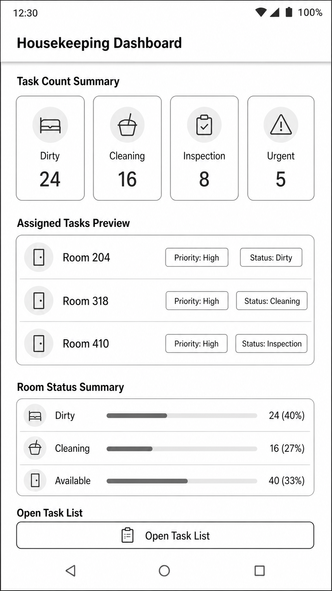

**Figure 3-47: Mobile Flutter Screen Design of Housekeeping Dashboard**

| **#** | **Field / Component Name** | **Type** | **Mandatory** | **Max Length** | **Description** |
| --- | --- | --- | --- | --- | --- |
| 1 | Task Count Summary | Metric Cards | Yes | N/A | Dirty, cleaning, inspection, urgent tasks |
| 2 | Assigned Tasks Preview | List | No | N/A | High priority tasks |
| 3 | Room Status Summary | Component | Yes | N/A | Dirty/cleaning/available summary |
| 4 | Open Task List Action | Button | Yes | N/A | Navigate to task list |

**Table 3-31: Screen Definition of Housekeeping Dashboard**

##### SCR-031 - Housekeeping Task List Screen

**Purpose:** Displays assigned or hotel-level cleaning tasks according to role.

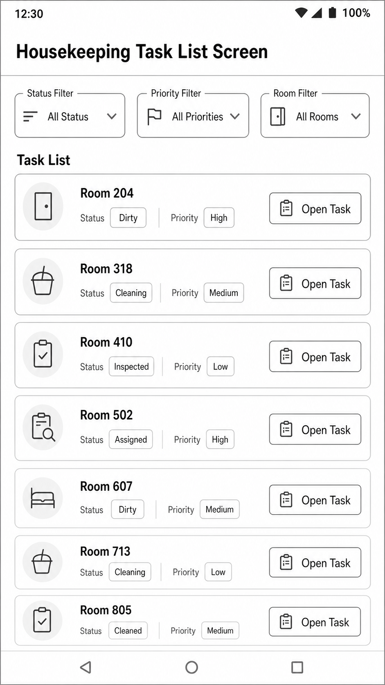

**Figure 3-48: Mobile Flutter Screen Design of Housekeeping Task List Screen**

| **#** | **Field / Component Name** | **Type** | **Mandatory** | **Max Length** | **Description** |
| --- | --- | --- | --- | --- | --- |
| 1 | Task List | Table/Card List | Yes | N/A | Assigned or hotel-level tasks |
| 2 | Status Filter | Filter | No | N/A | Dirty, assigned, cleaning, cleaned, inspected |
| 3 | Priority Filter | Filter | No | N/A | Priority |
| 4 | Room Filter | Filter | No | N/A | Room number/type |
| 5 | Open Task Action | Button | Yes | N/A | Open task detail |

**Table 3-32: Screen Definition of Housekeeping Task List Screen**

##### SCR-032 - Housekeeping Task Detail Screen

**Purpose:** Allows update of cleaning status, checklist, notes, and issue reporting.

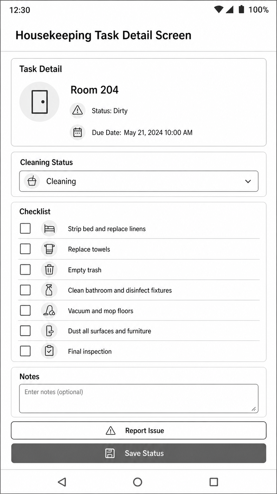

**Figure 3-49: Mobile Flutter Screen Design of Housekeeping Task Detail Screen**

| **#** | **Field / Component Name** | **Type** | **Mandatory** | **Max Length** | **Description** |
| --- | --- | --- | --- | --- | --- |
| 1 | Task Detail | Component | Yes | N/A | Task room, status, checklist, due date |
| 2 | Cleaning Status | Dropdown | Yes | N/A | Open, Assigned, In Progress, Completed, Issue Reported, Cancelled; room status transition shown separately |
| 3 | Checklist | Checklist | No | N/A | Cleaning checklist |
| 4 | Notes | Text Area | No | 500 | Housekeeping notes |
| 5 | Report Issue Button | Button | No | N/A | Open issue reporting |
| 6 | Save Status Button | Button | Yes | N/A | Save status update |
| 7 | Issue Type | Dropdown | Conditional | N/A | Required when reporting a room issue |
| 8 | Issue Severity | Dropdown | Conditional | N/A | Low, medium, high, or out-of-service severity |
| 9 | Issue Description | Text Area | Conditional | 500 | Required issue description |
| 10 | Issue Photo/Note | Attachment/Text | No | N/A | Optional supporting evidence |

**Table 3-33: Screen Definition of Housekeeping Task Detail Screen**

#### Use Case Description

##### Use Case Description - UC-032 View Housekeeping Tasks

| **Use Case ID** | | **UC-032** | **Use Case Name** | | **View Housekeeping Tasks** | |
| --- | --- | --- | --- | --- | --- | --- |
| **Author** | | BA Documentation Assistant | **Version** | 1.2 | **Date** | 2026-06-29 |
| **Actor** | | Housekeeping Staff, Hotel Manager | | | | |
| **Secondary Actor(s)** | | None | | **Feature / Group Function** | Housekeeping | |
| **Description** | | View assigned or hotel-level housekeeping tasks by room, date, priority, and status. | | | | |
| **Precondition** | | Actor authenticated; hotel assignment and task visibility can be validated before list display. | | | | |
| **Trigger** | | Actor opens Housekeeping Task List. | | | | |
| **Post-Condition** | | POS-01: Authorized housekeeping tasks are displayed. | | | | |
| **Main flows** | | | | | | |
| **Step** | **Actor** | **Action** | | | | |
| 1 | **Actor** | opens Housekeeping Task List. | | | | |
| 2 | System | validates actor role, hotel assignment, and task visibility scope. | | | | |
| 3 | System | displays assigned tasks or hotel-level tasks according to role. | | | | |
| 4 | **Actor** | filters by room, date, status, priority, or task type. | | | | |
| 5 | System | refreshes list. | | | | |
| 6 | **Actor** | selects task. | | | | |
| 7 | System | validates selected task access and displays task detail with allowed actions. | | | | |
| **Alternative flows** | | | | | | |
| **Alternative ID** | | AT-UC032-03A | | **Branch from Main Step** | 3 | |
| **Condition** | | No tasks | | | | |
| **Sub step** | **Actor** | **Action** | | | | |
| 3.1 | System | Displays MSG-HK-001. | | | | |
| 3.2 | System | Allows the actor to adjust filters or leave the screen; no records are changed. | | | | |
| **Alternative ID** | | AT-UC032-02A | | **Branch from Main Step** | 2 | |
| **Condition** | | Unauthorized hotel | | | | |
| **Sub step** | **Actor** | **Action** | | | | |
| 2.1 | System | Displays MSG-AUTH-007. | | | | |
| 2.2 | System | Keeps data unchanged and terminates the use case for this actor. | | | | |
| **Business Rules** | | | | | | |
| **#** | **Rule Description** | | | | | |
| BR-HK-001 | After checkout, an assigned physical room shall become Dirty or Cleaning Required before becoming Available again unless explicitly overridden by policy. | | | | | |
| BR-HK-002 | A room may become Available only after required cleaning and/or inspection is completed according to hotel policy. | | | | | |
| BR-STAFF-002 | Hotel staff may access only hotel(s) to which they are assigned. | | | | | |
| BR-STAFF-005 | Housekeeping Staff may view room/task information required for cleaning but shall not access payment, refund, commission, settlement, or full customer personal data. | | | | | |

**Related Application Messages:** MSG-HK-001, MSG-AUTH-007

##### Use Case Description - UC-033 Update Room Cleaning Status

| **Use Case ID** | | **UC-033** | **Use Case Name** | | **Update Room Cleaning Status** | |
| --- | --- | --- | --- | --- | --- | --- |
| **Author** | | BA Documentation Assistant | **Version** | 1.2 | **Date** | 2026-06-29 |
| **Actor** | | Housekeeping Staff, Hotel Manager | | | | |
| **Secondary Actor(s)** | | Notification Service | | **Feature / Group Function** | Housekeeping | |
| **Description** | | Update cleaning task and room cleaning status. | | | | |
| **Precondition** | | Actor authenticated; housekeeping task exists or room requires cleaning, and task access can be validated before detail display. | | | | |
| **Trigger** | | Actor updates cleaning status. | | | | |
| **Post-Condition** | | POS-01: Housekeeping task and room cleaning status are updated according to allowed workflow. | | | | |
| **Main flows** | | | | | | |
| **Step** | **Actor** | **Action** | | | | |
| 1 | **Actor** | opens housekeeping task detail. | | | | |
| 2 | System | validates actor role, hotel assignment, and selected task access before showing task details. | | | | |
| 3 | System | displays room, task status, checklist, notes, and allowed transitions. | | | | |
| 4 | **Actor** | selects new cleaning status and enters notes if required. | | | | |
| 5 | System | validates status transition and permission. | | | | |
| 6 | System | updates housekeeping task. | | | | |
| 7 | System | updates room status according to rule and records RoomStatusHistory. | | | | |
| 8 | System | records audit and sends/records notification if needed. | | | | |
| 9 | System | displays success. | | | | |
| **Alternative flows** | | | | | | |
| **Alternative ID** | | AT-UC033-05A | | **Branch from Main Step** | 5 | |
| **Condition** | | Invalid transition | | | | |
| **Sub step** | **Actor** | **Action** | | | | |
| 5.1 | System | Displays MSG-HK-002. | | | | |
| 5.2 | System | Keeps the record unchanged and terminates the attempted action. | | | | |
| **Alternative ID** | | AT-UC033-04A | | **Branch from Main Step** | 4 | |
| **Condition** | | Issue found | | | | |
| **Sub step** | **Actor** | **Action** | | | | |
| 4.1 | **Actor** | chooses Report Issue instead of completing the cleaning status update. | | | | |
| 4.2 | System | Starts UC-034 when the actor chooses to report the issue; otherwise the cleaning update continues from main flow step 5. | | | | |
| **Alternative ID** | | AT-UC033-07A | | **Branch from Main Step** | 7 | |
| **Condition** | | Inspection required | | | | |
| **Sub step** | **Actor** | **Action** | | | | |
| 7.1 | System | Marks room Inspection Required and records RoomStatusHistory. | | | | |
| 7.2 | System | Routes the room to inspection before it can become Available. | | | | |
| **Alternative ID** | | AT-UC033-02A | | **Branch from Main Step** | 2 | |
| **Condition** | | Unauthorized hotel or task | | | | |
| **Sub step** | **Actor** | **Action** | | | | |
| 2.1 | System | Displays MSG-AUTH-007. | | | | |
| 2.2 | System | Rejects access before displaying task details and terminates the use case for this actor. | | | | |
| **Business Rules** | | | | | | |
| **#** | **Rule Description** | | | | | |
| BR-HK-001 | After checkout, an assigned physical room shall become Dirty or Cleaning Required before becoming Available again unless explicitly overridden by policy. | | | | | |
| BR-HK-002 | A room may become Available only after required cleaning and/or inspection is completed according to hotel policy. | | | | | |
| BR-HK-003 | Housekeeping status transitions shall follow allowed sequence: Dirty -> Cleaning -> Inspection Required or Available. | | | | | |
| BR-STAFF-002 | Hotel staff may access only hotel(s) to which they are assigned. | | | | | |
| BR-STAFF-005 | Housekeeping Staff may view room/task information required for cleaning but shall not access payment, refund, commission, settlement, or full customer personal data. | | | | | |
| BR-AUDIT-001 | Actions that change protected data, booking status, room assignment, room status, staff assignment, housekeeping task, maintenance request, payment collection, refund, commission, reconciliation, settlement, or hotel approval shall be audited. | | | | | |

**Related Application Messages:** MSG-HK-002, MSG-HK-003, MSG-AUTH-007

##### Use Case Description - UC-034 Report Room Issue

| **Use Case ID** | | **UC-034** | **Use Case Name** | | **Report Room Issue** | |
| --- | --- | --- | --- | --- | --- | --- |
| **Author** | | BA Documentation Assistant | **Version** | 1.2 | **Date** | 2026-06-29 |
| **Actor** | | Housekeeping Staff, Receptionist, Hotel Manager | | | | |
| **Secondary Actor(s)** | | Maintenance Staff, Notification Service | | **Feature / Group Function** | Housekeeping | |
| **Description** | | Report room issue and create maintenance request. | | | | |
| **Precondition** | | Actor authenticated; room exists and hotel assignment can be validated before issue form display. | | | | |
| **Trigger** | | Actor selects Report Issue. | | | | |
| **Post-Condition** | | POS-01: Maintenance request is created and room status is updated if issue severity requires blocking. | | | | |
| **Main flows** | | | | | | |
| **Step** | **Actor** | **Action** | | | | |
| 1 | **Actor** | opens room issue report form. | | | | |
| 2 | System | validates actor role, hotel assignment, room access, and issue-report permission before showing room details. | | | | |
| 3 | System | displays room, issue type, severity, description, photo/note fields if enabled. | | | | |
| 4 | **Actor** | enters issue details and submits report. | | | | |
| 5 | System | validates required issue information and hotel assignment. | | | | |
| 6 | System | creates maintenance request. | | | | |
| 7 | System | updates room status to Maintenance or Out of Service if severity requires blocking and records RoomStatusHistory. | | | | |
| 8 | System | notifies/records notification for Maintenance Staff and Hotel Manager. | | | | |
| 9 | System | displays success. | | | | |
| **Alternative flows** | | | | | | |
| **Alternative ID** | | AT-UC034-05A | | **Branch from Main Step** | 5 | |
| **Condition** | | Missing issue details | | | | |
| **Sub step** | **Actor** | **Action** | | | | |
| 5.1 | System | Displays MSG-MAINT-001. | | | | |
| 5.2 | System | Keeps submitted data unchanged and returns the actor to main flow step 4 for correction. | | | | |
| **Alternative ID** | | AT-UC034-07A | | **Branch from Main Step** | 7 | |
| **Condition** | | Low severity issue | | | | |
| **Sub step** | **Actor** | **Action** | | | | |
| 7.1 | System | Creates request without blocking room if policy allows. | | | | |
| 7.2 | System | Keeps room availability unchanged unless policy later requires blocking. | | | | |
| **Alternative ID** | | AT-UC034-02A | | **Branch from Main Step** | 2 | |
| **Condition** | | Unauthorized hotel or room | | | | |
| **Sub step** | **Actor** | **Action** | | | | |
| 2.1 | System | Displays MSG-AUTH-007. | | | | |
| 2.2 | System | Rejects access before displaying room details and terminates the use case for this actor. | | | | |
| **Business Rules** | | | | | | |
| **#** | **Rule Description** | | | | | |
| BR-MAINT-001 | A room under Maintenance or Out of Service shall not be counted as available for booking or room assignment. | | | | | |
| BR-MAINT-002 | A maintenance request must be resolved before the room can return to Available unless authorized manager override is recorded. | | | | | |
| BR-HK-004 | A reported room issue may create a maintenance request and may block room availability depending on severity. | | | | | |
| BR-STAFF-002 | Hotel staff may access only hotel(s) to which they are assigned. | | | | | |
| BR-STAFF-005 | Housekeeping Staff may view room/task information required for cleaning but shall not access payment, refund, commission, settlement, or full customer personal data. | | | | | |
| BR-AUDIT-001 | Actions that change protected data, booking status, room assignment, room status, staff assignment, housekeeping task, maintenance request, payment collection, refund, commission, reconciliation, settlement, or hotel approval shall be audited. | | | | | |

**Related Application Messages:** MSG-MAINT-001, MSG-MAINT-002, MSG-AUTH-007

### 3.2.10 FEAT-MAINTENANCE - Maintenance Operation

#### Purpose

This feature supports maintenance request handling, status updates, and room release after repair.

#### Screen Mock-up and Screen Definition

##### SCR-033 - Maintenance Request List Screen

**Purpose:** Displays maintenance requests by room, status, severity, priority, and assignee.

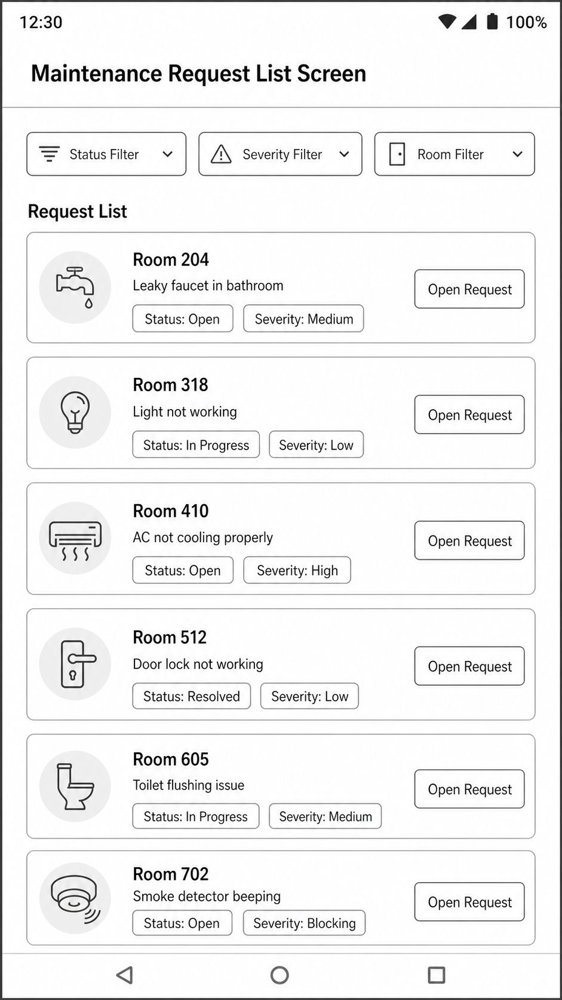

**Figure 3-50: Mobile Flutter Screen Design of Maintenance Request List Screen**

| **#** | **Field / Component Name** | **Type** | **Mandatory** | **Max Length** | **Description** |
| --- | --- | --- | --- | --- | --- |
| 1 | Request List | Table/Card List | Yes | N/A | Maintenance requests |
| 2 | Status Filter | Filter | No | N/A | Open, Assigned, In Progress, On Hold, Completed, Resolved |
| 3 | Severity Filter | Filter | No | N/A | Low, medium, high, blocking |
| 4 | Room Filter | Filter | No | N/A | Physical room |
| 5 | Open Request Action | Button | Yes | N/A | Open request detail |

**Table 3-34: Screen Definition of Maintenance Request List Screen**

##### SCR-034 - Maintenance Request Detail Screen

**Purpose:** Allows update of maintenance status, notes, assignee, and room release.

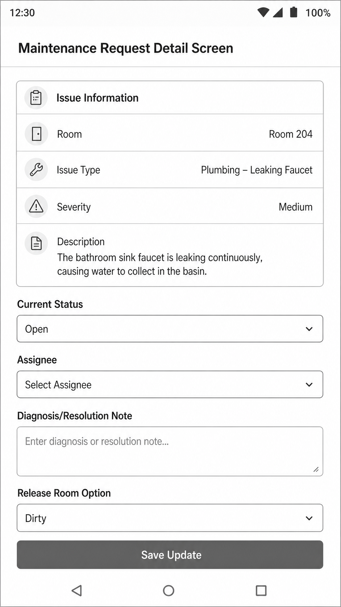

**Figure 3-51: Mobile Flutter Screen Design of Maintenance Request Detail Screen**

| **#** | **Field / Component Name** | **Type** | **Mandatory** | **Max Length** | **Description** |
| --- | --- | --- | --- | --- | --- |
| 1 | Issue Information | Component | Yes | N/A | Room, issue type, severity, description |
| 2 | Current Status | Dropdown | Yes | N/A | Request status |
| 3 | Assignee | Dropdown | No | N/A | Maintenance staff assignee |
| 4 | Diagnosis/Resolution Note | Text Area | Conditional | 1000 | Required for completion |
| 5 | Release Room Option | Action/Dropdown | Conditional | N/A | Return room to Dirty, Inspection Required, or Available path |
| 6 | Save Update Button | Button | Yes | N/A | Save maintenance update |

**Table 3-35: Screen Definition of Maintenance Request Detail Screen**

#### Use Case Description

##### Use Case Description - UC-035 View Maintenance Requests

| **Use Case ID** | | **UC-035** | **Use Case Name** | | **View Maintenance Requests** | |
| --- | --- | --- | --- | --- | --- | --- |
| **Author** | | BA Documentation Assistant | **Version** | 1.2 | **Date** | 2026-06-29 |
| **Actor** | | Maintenance Staff, Hotel Manager | | | | |
| **Secondary Actor(s)** | | None | | **Feature / Group Function** | Maintenance | |
| **Description** | | View open, assigned, and resolved maintenance requests for assigned hotels. | | | | |
| **Precondition** | | Actor authenticated; hotel assignment and maintenance visibility can be validated before list display. | | | | |
| **Trigger** | | Actor opens Maintenance Request List. | | | | |
| **Post-Condition** | | POS-01: Authorized maintenance requests are displayed. | | | | |
| **Main flows** | | | | | | |
| **Step** | **Actor** | **Action** | | | | |
| 1 | **Actor** | opens Maintenance Request List. | | | | |
| 2 | System | validates actor role, hotel assignment, and maintenance visibility scope. | | | | |
| 3 | System | displays requests by room, severity, status, assignee, and date. | | | | |
| 4 | **Actor** | filters or selects request. | | | | |
| 5 | System | validates selected request access and displays request detail with allowed actions. | | | | |
| **Alternative flows** | | | | | | |
| **Alternative ID** | | AT-UC035-03A | | **Branch from Main Step** | 3 | |
| **Condition** | | No request | | | | |
| **Sub step** | **Actor** | **Action** | | | | |
| 3.1 | System | Displays MSG-MAINT-003. | | | | |
| 3.2 | System | Allows the actor to adjust filters or leave the screen; no records are changed. | | | | |
| **Alternative ID** | | AT-UC035-02A | | **Branch from Main Step** | 2 | |
| **Condition** | | Unauthorized hotel | | | | |
| **Sub step** | **Actor** | **Action** | | | | |
| 2.1 | System | Displays MSG-AUTH-007. | | | | |
| 2.2 | System | Keeps data unchanged and terminates the use case for this actor. | | | | |
| **Business Rules** | | | | | | |
| **#** | **Rule Description** | | | | | |
| BR-MAINT-001 | A room under Maintenance or Out of Service shall not be counted as available for booking or room assignment. | | | | | |
| BR-STAFF-002 | Hotel staff may access only hotel(s) to which they are assigned. | | | | | |
| BR-STAFF-006 | Maintenance Staff may view maintenance information required for repair but shall not access customer payment, refund, commission, settlement, or full customer personal data. | | | | | |

**Related Application Messages:** MSG-MAINT-003, MSG-AUTH-007

##### Use Case Description - UC-036 Update Maintenance Request

| **Use Case ID** | | **UC-036** | **Use Case Name** | | **Update Maintenance Request** | |
| --- | --- | --- | --- | --- | --- | --- |
| **Author** | | BA Documentation Assistant | **Version** | 1.2 | **Date** | 2026-06-29 |
| **Actor** | | Maintenance Staff, Hotel Manager | | | | |
| **Secondary Actor(s)** | | Notification Service | | **Feature / Group Function** | Maintenance | |
| **Description** | | Update diagnosis, work status, note, and completion result. | | | | |
| **Precondition** | | Actor authenticated/assigned; maintenance request exists. | | | | |
| **Trigger** | | Actor updates maintenance request detail. | | | | |
| **Post-Condition** | | POS-01: Maintenance request status, notes, or completion result is updated and audited. | | | | |
| **Main flows** | | | | | | |
| **Step** | **Actor** | **Action** | | | | |
| 1 | **Actor** | opens maintenance request detail. | | | | |
| 2 | System | validates actor role, hotel assignment, and selected request access before showing request details. | | | | |
| 3 | System | displays room, issue information, current status, assignee, priority, notes, and allowed transitions. | | | | |
| 4 | **Actor** | updates diagnosis, status, note, assignee, or completion information. | | | | |
| 5 | System | validates status transition and permission. | | | | |
| 6 | System | updates maintenance request. | | | | |
| 7 | System | records audit and sends/records notification if required. | | | | |
| 8 | System | displays success. | | | | |
| **Alternative flows** | | | | | | |
| **Alternative ID** | | AT-UC036-05A | | **Branch from Main Step** | 5 | |
| **Condition** | | Invalid transition | | | | |
| **Sub step** | **Actor** | **Action** | | | | |
| 5.1 | System | Displays MSG-MAINT-004. | | | | |
| 5.2 | System | Keeps the record unchanged and terminates the attempted action. | | | | |
| **Alternative ID** | | AT-UC036-05B | | **Branch from Main Step** | 5 | |
| **Condition** | | Missing completion note | | | | |
| **Sub step** | **Actor** | **Action** | | | | |
| 5.1 | System | Displays MSG-MAINT-005. | | | | |
| 5.2 | System | Keeps submitted data unchanged and returns the actor to main flow step 4 for correction. | | | | |
| **Alternative ID** | | AT-UC036-02A | | **Branch from Main Step** | 2 | |
| **Condition** | | Unauthorized hotel or request | | | | |
| **Sub step** | **Actor** | **Action** | | | | |
| 2.1 | System | Displays MSG-AUTH-007. | | | | |
| 2.2 | System | Rejects access before displaying request details and terminates the use case for this actor. | | | | |
| **Business Rules** | | | | | | |
| **#** | **Rule Description** | | | | | |
| BR-MAINT-001 | A room under Maintenance or Out of Service shall not be counted as available for booking or room assignment. | | | | | |
| BR-MAINT-002 | A maintenance request must be resolved before the room can return to Available unless authorized manager override is recorded. | | | | | |
| BR-STAFF-002 | Hotel staff may access only hotel(s) to which they are assigned. | | | | | |
| BR-STAFF-006 | Maintenance Staff may view maintenance information required for repair but shall not access customer payment, refund, commission, settlement, or full customer personal data. | | | | | |
| BR-AUDIT-001 | Actions that change protected data, booking status, room assignment, room status, staff assignment, housekeeping task, maintenance request, payment collection, refund, commission, reconciliation, settlement, or hotel approval shall be audited. | | | | | |

**Related Application Messages:** MSG-MAINT-004, MSG-MAINT-005, MSG-MAINT-006, MSG-AUTH-007

##### Use Case Description - UC-037 Release Room from Maintenance

| **Use Case ID** | | **UC-037** | **Use Case Name** | | **Release Room from Maintenance** | |
| --- | --- | --- | --- | --- | --- | --- |
| **Author** | | BA Documentation Assistant | **Version** | 1.2 | **Date** | 2026-06-29 |
| **Actor** | | Maintenance Staff, Hotel Manager | | | | |
| **Secondary Actor(s)** | | Housekeeping Staff, Notification Service | | **Feature / Group Function** | Maintenance | |
| **Description** | | Mark maintenance completed and return the room to cleaning/available path according to room status rule. | | | | |
| **Precondition** | | Actor authenticated/assigned; maintenance request exists and may be ready for release. | | | | |
| **Trigger** | | The actor selects the Release Room. | | | | |
| **Post-Condition** | | POS-01: Room is released from maintenance to Dirty, Inspection Required, or Available according to policy, and follow-up housekeeping task is created if required. | | | | |
| **Main flows** | | | | | | |
| **Step** | **Actor** | **Action** | | | | |
| 1 | **Actor** | opens completed maintenance request detail. | | | | |
| 2 | System | validates actor role, hotel assignment, request access, and room release permission before showing release options. | | | | |
| 3 | System | displays room status, completion information, and release options. | | | | |
| 4 | **Actor** | confirms release and selects next room status if required. | | | | |
| 5 | System | validates maintenance completion and permission. | | | | |
| 6 | System | updates maintenance request as Resolved if not already. | | | | |
| 7 | System | updates room status to Dirty, Inspection Required, or Available according to policy and records RoomStatusHistory. | | | | |
| 8 | System | creates a housekeeping task if cleaning/inspection is required. | | | | |
| 9 | System | records audit and sends/records notification. | | | | |
| 10 | System | displays success. | | | | |
| **Alternative flows** | | | | | | |
| **Alternative ID** | | AT-UC037-05A | | **Branch from Main Step** | 5 | |
| **Condition** | | Maintenance not complete | | | | |
| **Sub step** | **Actor** | **Action** | | | | |
| 5.1 | System | Displays MSG-MAINT-007. | | | | |
| 5.2 | System | Keeps the record unchanged and terminates the attempted action. | | | | |
| **Alternative ID** | | AT-UC037-05B | | **Branch from Main Step** | 5 | |
| **Condition** | | Manager approval required | | | | |
| **Sub step** | **Actor** | **Action** | | | | |
| 5.1 | System | Displays MSG-MAINT-008. | | | | |
| 5.2 | System | Keeps the record unchanged and terminates the attempted action. | | | | |
| **Alternative ID** | | AT-UC037-02A | | **Branch from Main Step** | 2 | |
| **Condition** | | Unauthorized hotel, request, or room | | | | |
| **Sub step** | **Actor** | **Action** | | | | |
| 2.1 | System | Displays MSG-AUTH-007. | | | | |
| 2.2 | System | Rejects access before displaying room release details and terminates the use case for this actor. | | | | |
| **Business Rules** | | | | | | |
| **#** | **Rule Description** | | | | | |
| BR-MAINT-002 | A maintenance request must be resolved before the room can return to Available unless authorized manager override is recorded. | | | | | |
| BR-HK-002 | A room may become Available only after required cleaning and/or inspection is completed according to hotel policy. | | | | | |
| BR-ROOM-006 | Physical room lifecycle status shall not be directly edited; status changes must use allowed lifecycle actions, conflict validation, audit, and RoomStatusHistory. | | | | | |
| BR-STAFF-002 | Hotel staff may access only hotel(s) to which they are assigned. | | | | | |
| BR-STAFF-006 | Maintenance Staff may view maintenance information required for repair but shall not access customer payment, refund, commission, settlement, or full customer personal data. | | | | | |
| BR-AUDIT-001 | Actions that change protected data, booking status, room assignment, room status, staff assignment, housekeeping task, maintenance request, payment collection, refund, commission, reconciliation, settlement, or hotel approval shall be audited. | | | | | |

**Related Application Messages:** MSG-MAINT-007, MSG-MAINT-008, MSG-MAINT-009, MSG-AUTH-007

### 3.2.11 FEAT-ADMIN-APPROVAL - Platform Hotel Approval

#### Purpose

This feature allows Platform Administrator to review, approve, or reject submitted hotel properties before marketplace publication.

#### Screen Mock-up and Screen Definition

##### SCR-037 - Hotel Approval Screen

**Purpose:** Allows Platform Administrator to approve or reject submitted hotels.

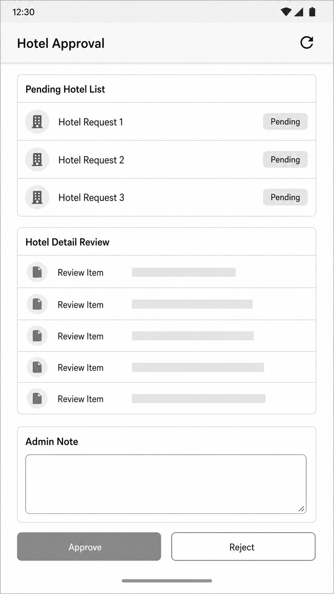

**Figure 3-52: Mobile Flutter Screen Design of Hotel Approval Screen**

| **#** | **Field / Component Name** | **Type** | **Mandatory** | **Max Length** | **Description** |
| --- | --- | --- | --- | --- | --- |
| 1 | Pending Hotel List | Table | Yes | N/A | Submitted hotels |
| 2 | Hotel Detail Review | Component | Yes | N/A | Profile, images, amenities, policy, owner info |
| 3 | Admin Note | Text Area | Conditional | 500 | Required when rejecting |
| 4 | Approve Button | Button | Yes | N/A | Approve hotel |
| 5 | Reject Button | Button | Yes | N/A | Reject hotel with reason |

**Table 3-36: Screen Definition of Hotel Approval Screen**

#### Use Case Description

##### Use Case Description - UC-018 Approve Hotel Property

| **Use Case ID** | | **UC-018** | **Use Case Name** | | **Approve Hotel Property** | |
| --- | --- | --- | --- | --- | --- | --- |
| **Author** | | BA Documentation Assistant | **Version** | 1.2 | **Date** | 2026-06-29 |
| **Actor** | | Platform Administrator | | | | |
| **Secondary Actor(s)** | | Notification Service | | **Feature / Group Function** | Platform Approval | |
| **Description** | | Approve or reject submitted hotel properties. | | | | |
| **Precondition** | | Platform Administrator authenticated; hotel submission exists. | | | | |
| **Trigger** | | Admin opens Hotel Approval. | | | | |
| **Post-Condition** | | POS-01: Hotel approval status is updated and marketplace visibility follows the new approval state. | | | | |
| **Main flows** | | | | | | |
| **Step** | **Actor** | **Action** | | | | |
| 1 | Platform Administrator | Admin opens Hotel Approval Screen. | | | | |
| 2 | System | displays pending hotel submissions. | | | | |
| 3 | Platform Administrator | Admin selects a hotel. | | | | |
| 4 | System | displays submitted hotel data, images, amenities, policies, owner info, and review notes. | | | | |
| 5 | Platform Administrator | Admin approves/rejects and enters reason if required. | | | | |
| 6 | System | validates decision. | | | | |
| 7 | System | updates status and records audit. | | | | |
| 8 | System | sends/records owner notification. | | | | |
| 9 | System | displays success. | | | | |
| **Alternative flows** | | | | | | |
| **Alternative ID** | | AT-UC018-06A | | **Branch from Main Step** | 6 | |
| **Condition** | | Missing rejection reason | | | | |
| **Sub step** | **Actor** | **Action** | | | | |
| 6.1 | System | Displays MSG-ADMIN-003. | | | | |
| 6.2 | System | Keeps submitted data unchanged and returns the actor to main flow step 5 for correction. | | | | |
| **Alternative ID** | | AT-UC018-06B | | **Branch from Main Step** | 6 | |
| **Condition** | | Already reviewed | | | | |
| **Sub step** | **Actor** | **Action** | | | | |
| 6.1 | System | Displays MSG-ADMIN-004 and refreshes status. | | | | |
| 6.2 | System | Keeps the record unchanged and terminates the attempted action. | | | | |
| **Business Rules** | | | | | | |
| **#** | **Rule Description** | | | | | |
| BR-MKT-001 | Only approved, active, and publicly available hotels shall appear in marketplace search results and hotel detail pages. | | | | | |
| BR-ADMIN-001 | Platform Administrator may approve or reject hotel submissions; rejection requires a reason. | | | | | |
| BR-AUDIT-001 | Actions that change protected data, booking status, room assignment, room status, staff assignment, housekeeping task, maintenance request, payment collection, refund, commission, reconciliation, settlement, or hotel approval shall be audited. | | | | | |

**Related Application Messages:** MSG-ADMIN-001, MSG-ADMIN-003, MSG-ADMIN-004

### 3.2.12 FEAT-ADMIN-FINANCE - Platform Finance Administration

#### Purpose

This feature supports platform finance operations: commission configuration, payment reconciliation, refund status processing, and settlement/collection marking.

#### Screen Mock-up and Screen Definition

##### SCR-038 - Commission Management Screen

**Purpose:** Allows Platform Administrator to configure commission rate per hotel.

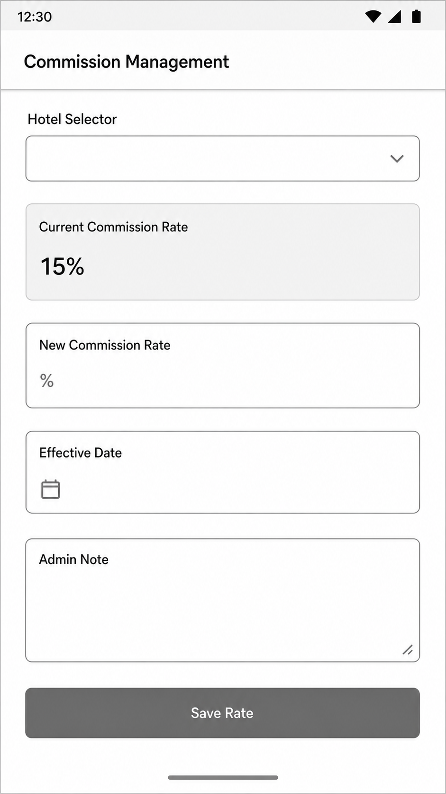

**Figure 3-53: Mobile Flutter Screen Design of Commission Management Screen**

| **#** | **Field / Component Name** | **Type** | **Mandatory** | **Max Length** | **Description** |
| --- | --- | --- | --- | --- | --- |
| 1 | Hotel Selector | Dropdown/Search | Yes | N/A | Approved hotel |
| 2 | Current Commission Rate | Label | Yes | N/A | Current rate |
| 3 | New Commission Rate | Number/Percent | Yes | N/A | New rate within allowed range |
| 4 | Effective Date | Date | No | N/A | Future effective date if supported |
| 5 | Admin Note | Text Area | No | 500 | Reason for change |
| 6 | Save Rate Button | Button | Yes | N/A | Save commission rate |

**Table 3-37: Screen Definition of Commission Management Screen**

##### SCR-039 - Payment Reconciliation Screen

**Purpose:** Allows Platform Administrator to review and mark payment reconciliation status.

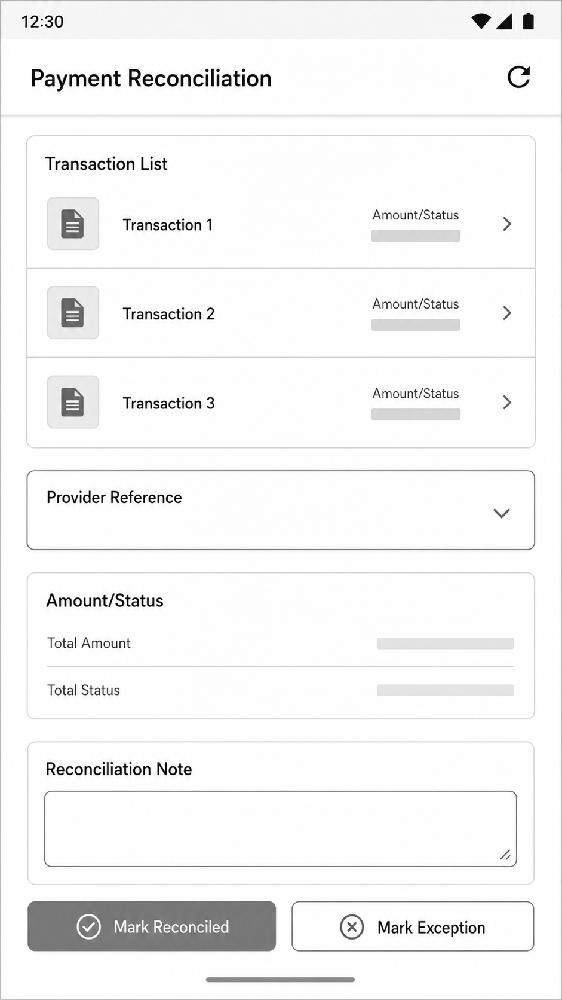

**Figure 3-54: Mobile Flutter Screen Design of Payment Reconciliation Screen**

| **#** | **Field / Component Name** | **Type** | **Mandatory** | **Max Length** | **Description** |
| --- | --- | --- | --- | --- | --- |
| 1 | Transaction List | Table | Yes | N/A | Payment transactions |
| 2 | Provider Reference | Label/Search | No | N/A | payOS reference |
| 3 | Amount/Status | Component | Yes | N/A | Payment status and amount |
| 4 | Reconciliation Note | Text Area | Conditional | 500 | Required for exception |
| 5 | Mark Reconciled Button | Button | Yes | N/A | Set reconciled |
| 6 | Mark Exception Button | Button | Yes | N/A | Set exception |

**Table 3-38: Screen Definition of Payment Reconciliation Screen**

##### SCR-040 - Refund Management Screen

**Purpose:** Allows Platform Administrator to approve, reject, or mark manual refund processing status.

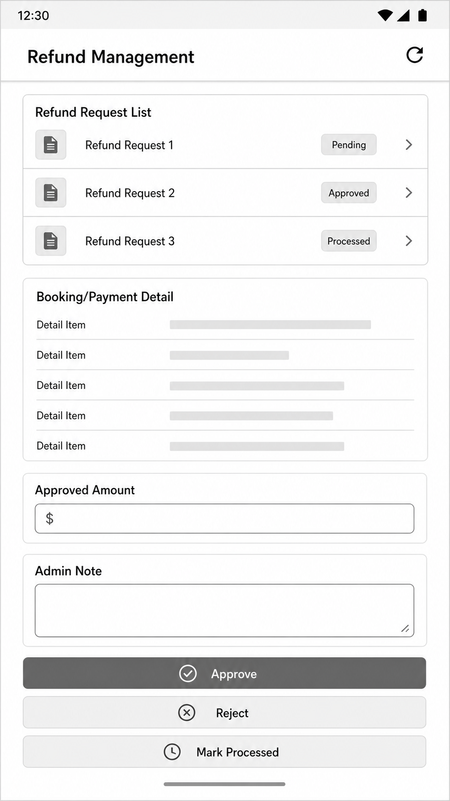

**Figure 3-55: Mobile Flutter Screen Design of Refund Management Screen**

| **#** | **Field / Component Name** | **Type** | **Mandatory** | **Max Length** | **Description** |
| --- | --- | --- | --- | --- | --- |
| 1 | Refund Request List | Table | Yes | N/A | Refund records |
| 2 | Booking/Payment Detail | Component | Yes | N/A | Policy, paid amount, requested refund |
| 3 | Approved Amount | Currency | Conditional | N/A | Approved refund amount |
| 4 | Admin Note | Text Area | Conditional | 500 | Required for rejection/exception |
| 5 | Approve/Reject/Mark Processed Actions | Buttons | Yes | N/A | Process manual refund status |

**Table 3-39: Screen Definition of Refund Management Screen**

##### SCR-041 - Settlement Management Screen

**Purpose:** Allows Platform Administrator to mark hotel settlement or commission collection.

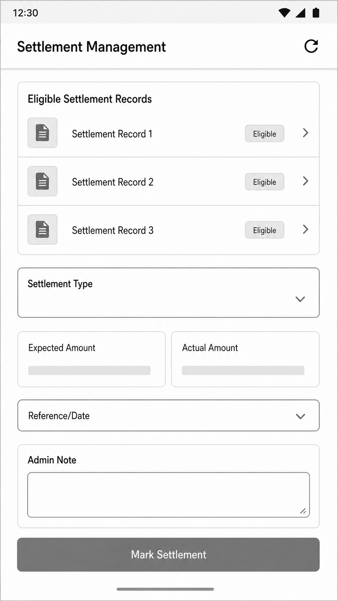

**Figure 3-56: Mobile Flutter Screen Design of Settlement Management Screen**

| **#** | **Field / Component Name** | **Type** | **Mandatory** | **Max Length** | **Description** |
| --- | --- | --- | --- | --- | --- |
| 1 | Eligible Settlement Records | Table | Yes | N/A | Hotel payable or commission receivable records |
| 2 | Settlement Type | Dropdown | Yes | N/A | Hotel settlement or commission collection |
| 3 | Expected Amount | Label | Yes | N/A | System expected amount |
| 4 | Actual Amount | Currency | Yes | N/A | Amount settled/collected |
| 5 | Reference/Date | Text/Date | Yes | 100 | Manual reference and date |
| 6 | Admin Note | Text Area | No | 500 | Optional note |
| 7 | Exception Reason | Text Area | Conditional | 500 | Required when amount mismatch or exception handling is selected |
| 8 | Mark Settlement Button | Button | Yes | N/A | Record settlement/collection |

**Table 3-40: Screen Definition of Settlement Management Screen**

#### Use Case Description

##### Use Case Description - UC-019 Manage Commission Rate

| **Use Case ID** | | **UC-019** | **Use Case Name** | | **Manage Commission Rate** | |
| --- | --- | --- | --- | --- | --- | --- |
| **Author** | | BA Documentation Assistant | **Version** | 1.2 | **Date** | 2026-06-29 |
| **Actor** | | Platform Administrator | | | | |
| **Secondary Actor(s)** | | None | | **Feature / Group Function** | Platform Finance | |
| **Description** | | Set commission rate per approved hotel. | | | | |
| **Precondition** | | Platform Administrator authenticated; hotel exists. | | | | |
| **Trigger** | | Admin opens Commission Management. | | | | |
| **Post-Condition** | | POS-01: Commission rate is saved for future booking snapshots. | | | | |
| **Main flows** | | | | | | |
| **Step** | **Actor** | **Action** | | | | |
| 1 | Platform Administrator | Admin opens Commission Management. | | | | |
| 2 | System | displays hotels and current rates. | | | | |
| 3 | Platform Administrator | Admin selects hotel and enters new rate/note/effective date. | | | | |
| 4 | System | validates rate range and effective date. | | | | |
| 5 | System | records rate for future bookings. | | | | |
| 6 | System | preserves existing booking snapshots. | | | | |
| 7 | System | records audit and displays success. | | | | |
| **Alternative flows** | | | | | | |
| **Alternative ID** | | AT-UC019-04A | | **Branch from Main Step** | 4 | |
| **Condition** | | Invalid rate | | | | |
| **Sub step** | **Actor** | **Action** | | | | |
| 4.1 | System | Displays MSG-FIN-002. | | | | |
| 4.2 | System | Keeps submitted data unchanged and returns the actor to main flow step 3 for correction. | | | | |
| **Alternative ID** | | AT-UC019-04B | | **Branch from Main Step** | 4 | |
| **Condition** | | Hotel not approved | | | | |
| **Sub step** | **Actor** | **Action** | | | | |
| 4.1 | System | Displays MSG-ADMIN-005. | | | | |
| 4.2 | System | Keeps the record unchanged and terminates the attempted action. | | | | |
| **Business Rules** | | | | | | |
| **#** | **Rule Description** | | | | | |
| BR-FIN-001 | Commission amount shall be calculated from the booking amount and commission rate snapshot captured at booking confirmation. | | | | | |
| BR-ADMIN-002 | Commission rate updates apply to future booking snapshots and shall not alter historical booking snapshots. | | | | | |
| BR-AUDIT-001 | Actions that change protected data, booking status, room assignment, room status, staff assignment, housekeeping task, maintenance request, payment collection, refund, commission, reconciliation, settlement, or hotel approval shall be audited. | | | | | |

**Related Application Messages:** MSG-FIN-002, MSG-ADMIN-002, MSG-ADMIN-005

##### Use Case Description - UC-020 Reconcile Payment

| **Use Case ID** | | **UC-020** | **Use Case Name** | | **Reconcile Payment** | |
| --- | --- | --- | --- | --- | --- | --- |
| **Author** | | BA Documentation Assistant | **Version** | 1.2 | **Date** | 2026-06-29 |
| **Actor** | | Platform Administrator | | | | |
| **Secondary Actor(s)** | | payOS Payment Gateway | | **Feature / Group Function** | Platform Finance | |
| **Description** | | Review payment transaction status and mark reconciliation result. | | | | |
| **Precondition** | | Platform Administrator authenticated; payment transaction exists. | | | | |
| **Trigger** | | Admin opens Payment Reconciliation. | | | | |
| **Post-Condition** | | POS-01: Payment transaction reconciliation status is updated and audit is recorded. | | | | |
| **Main flows** | | | | | | |
| **Step** | **Actor** | **Action** | | | | |
| 1 | Platform Administrator | Admin opens Payment Reconciliation. | | | | |
| 2 | System | displays transactions with filters. | | | | |
| 3 | Platform Administrator | Admin selects transaction. | | | | |
| 4 | System | displays payment, booking, provider reference, amount, and reconciliation status. | | | | |
| 5 | Platform Administrator | Admin marks Reconciled or Exception and enters note if required. | | | | |
| 6 | System | validates decision, required note, current reconciliation state, and duplicate/concurrent update guard. | | | | |
| 7 | System | records reconciliation status and audit if the transaction is still eligible for update. | | | | |
| 8 | System | displays success. | | | | |
| **Alternative flows** | | | | | | |
| **Alternative ID** | | AT-UC020-06A | | **Branch from Main Step** | 6 | |
| **Condition** | | Amount/status mismatch | | | | |
| **Sub step** | **Actor** | **Action** | | | | |
| 6.1 | System | Allows Exception with note. | | | | |
| 6.2 | System | Requires an exception note or corrected decision before reconciliation resumes at main flow step 5. | | | | |
| **Alternative ID** | | AT-UC020-06B | | **Branch from Main Step** | 6 | |
| **Condition** | | Duplicate reconciliation action or already reconciled transaction | | | | |
| **Sub step** | **Actor** | **Action** | | | | |
| 6.1 | System | Detects that the reconciliation state has already been finalized or concurrently updated. | | | | |
| 6.2 | System | Keeps the existing reconciliation result, prevents duplicate counting, and displays the current transaction state. | | | | |
| **Business Rules** | | | | | | |
| **#** | **Rule Description** | | | | | |
| BR-PAY-003 | Duplicate payment notifications shall not create duplicate successful payment or commission records. | | | | | |
| BR-FIN-002 | Platform Collect hotel payable shall consider paid amount, refund amount, and commission amount. | | | | | |
| BR-ADMIN-003 | Payment reconciliation exceptions require an admin note. | | | | | |
| BR-AUDIT-001 | Actions that change protected data, booking status, room assignment, room status, staff assignment, housekeeping task, maintenance request, payment collection, refund, commission, reconciliation, settlement, or hotel approval shall be audited. | | | | | |

**Related Application Messages:** MSG-FIN-003, MSG-FIN-004

##### Use Case Description - UC-021 Process Refund Status

| **Use Case ID** | | **UC-021** | **Use Case Name** | | **Process Refund Status** | |
| --- | --- | --- | --- | --- | --- | --- |
| **Author** | | BA Documentation Assistant | **Version** | 1.2 | **Date** | 2026-06-29 |
| **Actor** | | Platform Administrator | | | | |
| **Secondary Actor(s)** | | Customer, Notification Service | | **Feature / Group Function** | Platform Finance | |
| **Description** | | Record manual refund decision and refund status. | | | | |
| **Precondition** | | Platform Administrator authenticated; RefundRecord exists. | | | | |
| **Trigger** | | Admin opens Refund Management. | | | | |
| **Post-Condition** | | POS-01: Refund status is updated and customer-visible refund status changes accordingly. | | | | |
| **Main flows** | | | | | | |
| **Step** | **Actor** | **Action** | | | | |
| 1 | Platform Administrator | Admin opens Refund Management. | | | | |
| 2 | System | displays refund request list. | | | | |
| 3 | Platform Administrator | Admin selects refund. | | | | |
| 4 | System | displays booking, payment, policy, paid amount, requested amount, and current refund status. | | | | |
| 5 | Platform Administrator | Admin approves/rejects/marks processed and enters amount/note if required. | | | | |
| 6 | System | validates amount and transition. | | | | |
| 7 | System | updates refund status and records audit. | | | | |
| 8 | System | sends/records Customer notification. | | | | |
| 9 | System | displays success. | | | | |
| **Alternative flows** | | | | | | |
| **Alternative ID** | | AT-UC021-06A | | **Branch from Main Step** | 6 | |
| **Condition** | | Invalid transition | | | | |
| **Sub step** | **Actor** | **Action** | | | | |
| 6.1 | System | Displays MSG-REF-003. | | | | |
| 6.2 | System | Keeps the record unchanged and terminates the attempted action. | | | | |
| **Alternative ID** | | AT-UC021-06B | | **Branch from Main Step** | 6 | |
| **Condition** | | Amount exceeds paid amount | | | | |
| **Sub step** | **Actor** | **Action** | | | | |
| 6.1 | System | Displays MSG-REF-004. | | | | |
| 6.2 | System | Keeps submitted data unchanged and returns the actor to main flow step 5 for correction. | | | | |
| **Business Rules** | | | | | | |
| **#** | **Rule Description** | | | | | |
| BR-REF-001 | Refund eligibility shall be determined based on booking status, payment status, payment mode, and cancellation policy. | | | | | |
| BR-REF-002 | Manual refund processing status shall be recorded by Platform Administrator in MVP+Staff scope. | | | | | |
| BR-FIN-002 | Platform Collect hotel payable shall consider paid amount, refund amount, and commission amount. | | | | | |
| BR-AUDIT-001 | Actions that change protected data, booking status, room assignment, room status, staff assignment, housekeeping task, maintenance request, payment collection, refund, commission, reconciliation, settlement, or hotel approval shall be audited. | | | | | |

**Related Application Messages:** MSG-REF-001, MSG-REF-003, MSG-REF-004

##### Use Case Description - UC-022 Mark Settlement

| **Use Case ID** | | **UC-022** | **Use Case Name** | | **Mark Settlement** | |
| --- | --- | --- | --- | --- | --- | --- |
| **Author** | | BA Documentation Assistant | **Version** | 1.2 | **Date** | 2026-06-29 |
| **Actor** | | Platform Administrator | | | | |
| **Secondary Actor(s)** | | Property Owner, Notification Service | | **Feature / Group Function** | Platform Finance | |
| **Description** | | Mark hotel payable settlement or commission collection as completed. | | | | |
| **Precondition** | | Platform Administrator authenticated; settlement or commission candidate records exist. | | | | |
| **Trigger** | | Admin opens Settlement Management. | | | | |
| **Post-Condition** | | POS-01: Settlement or commission collection status is updated and notification/audit is recorded. | | | | |
| **Main flows** | | | | | | |
| **Step** | **Actor** | **Action** | | | | |
| 1 | Platform Administrator | Admin opens Settlement Management. | | | | |
| 2 | System | calculates eligibility by Settlement Type: Hotel Settlement uses Platform Collect reconciliation/refund/stay status, while Commission Collection uses CommissionRecord and Pay-at-Property collection/receivable status without requiring payOS reconciliation. | | | | |
| 3 | System | displays eligible hotel settlement records and eligible commission collection records only. | | | | |
| 4 | Platform Administrator | Admin selects record/batch. | | | | |
| 5 | System | displays expected amount, settlement type, related items, hotel, applicable reconciliation/refund/commission/collection state, exception state, and current settlement status. | | | | |
| 6 | Platform Administrator | Admin enters settlement date, amount, reference, and note. | | | | |
| 7 | System | validates selected settlement type eligibility, amount, required reference/date, applicable unresolved refund/reconciliation/commission/collection state, and exception state. | | | | |
| 8 | System | records settlement/collection status and audit. | | | | |
| 9 | System | sends/records Property Owner notification. | | | | |
| 10 | System | displays success. | | | | |
| **Alternative flows** | | | | | | |
| **Alternative ID** | | AT-UC022-07A | | **Branch from Main Step** | 7 | |
| **Condition** | | Ineligible record | | | | |
| **Sub step** | **Actor** | **Action** | | | | |
| 7.1 | System | Displays MSG-FIN-005. | | | | |
| 7.2 | System | Keeps the record unchanged and terminates the attempted action. | | | | |
| **Alternative ID** | | AT-UC022-07B | | **Branch from Main Step** | 7 | |
| **Condition** | | Amount mismatch | | | | |
| **Sub step** | **Actor** | **Action** | | | | |
| 7.1 | System | Displays MSG-FIN-006 unless exception handling is allowed. | | | | |
| 7.2 | System | Requires corrected amount or allowed exception handling before settlement resumes at main flow step 6. | | | | |
| **Alternative ID** | | AT-UC022-07C | | **Branch from Main Step** | 7 | |
| **Condition** | | Missing settlement date or reference | | | | |
| **Sub step** | **Actor** | **Action** | | | | |
| 7.1 | System | Displays MSG-FIN-007. | | | | |
| 7.2 | System | Keeps submitted data unchanged and returns the actor to main flow step 6 for correction. | | | | |
| **Alternative ID** | | AT-UC022-07D | | **Branch from Main Step** | 7 | |
| **Condition** | | Unresolved required prerequisite or finance exception | | | | |
| **Sub step** | **Actor** | **Action** | | | | |
| 7.1 | System | Displays MSG-FIN-005 and identifies the unresolved blocker for the selected settlement type. | | | | |
| 7.2 | System | Keeps the record Not Eligible or Exception until the settlement-type-specific blocker is resolved. | | | | |
| **Business Rules** | | | | | | |
| **#** | **Rule Description** | | | | | |
| BR-FIN-002 | Platform Collect hotel payable shall consider paid amount, refund amount, and commission amount. | | | | | |
| BR-FIN-003 | Pay at Property booking shall create commission receivable owed by hotel to platform. | | | | | |
| BR-FIN-005 | Settlement and commission collection shall be manually marked by Platform Administrator in MVP+Staff scope. | | | | | |
| BR-FIN-007 | Settlement eligibility shall be evaluated by settlement type: Platform Collect hotel settlement requires reconciled/non-exception payment, resolved refund outcome, no unresolved finance exception, and an eligible financial stay/cancellation/no-show state; Pay-at-Property commission collection requires a valid receivable CommissionRecord, applicable collection/booking status, and no unresolved finance exception, but does not require payOS reconciliation. | | | | | |
| BR-AUDIT-001 | Actions that change protected data, booking status, room assignment, room status, staff assignment, housekeeping task, maintenance request, payment collection, refund, commission, reconciliation, settlement, or hotel approval shall be audited. | | | | | |

**Related Application Messages:** MSG-FIN-001, MSG-FIN-005, MSG-FIN-006, MSG-FIN-007

### 3.2.13 FEAT-ADMIN-REPORT - Platform Reporting

#### Purpose

This feature provides platform-level operational and financial dashboard metrics.

#### Screen Mock-up and Screen Definition

##### SCR-036 - Admin Dashboard

**Purpose:** Displays platform-level booking, revenue, commission, refund, settlement, approval, and exception metrics.

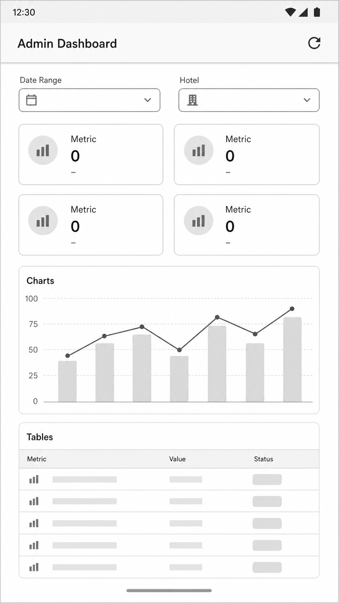

**Figure 3-57: Mobile Flutter Screen Design of Admin Dashboard**

| **#** | **Field / Component Name** | **Type** | **Mandatory** | **Max Length** | **Description** |
| --- | --- | --- | --- | --- | --- |
| 1 | Date Range Filter | Date Range | No | N/A | Reporting period |
| 2 | Hotel Filter | Filter | No | N/A | Optional hotel filter |
| 3 | Metric Cards | Component | Yes | N/A | Bookings, revenue, commission, refunds, settlement, exceptions |
| 4 | Charts/Tables | Component | No | N/A | Aggregated metrics |
| 5 | Refresh Action | Button | Yes | N/A | Refresh metrics |

**Table 3-41: Screen Definition of Admin Dashboard**

#### Use Case Description

##### Use Case Description - UC-023 View Platform Dashboard

| **Use Case ID** | | **UC-023** | **Use Case Name** | | **View Platform Dashboard** | |
| --- | --- | --- | --- | --- | --- | --- |
| **Author** | | BA Documentation Assistant | **Version** | 1.2 | **Date** | 2026-06-29 |
| **Actor** | | Platform Administrator | | | | |
| **Secondary Actor(s)** | | None | | **Feature / Group Function** | Reporting | |
| **Description** | | View platform booking, revenue, commission, payment, refund, and settlement metrics. | | | | |
| **Precondition** | | Platform Administrator authenticated. | | | | |
| **Trigger** | | Admin opens Dashboard. | | | | |
| **Post-Condition** | | POS-01: Platform dashboard metrics are displayed for the selected filters. | | | | |
| **Main flows** | | | | | | |
| **Step** | **Actor** | **Action** | | | | |
| 1 | Platform Administrator | Admin opens dashboard. | | | | |
| 2 | System | displays date/hotel filters and metrics for bookings, revenue, commission, refund, settlement, and hotel approval. | | | | |
| 3 | Platform Administrator | Admin applies filters. | | | | |
| 4 | System | refreshes metrics. | | | | |
| 5 | Platform Administrator | Admin navigates to details if needed. | | | | |
| **Alternative flows** | | | | | | |
| **Alternative ID** | | AT-UC023-04A | | **Branch from Main Step** | 4 | |
| **Condition** | | No data | | | | |
| **Sub step** | **Actor** | **Action** | | | | |
| 4.1 | System | Displays MSG-RPT-001. | | | | |
| 4.2 | System | Displays empty metrics and allows the administrator to adjust filters or navigate away; no records are changed. | | | | |
| **Business Rules** | | | | | | |
| **#** | **Rule Description** | | | | | |
| BR-ADMIN-004 | Platform dashboard metrics shall be calculated from historical booking, payment, refund, commission, settlement, and approval records. | | | | | |

**Related Application Messages:** MSG-RPT-001

### 3.2.14 FEAT-AUTO-NOTI - Automation and Notification

#### Purpose

This feature supports time-based booking expiration and notification recording/dispatch without a direct user screen.

#### Screen Mock-up and Screen Definition

This feature does not have a direct user screen in MVP+Staff v1.2. It is represented by non-screen functions, scheduler-triggered behavior, notification records, and related use case descriptions.

The non-screen flow for this feature is defined by UC-024, NSF-002, NSF-003, and the related business rules in Section 5.1. No separate user-facing screen mock-up is required for MVP+Staff v1.2.

#### Use Case Description

##### Use Case Description - UC-024 Expire Unpaid Booking

| **Use Case ID** | | **UC-024** | **Use Case Name** | | **Expire Unpaid Booking** | |
| --- | --- | --- | --- | --- | --- | --- |
| **Author** | | BA Documentation Assistant | **Version** | 1.2 | **Date** | 2026-06-29 |
| **Actor** | | System Scheduler | | | | |
| **Secondary Actor(s)** | | Notification Service | | **Feature / Group Function** | Automation | |
| **Description** | | Expire pending-payment bookings when payment timeout is reached. | | | | |
| **Precondition** | | Pending Payment booking exists; timeout configured. | | | | |
| **Trigger** | | Payment timeout is reached. | | | | |
| **Post-Condition** | | POS-01: Expired Pending Payment bookings are marked Expired and reserved availability is released. | | | | |
| **Main flows** | | | | | | |
| **Step** | **Actor** | **Action** | | | | |
| 1 | System | triggers expiration check. | | | | |
| 2 | System | identifies Pending Payment bookings past deadline. | | | | |
| 3 | System | atomically verifies booking is still Pending Payment, no successful payment exists, and expiration lock can be acquired. | | | | |
| 4 | System | marks eligible locked bookings Expired. | | | | |
| 5 | System | releases availability. | | | | |
| 6 | System | records notification event. | | | | |
| 7 | System | skips records that did not pass the atomic eligibility check. | | | | |
| **Alternative flows** | | | | | | |
| **Alternative ID** | | AT-UC024-03A | | **Branch from Main Step** | 3 | |
| **Condition** | | Payment success already exists | | | | |
| **Sub step** | **Actor** | **Action** | | | | |
| 3.1 | System | Does not expire booking. | | | | |
| 3.2 | System | Skips expiration and leaves the successfully paid booking unchanged. | | | | |
| **Alternative ID** | | AT-UC024-03B | | **Branch from Main Step** | 3 | |
| **Condition** | | Booking status changed | | | | |
| **Sub step** | **Actor** | **Action** | | | | |
| 3.1 | System | Skips booking and avoids duplicate action. | | | | |
| 3.2 | System | Leaves any already paid, confirmed, cancelled, or otherwise  non-pending booking unchanged. | | | | |
| **Business Rules** | | | | | | |
| **#** | **Rule Description** | | | | | |
| BR-BOOK-006 | A Platform Collect booking shall remain Pending Payment until successful payment is recorded or payment timeout occurs. | | | | | |
| BR-BOOK-007 | Pending Payment bookings shall expire after 15 minutes if payment is not completed; the value may be configurable by platform setting but the MVP default is 15 minutes. | | | | | |
| BR-ROOM-002 | Blocked, inactive, occupied, dirty, cleaning, inspection-required, maintenance, or out-of-service rooms shall not be counted as available for new assignment unless a permitted status transition makes them available. | | | | | |
| BR-PAY-003 | Duplicate payment notifications shall not create duplicate successful payment or commission records. | | | | | |
| BR-PAY-005 | The first atomic transition to either Confirmed by successful payment or Expired by timeout wins; later callbacks shall be audit-only unless an authorized exception process is defined. | | | | | |

**Related Application Messages:** MSG-BOOK-006

# 4. Non-Functional Requirements

## 4.1 External Interfaces

| **Interface ID** | **External Entity** | **Direction** | **Data / Event** | **Requirement** | **Related UC / NSF** |
| --- | --- | --- | --- | --- | --- |
| INT-PAY-001 | payOS Payment Gateway | System -> payOS | Payment request / payment instruction data | The system shall initiate payment instruction for Platform Collect bookings. | UC-006 |
| INT-PAY-002 | payOS Payment Gateway | payOS -> System | Payment result return or notification | The system shall record payment results and handle delayed/duplicate notifications safely. | UC-006, NSF-001 |
| INT-NOTI-001 | Notification Service / Mock | System -> Notification Service | Notification event data | The system shall send or record notification events for configured business events. | NSF-003 |
| INT-SCHED-001 | System Scheduler | Scheduler -> System | Time-based trigger | The system shall trigger expiration checks for Pending Payment bookings. | UC-024, NSF-002 |

## 4.2 Quality Attributes

| **NFR ID** | **Category** | **Requirement Statement** | **Verification Method** | **Related Features** |
| --- | --- | --- | --- | --- |
| NFR-USE-001 | Usability | A first-time Customer shall be able to search hotels and reach the Booking Form within 5 minutes using required search criteria. | Usability test with representative user. | FEAT-MKT, FEAT-CUST-BOOK |
| NFR-USE-002 | Usability | User-facing validation and error messages shall be clear, non-technical, and mapped to the Application Messages List. | Message review and UI test. | All user-facing features |
| NFR-USE-003 | Usability | Staff screens shall show role-relevant actions only, reducing accidental access to unauthorized operations. | Authorization and UI role test. | FEAT-STAFF, FEAT-FRONTDESK, FEAT-HOUSEKEEPING, FEAT-MAINTENANCE |
| NFR-REL-001 | Reliability | Confirmed booking and availability reservation shall remain consistent after booking creation, payment success, cancellation, expiration, check-in, checkout, and room assignment. | Transaction consistency test. | FEAT-CUST-BOOK, FEAT-FRONTDESK, FEAT-ROOM-INV |
| NFR-REL-002 | Reliability | Duplicate or delayed payment notifications shall not double-confirm a booking, duplicate payment amount, or double-count commission. | Duplicate callback test. | FEAT-CUST-BOOK, FEAT-ADMIN-FINANCE |
| NFR-REL-003 | Reliability | Room status shall remain consistent with active stay, housekeeping task, and maintenance request status. | Room lifecycle test. | FEAT-FRONTDESK, FEAT-HOUSEKEEPING, FEAT-MAINTENANCE |
| NFR-PER-001 | Performance | Search results shall be displayed within 3 seconds under normal MVP load and indexed/searchable data volume. | Performance test. | FEAT-MKT |
| NFR-PER-002 | Performance | Booking creation, cancellation, check-in, checkout, staff assignment, housekeeping status update, and maintenance update shall complete within 5 seconds under normal MVP load. | Performance test. | FEAT-CUST-BOOK, FEAT-FRONTDESK, FEAT-STAFF, FEAT-HOUSEKEEPING, FEAT-MAINTENANCE |
| NFR-SEC-001 | Security | The system shall require authentication before any protected Customer, Owner, Manager, Receptionist, Housekeeping, Maintenance, or Platform Administrator function is accessed. | Access-control test. | All protected features |
| NFR-SEC-002 | Security | The system shall enforce role-based and hotel-scoped access control for Customer, Property Owner, Hotel Manager, Receptionist, Housekeeping Staff, Maintenance Staff, and Platform Administrator. | RBAC and hotel-scope test. | All protected features |
| NFR-SEC-003 | Security | Staff users shall access only assigned hotel data unless they hold Property Owner or platform-level authority. | Authorization test. | FEAT-STAFF, FEAT-FRONTDESK, FEAT-HOUSEKEEPING, FEAT-MAINTENANCE |
| NFR-SEC-004 | Security | Housekeeping and Maintenance screens shall not display payment, refund, commission, settlement, or full customer personal information unless explicitly authorized. | Privacy UI review. | FEAT-HOUSEKEEPING, FEAT-MAINTENANCE |
| NFR-SEC-005 | Security | Passwords shall never be displayed in clear text and shall not be stored as plain text. | Security review. | FEAT-AUTH |
| NFR-SEC-006 | Security | Financial and personal-data related communication shall use secure transmission in production deployment. | Deployment/security review. | FEAT-CUST-BOOK, FEAT-ADMIN-FINANCE |
| NFR-AUD-001 | Auditability | The system shall record audit logs for staff, booking, room assignment, room status, payment collection, refund, commission, reconciliation, settlement, hotel approval, housekeeping, and maintenance actions. | Audit-log test. | All protected operational/financial features |
| NFR-AVL-001 | Availability | MVP demo environment should be available during agreed demo/testing windows, excluding planned maintenance. | Demo readiness check. | All features |
| NFR-MAINT-001 | Maintainability | Requirements shall be traceable from Actor -> Use Case -> Feature -> Screen/NSF -> Entity -> Business Rule -> Test Implication. | Traceability review. | Documentation-wide |
| NFR-BACK-001 | Backup/Recovery | Production deployment shall support database backup and restore procedures. | SDD/operation plan review. | All persistent data features |
| NFR-PRIV-001 | Privacy | The system shall collect only guest/customer/staff information required for account, booking, payment, stay, housekeeping, and maintenance operation in MVP+Staff scope. | Data field review. | FEAT-AUTH, FEAT-CUST-BOOK, FEAT-FRONTDESK, FEAT-HOUSEKEEPING, FEAT-MAINTENANCE |
| NFR-PRIV-002 | Privacy | Identity document information collected during check-in shall be visible only to authorized hotel operational roles and shall not be exposed to housekeeping, maintenance, or unrelated platform finance screens. | Privacy/access-control review. | FEAT-FRONTDESK |
| NFR-PRIV-003 | Privacy | Customer-facing booking detail shall show booking receipt/payment summary only, not the full hotel folio or platform finance details. | UI privacy review. | FEAT-CUST-MYBOOK, FEAT-FRONTDESK |
| NFR-COMP-001 | Compatibility | Flutter mobile UI shall be designed for common mobile screen sizes used in MVP testing. | Device compatibility test. | FEAT-MKT, FEAT-CUST-BOOK, FEAT-FRONTDESK, FEAT-HOUSEKEEPING, FEAT-MAINTENANCE |

---

# 5. Requirement Appendix

## 5.1 Business Rules

| **ID** | **Rule Definition** | **Related Use Cases** | **Evidence / Assumption** |
| --- | --- | --- | --- |
| BR-AUTH-001 | A Guest must register or log in before creating a booking. | UC-003, UC-005 | Confirmed scope. |
| BR-AUTH-002 | A user account may have one or more roles; hotel staff roles shall be scoped to assigned hotel(s); platform roles shall not grant hotel tenant permissions unless explicitly assigned. | UC-004, UC-026, UC-027 | Updated for accepted staff scope. |
| BR-AUTH-003 | Inactive or blocked accounts shall not be authenticated. | UC-004 | Security rule. |
| BR-AUTH-004 | A user may view and update only his or her own basic profile unless an authorized administrator function exists. | UC-025 | Privacy/security rule. |
| BR-MKT-001 | Only approved, active, and publicly available hotels shall appear in marketplace search results and hotel detail pages. | UC-001, UC-002, UC-018 | Confirmed MVP. |
| BR-OWNER-001 | A Property Owner may manage only hotels, rooms, staff, bookings, and operations belonging to owned hotels. | UC-009 to UC-017, UC-026, UC-027 | Security rule. |
| BR-BOOK-001 | The check-out date must be later than the check-in date. | UC-001, UC-005, UC-013, UC-031 | Standard hotel booking rule. |
| BR-BOOK-002 | A booking must contain at least one customer/guest identity, one hotel, one room type line, one check-in date, and one check-out date. | UC-005, UC-031 | Assumption. |
| BR-BOOK-003 | A Customer or authorized hotel-side actor can create an instant booking only if availability exists for the selected private room type and date range. | UC-005, UC-031 | Confirmed instant booking. |
| BR-BOOK-004 | The system shall reserve availability after booking creation according to booking status and payment mode. | UC-005 | Assumption. |
| BR-BOOK-005 | A Pay at Property booking shall be Confirmed immediately after successful availability validation. | UC-005, UC-031 | Confirmed payment mode. |
| BR-BOOK-006 | A Platform Collect booking shall remain Pending Payment until successful payment is recorded or payment timeout occurs. | UC-005, UC-006, UC-024 | Assumption. |
| BR-BOOK-007 | Pending Payment bookings shall expire after 15 minutes if payment is not completed; the value may be configurable by platform setting but the MVP default is 15 minutes. | UC-006, UC-024 | Replaces prior unspecified placeholder with explicit configurable assumption. |
| BR-BOOK-008 | A Customer may view and cancel only his or her own booking. | UC-007, UC-008 | Security rule. |
| BR-BOOK-009 | A hotel-side actor may view and operate only bookings belonging to owned or assigned hotels. | UC-014 to UC-017, UC-028 to UC-031 | Updated for staff scope. |
| BR-BOOK-010 | Walk-in bookings are allowed only when the hotel and actor permission enable walk-in booking. | UC-031 | Staff scope assumption. |
| BR-BOOK-011 | One booking shall contain exactly one room type and a quantity of private rooms in MVP+Staff v1.2. | UC-005, UC-031 | Confirmed by final v1.2 user decision. |
| BR-BOOK-012 | Booking amount in MVP+Staff v1.2 shall be calculated from room price only: unit price per night x room quantity x night count. | UC-005, UC-006, UC-031 | Confirmed by final v1.2 user decision. |
| BR-ROOM-001 | A physical room cannot be assigned to more than one active stay for overlapping dates. | UC-015, UC-029 | Physical room assignment rule. |
| BR-ROOM-002 | Blocked, inactive, occupied, dirty, cleaning, inspection-required, maintenance, or out-of-service rooms shall not be counted as available for new assignment unless a permitted status transition makes them available. | UC-001, UC-005, UC-013, UC-029, UC-037 | Updated for room lifecycle. |
| BR-ROOM-003 | Room capacity must be greater than zero. | UC-011 | Validation rule. |
| BR-ROOM-004 | Base price per night must be zero or greater. | UC-011 | Validation rule. |
| BR-ROOM-005 | Room numbers must be unique within the same hotel. | UC-012 | Validation rule. |
| BR-AVAIL-001 | A room or room type cannot be blocked for dates that conflict with active bookings unless a controlled exception process is used. | UC-013 | Availability rule. |
| BR-AVAIL-002 | Availability changes shall affect public marketplace availability after they are saved. | UC-013, UC-001 | Marketplace consistency. |
| BR-STAFF-001 | Property Owner or authorized Hotel Manager may create, invite, deactivate, and assign hotel staff roles for hotels under their authority. | UC-026, UC-027 | Staff scope. |
| BR-STAFF-002 | Hotel staff may access only hotel(s) to which they are assigned. | UC-004, UC-026 to UC-037 | Staff access control. |
| BR-STAFF-003 | Receptionists may view and operate bookings only for assigned hotels. | UC-014 to UC-017, UC-028 to UC-031 | Staff access control. |
| BR-STAFF-004 | Receptionists may check in only Confirmed bookings and check out only Checked In bookings. | UC-015, UC-016 | Front desk status rule. |
| BR-STAFF-005 | Housekeeping Staff may view room/task information required for cleaning but shall not access payment, refund, commission, settlement, or full customer personal data. | UC-032, UC-033 | Privacy rule. |
| BR-STAFF-006 | Maintenance Staff may view maintenance information required for repair but shall not access customer payment, refund, commission, settlement, or full customer personal data. | UC-035, UC-036, UC-037 | Privacy rule. |
| BR-FD-001 | Hotel-side actor-created walk-in booking must be traceable as booking source Walk-in. | UC-031 | Operational reporting rule. |
| BR-STAY-001 | A confirmed booking may be checked in only when the hotel-side actor has permission, the booking belongs to the owned/assigned hotel, and required room assignment information is valid. | UC-015, UC-029 | Stay operation rule. |
| BR-STAY-002 | A checked-in booking may be checked out only by an authorized hotel-side actor and only after required outstanding balance handling is confirmed. | UC-016, UC-030 | Checkout rule. |
| BR-STAY-003 | Checkout shall finalize or update the basic invoice/folio and release assigned room according to room lifecycle rules. | UC-016, NSF-008 | Stay-to-housekeeping rule. |
| BR-STAY-004 | No-show may be marked only for eligible confirmed bookings after the configured operational no-show window and shall preserve financial traceability. | UC-017 | No-show rule. |
| BR-STAY-005 | Check-in shall record required identity document information such as ID/passport number when hotel operation requires it, and such information shall be protected as sensitive operational data. | UC-015 | Confirmed by final v1.2 user decision. |
| BR-HK-001 | After checkout, an assigned physical room shall become Dirty or Cleaning Required before becoming Available again unless explicitly overridden by policy. | UC-016, NSF-008 | Housekeeping rule. |
| BR-HK-002 | A room may become Available only after required cleaning and/or inspection is completed according to hotel policy. | UC-033, UC-037 | Housekeeping rule. |
| BR-HK-003 | Housekeeping status transitions shall follow allowed sequence: Dirty -> Cleaning -> Inspection Required or Available. | UC-033 | Status rule. |
| BR-HK-004 | A reported room issue may create a maintenance request and may block room availability depending on severity. | UC-034 | Maintenance linkage. |
| BR-MAINT-001 | A room under Maintenance or Out of Service shall not be counted as available for booking or room assignment. | UC-034, UC-035, UC-036, UC-037 | Maintenance rule. |
| BR-MAINT-002 | A maintenance request must be resolved before the room can return to Available unless authorized manager override is recorded. | UC-037 | Maintenance rule. |
| BR-PAY-001 | Online payment result shall update PaymentTransaction and Booking status consistently. | UC-006, NSF-001 | Payment rule. |
| BR-PAY-002 | Payment status shall not be manually changed by hotel staff for Platform Collect payments. | UC-006, UC-020 | Finance control. |
| BR-PAY-003 | Duplicate payment notifications shall not create duplicate successful payment or commission records. | UC-006, UC-020 | Reliability rule. |
| BR-PAY-004 | Pay-at-Property collections shall be recorded as hotel-side collection records, not payOS transactions. | UC-030 | Payment mode separation. |
| BR-PAY-007 | Pay-at-Property collection records shall use a collection-status lifecycle so partial, complete, voided, and exception collections can be audited without changing payOS transaction status. | UC-030 | Defines hotel-side collection lifecycle. |
| BR-REF-001 | Refund eligibility shall be determined based on booking status, payment status, payment mode, and cancellation policy. | UC-007, UC-021 | Refund rule. |
| BR-REF-002 | Manual refund processing status shall be recorded by Platform Administrator in MVP+Staff scope. | UC-021 | Confirmed manual refund. |
| BR-REF-003 | Cancellation policy shall be hotel-configurable and may define free-cancellation threshold, refund percentage, and non-refundable conditions. | UC-005, UC-007, UC-021 | Confirmed by final v1.2 user decision. |
| BR-FIN-001 | Commission amount shall be calculated from the booking amount and commission rate snapshot captured at booking confirmation. | UC-005, UC-006, UC-019, NSF-004 | Commission model. |
| BR-FIN-002 | Platform Collect hotel payable shall consider paid amount, refund amount, and commission amount. | UC-006, UC-016, UC-022, NSF-005 | Finance rule. |
| BR-FIN-003 | Pay at Property booking shall create commission receivable owed by hotel to platform. | UC-005, UC-030, UC-022, NSF-006 | Dual payment model. |
| BR-FIN-004 | No-show handling shall preserve financial traceability for payment, commission, and refund decisions. | UC-017 | Finance traceability. |
| BR-FIN-005 | Settlement and commission collection shall be manually marked by Platform Administrator in MVP+Staff scope. | UC-022 | Confirmed manual settlement. |
| BR-FIN-006 | Customer shall see a booking receipt/payment summary, while full hotel folio/invoice and platform finance details remain restricted to authorized hotel/platform roles. | UC-008, UC-016, UC-030 | Confirmed by final v1.2 user decision. |
| BR-FIN-007 | Settlement eligibility shall be evaluated by settlement type: Platform Collect hotel settlement requires reconciled/non-exception payment, resolved refund outcome, no unresolved finance exception, and an eligible financial stay/cancellation/no-show state; Pay-at-Property commission collection requires a valid receivable CommissionRecord, applicable collection/booking status, and no unresolved finance exception, but does not require payOS reconciliation. | UC-022 | Prevents premature settlement or commission collection while respecting payment-mode differences. |
| BR-ADMIN-001 | Platform Administrator may approve or reject hotel submissions; rejection requires a reason. | UC-018 | Admin approval rule. |
| BR-ADMIN-002 | Commission rate updates apply to future booking snapshots and shall not alter historical booking snapshots. | UC-019 | Finance consistency. |
| BR-ADMIN-003 | Payment reconciliation exceptions require an admin note. | UC-020 | Audit rule. |
| BR-ADMIN-004 | Platform dashboard metrics shall be calculated from historical booking, payment, refund, commission, settlement, and approval records. | UC-023 | Reporting rule. |
| BR-NOTI-001 | Notification events shall be recorded even when external delivery is mocked. | NSF-003 | MVP notification assumption. |
| BR-AUDIT-001 | Actions that change protected data, booking status, room assignment, room status, staff assignment, housekeeping task, maintenance request, payment collection, refund, commission, reconciliation, settlement, or hotel approval shall be audited. | All protected operational/admin use cases | Auditability rule. |

## 5.2 Status Lifecycles and Enumerations

### 5.2.1 Booking Status

| **Status** | **Meaning** | **Typical Entry Event** |
| --- | --- | --- |
| Pending Payment | Booking created with Platform Collect, waiting for payment. | Customer creates Platform Collect booking. |
| Confirmed | Booking is confirmed and ready for arrival/check-in. | Payment success or Pay at Property booking creation. |
| Checked In | Guests have arrived and stay active. | Receptionist/authorized actor checks in booking. |
| Checked Out | Stay has ended and checkout has been performed. | Receptionist/authorized actor checks out booking. |
| Cancelled | Booking is cancelled according to policy. | Customer cancellation. |
| Expired | Pending Payment booking timed out without successful payment. | Scheduler expiration. |
| No-show | Customers did not arrive within the allowed no-show window. | Receptionist/Hotel Manager marks no-show. |

### 5.2.2 Room Operational Status

| **Status** | **Meaning** |
| --- | --- |
| Available | Room may be booked or assigned if no date conflict exists. |
| Assigned | Room is assigned to a booking but guest has not checked in yet. |
| Occupied | Room is assigned to an active checked-in stay. |
| Dirty | Room requires cleaning after checkout or operational event. |
| Cleaning | Cleaning is in progress. |
| Inspection Required | Cleaning or maintenance completion requires inspection before availability. |
| Maintenance | Room is unavailable due to maintenance issue. |
| Out of Service | Room is unavailable for longer-term or severe issue. |
| Blocked | Room is manually blocked by authorized user for selected date range. |
| Inactive | Room is not active for booking or assignment. |

### 5.2.3 Payment Status

| **Status** | **Meaning** |
| --- | --- |
| Pending | Payment was initiated but not completed. |
| Processing | Payment result is not final or is being confirmed. |
| Paid | Payment succeeded. |
| Failed | Payment failed. |
| Cancelled | Customer cancelled payment or payment was cancelled. |
| Expired | Pending payment expired before successful completion. |

### 5.2.4 Reconciliation Status

| **Status** | **Meaning** |
| --- | --- |
| Unreconciled | Payment transaction has not yet been reconciled by Platform Administrator. |
| Reconciled | Payment transaction has been reviewed and accepted for settlement eligibility. |
| Exception | Payment transaction has discrepancy requiring follow-up before settlement. |

### 5.2.5 Refund Status

| **Status** | **Meaning** |
| --- | --- |
| Not Required | Cancellation does not require refund. |
| Requested | Refund review is required. |
| Approved | Platform Administrator approved refund. |
| Rejected | Platform Administrator rejected refund. |
| Processing | Manual refund is being handled or awaiting confirmation. |
| Processed | Refund was manually processed and recorded. |
| Failed | Manual refund processing failed and requires follow-up. |

### 5.2.6 Settlement Status

| **Status** | **Meaning** |
| --- | --- |
| Not Eligible | The record is not ready for settlement/collection. |
| Eligible | The record is ready for settlement/collection. |
| Pending | Settlement or commission collection has not yet been marked completed. |
| Partially Settled | Part of an eligible settlement batch has been settled or collected. |
| Settled | Platform Administrator marked the hotel payable as settled. |
| Exception | Settlement or commission collection has discrepancy requiring follow-up. |

### 5.2.7 Commission Status

| **Status** | **Meaning** |
| --- | --- |
| Calculated | Commission amount was calculated from the booking amount and commission rate snapshot. |
| Receivable | Pay-at-Property commission is owed by the hotel to the platform. |
| Deducted | Platform Collect commission was deducted from the hotel payable during settlement calculation. |
| Collected | Platform Administrator marked Pay-at-Property commission as collected. |
| Exception | Commission discrepancy requires follow-up before settlement or collection completion. |

### 5.2.8 Payment Collection Status

| **Status** | **Meaning** |
| --- | --- |
| Pending | Pay-at-Property collection is expected but not fully recorded. |
| Partially Collected | Part of the expected hotel-side amount has been recorded. |
| Collected | Expected hotel-side amount has been recorded. |
| Voided | A collection record was voided by authorized correction and remains auditable. |
| Exception | Collection discrepancy requires follow-up before checkout or settlement-dependent reporting. |

### 5.2.9 Housekeeping Task Status

| **Status** | **Meaning** |
| --- | --- |
| Open | The task is created but not started. |
| Assigned | The task is assigned to a staff member. |
| In Progress | Cleaning or inspection is being performed. |
| Completed | Task is completed. |
| Issue Reported | Task found room issue and maintenance request is created. |
| Cancelled | The task is cancelled by an authorized actor. |

### 5.2.10 Maintenance Request Status

| **Status** | **Meaning** |
| --- | --- |
| Open | Request is created and waiting for handling. |
| Assigned | Request is assigned to Maintenance Staff. |
| In Progress | Maintenance work is being performed. |
| On Hold | Request is paused due to dependency or decision. |
| Completed | Maintenance work is completed. |
| Resolved | The room has been released from the maintenance workflow. |
| Cancelled | The request is cancelled by an authorized actor. |

## 5.3 Common Requirements

| **ID** | **Common Requirement** |
| --- | --- |
| CR-001 | All create and update actions shall validate mandatory fields before saving. |
| CR-002 | All monetary values shall be displayed in Vietnamese Dong for MVP unless changed later. |
| CR-003 | All date ranges shall validate that end date is later than start date where applicable. |
| CR-004 | All user-facing error messages shall be clear and non-technical. |
| CR-005 | All role-restricted functions shall reject unauthorized access. |
| CR-006 | All ownership-restricted and hotel-assignment-restricted functions shall validate scope before allowing data access or action. |
| CR-007 | All financial actions shall be traceable with user, timestamp, related booking, amount, status, and note where applicable. |
| CR-008 | Deleted, inactive, blocked, dirty, cleaning, inspection-required, maintenance, or out-of-service rooms shall not be available for new public booking or assignment unless allowed by status transition rules. |
| CR-009 | Booking, payment, collection, refund, commission, invoice, housekeeping, maintenance, room status, and settlement records shall retain historical status for reporting. |
| CR-010 | User-visible lists shall support empty state messages. |
| CR-011 | The system shall not display unapproved hotels in the public marketplace. |
| CR-012 | The system shall not double-count payment, commission, refund, collection, or settlement records. |
| CR-013 | All notification events shall be recorded even when actual external delivery is mocked. |
| CR-014 | Staff screens shall display only the minimum information required for the staff role. |
| CR-015 | System-generated records shall keep reference to the triggering entity and event when applicable. |

## 5.4 Application Messages List

| **#** | **Message Code** | **Message Type** | **Context** | **Content** | **Related Screen / UC** |
| --- | --- | --- | --- | --- | --- |
| 1 | MSG-AUTH-001 | Error | Invalid login | Incorrect username or password. Please check again. | SCR-002, UC-004 |
| 2 | MSG-AUTH-002 | Info | Login required | Please log in or register before creating a booking. | SCR-006, UC-002 |
| 3 | MSG-AUTH-003 | Error | Duplicate email/phone | Email or phone number is already in use. | SCR-001, SCR-003, SCR-028 |
| 4 | MSG-AUTH-004 | Error | Required account field missing | Please complete all required account information. | SCR-001, SCR-003 |
| 5 | MSG-AUTH-005 | Error | Invalid password | Password must meet the required policy and confirmation must match. | SCR-001 |
| 6 | MSG-AUTH-006 | Error | Account inactive/blocked | This account is inactive or blocked. Please contact support. | SCR-002 |
| 7 | MSG-AUTH-007 | Error | Unauthorized action | You are not authorized to perform this action. | Protected screens |
| 8 | MSG-AUTH-008 | Error | No active hotel assignment | Your staff account has no active hotel assignment. Please contact your hotel administrator. | SCR-002, UC-004 |
| 9 | MSG-AUTH-009 | Success | Profile updated | Your profile has been updated successfully. | SCR-003 |
| 10 | MSG-MKT-001 | Info | No search results | No hotels match your search criteria. Please adjust your search. | SCR-005, UC-001 |
| 11 | MSG-MKT-002 | Error | Hotel unavailable | This hotel is no longer available for public booking. | SCR-006, UC-002 |
| 12 | MSG-MKT-003 | Error | Destination required | Please enter a destination or hotel keyword. | SCR-004 |
| 13 | MSG-BOOK-001 | Error | Invalid date range | The check-out date must be later than the check-in date. | SCR-004, SCR-007 |
| 14 | MSG-BOOK-002 | Error | Room unavailable | The selected room is no longer available for the selected dates. | SCR-006, SCR-007, SCR-027 |
| 15 | MSG-BOOK-003 | Success | Booking created | Booking has been created successfully. | SCR-008, UC-005 |
| 16 | MSG-BOOK-004 | Info | Pending payment | Booking is pending payment. Please complete payment before the deadline. | SCR-008, UC-005 |
| 17 | MSG-BOOK-005 | Success | Booking cancelled | Booking has been cancelled successfully. | SCR-010, UC-007 |
| 18 | MSG-BOOK-006 | Error | Booking expired | This pending payment booking has expired. Please create a new booking. | SCR-012, UC-006, UC-024 |
| 19 | MSG-BOOK-007 | Error | Cancellation not allowed | This booking cannot be cancelled according to its current status or policy. | SCR-010, UC-007 |
| 20 | MSG-BOOK-008 | Info | No bookings | You do not have any bookings yet. | SCR-009, UC-008 |
| 21 | MSG-BOOK-009 | Info | No hotel booking found | No bookings match the selected hotel filters. | SCR-020, UC-014 |
| 22 | MSG-PAY-001 | Success | Payment successful | Payment has been completed successfully. | SCR-012, UC-006 |
| 23 | MSG-PAY-002 | Error | Payment failed/cancelled | Payment was not completed. You may retry before the booking expires. | SCR-012, UC-006 |
| 24 | MSG-PAY-003 | Info | Payment processing | Payment result is being processed. The booking will update when the result is confirmed. | SCR-012, UC-006 |
| 25 | MSG-PAY-004 | Info | Pay at property | Booking is confirmed. Please pay at the property according to hotel policy. | SCR-008, UC-005 |
| 26 | MSG-PAY-005 | Error | Invalid collection amount | Please enter a valid collection amount. | SCR-026, UC-030 |
| 27 | MSG-PAY-006 | Error | Wrong payment mode | This action is allowed only for Pay at Property bookings. | SCR-026, UC-030 |
| 28 | MSG-PAY-007 | Error | Collection exceeds expected amount | The collection amount cannot exceed the expected balance unless exception handling is allowed. | SCR-026, UC-030 |
| 29 | MSG-PAY-008 | Success | Collection recorded | Payment collection has been recorded successfully. | SCR-026, UC-030 |
| 30 | MSG-REF-001 | Success | Refund status updated | Refund status has been updated successfully. | SCR-040, UC-021 |
| 31 | MSG-REF-002 | Info | Refund under review | The refund request is under review by the platform. | SCR-013, UC-007 |
| 32 | MSG-REF-003 | Error | Invalid refund status | The selected refund status transition is not allowed. | SCR-040, UC-021 |
| 33 | MSG-REF-004 | Error | Invalid refund amount | The refund amount cannot exceed the paid amount. | SCR-040, UC-021 |
| 34 | MSG-OWNER-001 | Success | Hotel submitted | Hotel property has been submitted for approval. | SCR-015, UC-009 |
| 35 | MSG-OWNER-002 | Error | Unauthorized hotel access | You can access only hotels that you own or are assigned to. | Hotel-scoped screens |
| 36 | MSG-OWNER-003 | Error | Invalid image | Please upload a valid image file. | SCR-015, SCR-016 |
| 37 | MSG-OWNER-004 | Success | Hotel profile updated | Hotel profile has been updated successfully. | SCR-016 |
| 38 | MSG-OWNER-005 | Info | Pending approval | Hotel property is waiting for platform approval. | SCR-015, UC-009 |
| 39 | MSG-OWNER-006 | Info | Review required | This change may require platform review before publication. | SCR-016 |
| 40 | MSG-ROOM-001 | Error | Invalid room type data | Please check the room type name, capacity, price, and status. | SCR-017, UC-011 |
| 41 | MSG-ROOM-002 | Error | Room type has future bookings | This room type cannot be deactivated because active future bookings exist. | SCR-017, UC-011 |
| 42 | MSG-ROOM-003 | Error | Duplicate room number | Room number must be unique within the hotel. | SCR-018, UC-012 |
| 43 | MSG-ROOM-004 | Error | Room occupied | This room cannot be inactivated because it is currently occupied. | SCR-018, UC-012 |
| 44 | MSG-ROOM-005 | Success | Room type saved | Room type has been saved successfully. | SCR-017 |
| 45 | MSG-ROOM-006 | Success | Physical room saved | The physical room has been saved successfully. | SCR-018 |
| 46 | MSG-ROOM-007 | Error | Room type mismatch | The selected physical room does not match the required room type. | SCR-024, UC-029 |
| 47 | MSG-ROOM-008 | Error | Invalid room status | The selected room status transition is not allowed. | SCR-035 |
| 48 | MSG-ROOM-009 | Error | Room assignment overlap | This physical room is already assigned to another active stay for the selected dates. | SCR-024, UC-029 |
| 49 | MSG-AVAIL-001 | Error | Availability conflict | Availability change conflicts with active booking or assignment. | SCR-019, UC-013 |
| 50 | MSG-AVAIL-002 | Success | Availability updated | Availability has been updated successfully. | SCR-019, UC-013 |
| 51 | MSG-STAY-001 | Success | Check-in completed | The guest has been checked in successfully. | SCR-025, UC-015 |
| 52 | MSG-STAY-002 | Success | Check-out completed | Guest has been checked out successfully. | SCR-026, UC-016 |
| 53 | MSG-STAY-003 | Error | Booking not confirmed | Only confirmed bookings can be checked in. | SCR-025, UC-015 |
| 54 | MSG-STAY-004 | Error | Physical room unavailable | Selected physical room is not available for assignment. | SCR-024, SCR-025 |
| 55 | MSG-STAY-005 | Error | Booking not checked in | Only checked-in bookings can be checked out. | SCR-026, UC-016 |
| 56 | MSG-STAY-006 | Error | No-show not allowed yet | This booking is not eligible to be marked as no-show yet. | SCR-021, UC-017 |
| 57 | MSG-STAY-007 | Error | Invalid stay status | This action is not allowed for the current booking status. | SCR-021, UC-017 |
| 58 | MSG-STAY-008 | Success | No-show marked | Booking has been marked as no-show. | SCR-021, UC-017 |
| 59 | MSG-STAY-009 | Error | Payment collection required | Please confirm payment collection before checkout. | SCR-026, UC-016 |
| 60 | MSG-FD-001 | Info | No arrivals/departures | No arrivals or departures match the selected filters. | SCR-023, UC-028 |
| 61 | MSG-FD-002 | Error | Guest information required | Please enter required guest contact information. | SCR-027, UC-031 |
| 62 | MSG-FD-003 | Error | Walk-in disabled | Walk-in booking is not enabled for this hotel or role. | SCR-027, UC-031 |
| 63 | MSG-STAFF-001 | Success | Staff account saved | The staff account or invitation has been saved successfully. | SCR-028, UC-026 |
| 64 | MSG-STAFF-002 | Error | Invalid staff role | Please select a valid staff role. | SCR-029, UC-027 |
| 65 | MSG-STAFF-003 | Error | Staff assignment required | Staff must be assigned to at least one hotel before accessing staff functions. | SCR-029, UC-027 |
| 66 | MSG-STAFF-004 | Error | Staff has open tasks | Please reassign or resolve open tasks before deactivating this staff account. | SCR-028, UC-026 |
| 67 | MSG-STAFF-005 | Success | Staff role updated | Staff role assignment has been updated successfully. | SCR-029, UC-027 |
| 68 | MSG-HK-001 | Info | No housekeeping tasks | No housekeeping tasks match the selected filters. | SCR-031, UC-032 |
| 69 | MSG-HK-002 | Error | Invalid cleaning transition | The selected cleaning status transition is not allowed. | SCR-032, UC-033 |
| 70 | MSG-HK-003 | Success | Cleaning status updated | Cleaning status has been updated successfully. | SCR-032, UC-033 |
| 71 | MSG-MAINT-001 | Error | Issue details required | Please enter required room issue information. | SCR-032, UC-034 |
| 72 | MSG-MAINT-002 | Success | Maintenance request created | The maintenance request has been created successfully. | SCR-032, UC-034 |
| 73 | MSG-MAINT-003 | Info | No maintenance requests | No maintenance requests match the selected filters. | SCR-033, UC-035 |
| 74 | MSG-MAINT-004 | Error | Invalid maintenance transition | The selected maintenance status transition is not allowed. | SCR-034, UC-036 |
| 75 | MSG-MAINT-005 | Error | Completion note required | Please enter a completion or resolution note. | SCR-034, UC-036 |
| 76 | MSG-MAINT-006 | Success | Maintenance request updated | The maintenance request has been updated successfully. | SCR-034, UC-036 |
| 77 | MSG-MAINT-007 | Error | Maintenance not complete | Maintenance must be completed before the room can be released. | SCR-034, UC-037 |
| 78 | MSG-MAINT-008 | Info | Manager approval required | Manager approval is required before releasing this room. | SCR-034, UC-037 |
| 79 | MSG-MAINT-009 | Success | Room released | The room has been released from maintenance workflow. | SCR-034, UC-037 |
| 80 | MSG-ADMIN-001 | Success | Hotel reviewed | The hotel review decision has been saved successfully. | SCR-037, UC-018 |
| 81 | MSG-ADMIN-002 | Success | Commission updated | Commission rate has been updated successfully. | SCR-038, UC-019 |
| 82 | MSG-ADMIN-003 | Error | Rejection reason required | Please enter a rejection reason. | SCR-037, UC-018 |
| 83 | MSG-ADMIN-004 | Error | Hotel already reviewed | This hotel submission has already been reviewed. Please refresh the page. | SCR-037, UC-018 |
| 84 | MSG-FIN-001 | Success | Settlement updated | Settlement or commission collection status has been updated successfully. | SCR-041, UC-022 |
| 85 | MSG-FIN-002 | Error | Invalid commission rate | Please enter a valid commission rate. | SCR-038, UC-019 |
| 86 | MSG-FIN-003 | Success | Reconciliation updated | Payment reconciliation status has been updated successfully. | SCR-039, UC-020 |
| 87 | MSG-FIN-004 | Error | Invalid reconciliation | Please check the reconciliation status and required note. | SCR-039, UC-020 |
| 88 | MSG-FIN-005 | Error | Settlement not eligible | This record is not eligible for settlement or collection. | SCR-041, UC-022 |
| 89 | MSG-FIN-006 | Error | Settlement amount mismatch | The entered amount does not match the expected amount. | SCR-041, UC-022 |
| 90 | MSG-FIN-007 | Error | Settlement date required | Please enter the settlement or collection date. | SCR-041, UC-022 |
| 91 | MSG-RPT-001 | Info | No dashboard data | No data is available for the selected filters. | SCR-036, UC-023 |

| 92 | MSG-ADMIN-005 | Error | Hotel not approved | Commission rate can be configured only for an approved hotel. | SCR-038, UC-019 |

## 5.5 Assumptions and Open Questions

### 5.5.1 Assumptions and Confirmed Scope Decisions

| **Assumption ID** | **Assumption / Decision** | **Reason** | **Impact if Wrong** | **Confirmation Status** |
| --- | --- | --- | --- | --- |
| ASSUMP-001 | The system supports hotels only, not hostels or dorm beds. | Users confirmed hotel-only and private rooms only. | Search, entity model, and capacity logic would change. | Confirmed. |
| ASSUMP-002 | The role name remains Property Owner even though MVP supports hotels only. | User selected Property Owner. | Terminology may be broader than hotel-only MVP. | Confirmed. |
| ASSUMP-003 | Staff roles are included in MVP+Staff v1.2: Hotel Manager, Receptionist, Housekeeping Staff, and Maintenance Staff. | Users accepted adding staff actors. | Feature, screen, authorization, entity, and traceability expand significantly. | Confirmed. |
| ASSUMP-004 | Hotel Accountant/Cashier is not a separate actor in v1.2; Receptionist records Pay-at-Property collection. | User selected no Cashier and Receptionist handles collection. | Separate cashier roles would add actor, authorization, and screens. | Confirmed. |
| ASSUMP-005 | Platform Administrator also performs finance operations in MVP+Staff. | Separate Platform Finance Operator not selected. | Separate finance roles would require an actor and authorization split. | Confirmed for current scope. |
| ASSUMP-006 | Booking is instant when availability exists. | User selected instant booking. | Request-to-book would add owner approval status and use cases. | Confirmed. |
| ASSUMP-007 | Platform Collect and Pay at Property are both in scope. | Users selected both payment modes. | Finance and commission flows depend on this. | Confirmed. |
| ASSUMP-008 | payOS is the selected MVP demo payment provider. | User selected payOS. | External interface details may change if the provider changes. | Confirmed. |
| ASSUMP-009 | Refund policy exists, but refund execution is manually recorded by Platform Administrator in MVP+Staff. | User selected manual refund processing. | Automated refund would require deeper payment gateway integration. | Confirmed. |
| ASSUMP-010 | Settlement is manually marked by Platform Administrator in MVP+Staff. | User selected manual settlement. | Automated payout would require bank integration. | Confirmed. |
| ASSUMP-011 | Basic staff-visible invoice/folio is generated at checkout, while Customer sees booking receipt/payment summary only. | User selected customer receipt only. | Full customer invoice visibility would require extra fields and compliance review. | Confirmed. |
| ASSUMP-012 | One booking contains exactly one room type and quantity in MVP+Staff v1.2. | User confirmed option A. | Multi-room-type booking would require more complex form, pricing, and entities. | Confirmed. |
| ASSUMP-013 | Room pricing uses base price per room type per night and booking amount is room price only. | User confirmed room price only. | Taxes/service fees would require pricing breakdown and additional finance rules. | Confirmed. |
| ASSUMP-014 | Notification can be mocked in MVP+Staff. | No external provider selected. | Real notification requires external interface details. | Needs implementation confirmation only. |
| ASSUMP-015 | Pending Payment booking expires after 15 minutes by default. | User confirmed 15-minute timeout. | Different timeout affects UX, scheduler, and payment retry rules. | Confirmed. |
| ASSUMP-016 | The housekeeping task is automatically created after checkout. | Supports accepted Housekeeping actor and room lifecycle. | Manual task creation would change checkout flow. | Confirmed for v1.2 requirements. |
| ASSUMP-017 | Maintenance workflow is simple: View Request, Update Status, Resolve/Release Room. | The user selected a simple maintenance workflow. | Manager inspection workflow would add states/screens. | Confirmed. |
| ASSUMP-018 | Check-in records identity document information such as ID/passport when required. | User confirmed identity document fields. | Data privacy and screen fields would change if not needed. | Confirmed. |
| ASSUMP-019 | Cancellation policy is hotel-configurable. | User selected configurable policy. | Fixed platform policy would simplify rules but reduce hotel flexibility. | Confirmed. |

### 5.5.2 Open Questions

| **Open Question ID** | **Question** | **Why It Matters** | **Related Area** | **Priority** |
| --- | --- | --- | --- | --- |
| OQ-001 | What is the default commission rate or allowed commission range? | Affects commission validation and admin finance screen. | UC-019 | Medium |
| OQ-002 | Should availability be managed primarily at room type quantity level, physical room/date level, or both? | Affects SDD database design and availability calculation detail. | UC-013, ENT-012 | High |
| OQ-003 | What exact identity document fields are legally/operationally required for the target market? | Affects privacy rules, check-in validation, and data retention. | UC-015, NFR-PRIV-001 | High |
| OQ-004 | Should Hotel Manager be allowed to manage staff roles without Property Owner approval, or only within delegated permission? | Affects authorization matrix and audit. | UC-026, UC-027 | Medium |

## 5.6 Traceability Matrix

| **Trace ID** | **SRS Item** | **Type** | **Related Feature** | **Related Screen / Function** | **Entity / Rule Link** | **Test Implication** | **Status** |
| --- | --- | --- | --- | --- | --- | --- | --- |
| TR-001 | UC-001 Search Hotels | Use Case | FEAT-MKT | SCR-004, SCR-005 | ENT-005, ENT-010, ENT-012; BR-MKT-001 | Search by destination/date/guest count and filters. | Covered |
| TR-002 | UC-002 View Hotel Detail | Use Case | FEAT-MKT | SCR-006 | ENT-005 to ENT-010; BR-MKT-001 | Display approved hotel, rooms, policies, availability. | Covered |
| TR-003 | UC-003 Register Account | Use Case | FEAT-AUTH | SCR-001 | ENT-001, ENT-002; BR-AUTH-001 | Register Customer or Property Owner. | Covered |
| TR-004 | UC-004 Login | Use Case | FEAT-AUTH | SCR-002 | ENT-001, ENT-002, ENT-003; BR-AUTH-002, BR-STAFF-002 | Authenticate and route by role/hotel assignment. | Covered |
| TR-005 | UC-005 Create Booking | Use Case | FEAT-CUST-BOOK | SCR-007, SCR-008 | ENT-013, ENT-014; BR-BOOK-001 to BR-BOOK-006 | Create instant booking with availability validation. | Covered |
| TR-006 | UC-006 Pay Online | Use Case | FEAT-CUST-BOOK | SCR-011, SCR-012, NSF-001 | ENT-016; BR-PAY-001, BR-PAY-003 | Payment success/failure/cancelled/processing behavior. | Covered |
| TR-007 | UC-007 Cancel Booking | Use Case | FEAT-CUST-MYBOOK | SCR-010, SCR-013 | ENT-013, ENT-018; BR-BOOK-008, BR-REF-001 | Cancel booking and create refund status if needed. | Covered |
| TR-008 | UC-008 View My Bookings | Use Case | FEAT-CUST-MYBOOK | SCR-009, SCR-010 | ENT-013; BR-BOOK-008 | Customers see their own bookings only. | Covered |
| TR-009 | UC-009 Register Hotel Property | Use Case | FEAT-HOTEL-SETUP | SCR-015 | ENT-005, ENT-006, ENT-007, ENT-008, ENT-009 | The owner submits the hotel for approval. | Covered |
| TR-010 | UC-010 Manage Hotel Profile | Use Case | FEAT-HOTEL-SETUP | SCR-016 | ENT-005 to ENT-009; BR-OWNER-001, BR-STAFF-002 | Owner/authorized manager updates assigned hotel. | Covered |
| TR-011 | UC-011 Manage Room Type | Use Case | FEAT-ROOM-INV | SCR-017 | ENT-010; BR-ROOM-003, BR-ROOM-004 | Create/update active private room type. | Covered |
| TR-012 | UC-012 Manage Physical Room | Use Case | FEAT-ROOM-INV | SCR-018 | ENT-011; BR-ROOM-005 | Create/update physical room and status. | Covered |
| TR-013 | UC-013 Manage Room Availability | Use Case | FEAT-ROOM-INV | SCR-019 | ENT-012; BR-AVAIL-001, BR-AVAIL-002 | Block/unblock availability and reject conflicts. | Covered |
| TR-014 | UC-014 View Hotel Bookings | Use Case | FEAT-FRONTDESK | SCR-020, SCR-021 | ENT-013; BR-BOOK-009, BR-STAFF-003 | Hotel actors see assigned hotel bookings only. | Covered |
| TR-015 | UC-015 Check In Customer | Use Case | FEAT-FRONTDESK | SCR-021, SCR-024, SCR-025 | ENT-013, ENT-015, ENT-028; BR-STAFF-004, BR-ROOM-001 | Check in confirmed booking and assign room. | Covered |
| TR-016 | UC-016 Check Out Customer | Use Case | FEAT-FRONTDESK | SCR-021, SCR-026, NSF-008 | ENT-019, ENT-025, ENT-027, ENT-028; BR-HK-001 | Checkout, finalize invoice, create cleaning workflow. | Covered |
| TR-017 | UC-017 Mark No-show | Use Case | FEAT-FRONTDESK | SCR-021, SCR-023 | ENT-013, ENT-028; BR-FIN-004 | Mark eligible confirmed booking as no-show. | Covered |
| TR-018 | UC-018 Approve Hotel Property | Use Case | FEAT-ADMIN-APPROVAL | SCR-037 | ENT-005, ENT-024; BR-ADMIN-001 | Approve/reject hotel publication. | Covered |
| TR-019 | UC-019 Manage Commission Rate | Use Case | FEAT-ADMIN-FINANCE | SCR-038 | ENT-020; BR-FIN-001, BR-ADMIN-002 | Set commission and preserve snapshots. | Covered |
| TR-020 | UC-020 Reconcile Payment | Use Case | FEAT-ADMIN-FINANCE | SCR-039, NSF-001 | ENT-016, ENT-024; BR-PAY-003, BR-ADMIN-003 | Reconcile payment and handle exceptions. | Covered |
| TR-021 | UC-021 Process Refund Status | Use Case | FEAT-ADMIN-FINANCE | SCR-040 | ENT-018, ENT-024; BR-REF-001, BR-REF-002 | Manual refund status update. | Covered |
| TR-022 | UC-022 Mark Settlement | Use Case | FEAT-ADMIN-FINANCE | SCR-041 | ENT-021, ENT-022, ENT-024; BR-FIN-005, BR-FIN-007 | Mark settlement/commission collection after settlement-type-specific eligibility validation. | Covered |
| TR-023 | UC-023 View Platform Dashboard | Use Case | FEAT-ADMIN-REPORT | SCR-036, NSF-007 | ENT-013, ENT-016, ENT-020 to ENT-022; BR-ADMIN-004 | Display platform metrics. | Covered |
| TR-024 | UC-024 Expire Unpaid Booking | Use Case | FEAT-AUTO-NOTI | NSF-002 | ENT-013, ENT-023; BR-BOOK-006, BR-BOOK-007 | Expire pending payment and release availability. | Covered |
| TR-025 | UC-025 Manage Own Profile | Use Case | FEAT-AUTH | SCR-003 | ENT-001; BR-AUTH-004 | Users update their own profile only. | Covered |
| TR-026 | UC-026 Manage Hotel Staff Accounts | Use Case | FEAT-STAFF | SCR-028 | ENT-001, ENT-003, ENT-004, ENT-024; BR-STAFF-001 | Create/invite/update/deactivate staff. | Covered |
| TR-027 | UC-027 Assign Staff Roles and Permissions | Use Case | FEAT-STAFF | SCR-029 | ENT-002, ENT-003, ENT-024; BR-STAFF-001, BR-STAFF-002 | Assign hotel-scoped roles correctly. | Covered |
| TR-028 | UC-028 View Arrival and Departure List | Use Case | FEAT-FRONTDESK | SCR-022, SCR-023 | ENT-013; BR-STAFF-003 | Front desk list by date/status. | Covered |
| TR-029 | UC-029 Assign Physical Room | Use Case | FEAT-FRONTDESK | SCR-024, SCR-021 | ENT-011, ENT-015, ENT-027; BR-ROOM-001 | Prevent overlapping physical room assignments. | Covered |
| TR-030 | UC-030 Record Pay-at-Property Payment | Use Case | FEAT-FRONTDESK | SCR-026 | ENT-017, ENT-019, ENT-024; BR-PAY-004, BR-PAY-006, BR-PAY-007 | Record collection and update balance. | Covered |
| TR-031 | UC-031 Create Walk-in Booking | Use Case | FEAT-FRONTDESK | SCR-027 | ENT-013, ENT-014, ENT-015; BR-FD-001 | Create hotel-side booking with source Walk-in. | Covered |
| TR-032 | UC-032 View Housekeeping Tasks | Use Case | FEAT-HOUSEKEEPING | SCR-030, SCR-031 | ENT-025; BR-STAFF-005 | Housekeeping sees only assigned/allowed tasks. | Covered |
| TR-033 | UC-033 Update Room Cleaning Status | Use Case | FEAT-HOUSEKEEPING | SCR-032, SCR-035 | ENT-025, ENT-027; BR-HK-001 to BR-HK-003 | Update cleaning status and room status. | Covered |
| TR-034 | UC-034 Report Room Issue | Use Case | FEAT-HOUSEKEEPING, FEAT-MAINTENANCE | SCR-032 | ENT-026, ENT-027; BR-HK-004, BR-MAINT-001 | The issue creates maintenance requests and may block rooms. | Covered |
| TR-035 | UC-035 View Maintenance Requests | Use Case | FEAT-MAINTENANCE | SCR-033 | ENT-026; BR-STAFF-006 | Maintenance sees assigned/allowed requests. | Covered |
| TR-036 | UC-036 Update Maintenance Request | Use Case | FEAT-MAINTENANCE | SCR-034 | ENT-026, ENT-024; BR-MAINT-001, BR-MAINT-002 | Update request status and audit. | Covered |
| TR-037 | UC-037 Release Room from Maintenance | Use Case | FEAT-MAINTENANCE | SCR-034, SCR-035 | ENT-026, ENT-025, ENT-027; BR-MAINT-002, BR-HK-002 | Release room and create cleaning/inspection if required. | Covered |
| TR-038 | NFR-SEC-002 Role and Hotel-scoped Access | NFR | All Protected Features | Screen Authorization Matrix | ENT-003; BR-STAFF-002 | Unauthorized role/hotel access is rejected. | Covered |
| TR-039 | NFR-SEC-004 Staff Privacy | NFR | FEAT-HOUSEKEEPING, FEAT-MAINTENANCE | SCR-030 to SCR-034 | BR-STAFF-005, BR-STAFF-006 | Staff privacy display restrictions. | Covered |
| TR-040 | NFR-REL-003 Room Lifecycle Consistency | NFR | FEAT-FRONTDESK, FEAT-HOUSEKEEPING, FEAT-MAINTENANCE | DGM-STATE-ROOM-001 | ENT-025, ENT-026, ENT-027 | Room status remains consistent across workflows. | Covered |

## 5.7 Revalidation Notes

| **Previous Issue** | **Resolution in v1.2** | **Revalidation Result** |
| --- | --- | --- |
| Staff roles were previously out of scope while hotel operation was too heavily assigned to Property Owner. | Added Hotel Manager, Receptionist, Housekeeping Staff, and Maintenance Staff; moved daily operation to appropriate staff roles while preserving Property Owner authority. | Fixed. |
| Guest was associated with Login inconsistently. | UC-004 now uses Registered User as primary actor and includes all registered roles. The guest still opens Login screen but is not the authenticated role. | Fixed. |
| Notification Service was omitted from some notification-related flows. | Notification Service appears in use cases and NSF-003 for event notification/recording. | Fixed. |
| Use case relationships included dangling or weak include/extend relationships. | Removed invalid include/extend relationships; kept only UC-015 includes UC-029 because Assign Physical Room is reusable and independent enough. Payment callback is NSF-001, refund admin processing is sequential dependency, and invoice generation is step in UC-016. | Fixed. |
| FEAT-PAY and FEAT-ADMIN overlapped. | Split finance into FEAT-CUST-BOOK for customer payment and FEAT-ADMIN-FINANCE for platform finance administration. | Fixed. |
| Screen flows were too large. | Split screen flow diagrams by business workflow: Customer, Hotel Setup, Front Desk, Housekeeping, Maintenance, Platform Admin. | Fixed. |
| Some screen-flow nodes had no screen IDs. | Added SCR-020 to SCR-041 and mapped each screen to use cases. | Fixed. |
| SCR-003 User Profile had no use case. | Added UC-025 Manage Own Profile. | Fixed. |
| HotelImage, Amenity, and CancellationPolicy appeared without entity definitions. | Added ENT-006, ENT-007, ENT-008, ENT-009. | Fixed. |
| Physical room assignment could not be represented properly with BookingRoom only. | Added ENT-015 BookingRoomAssignment. | Fixed. |
| SettlementRecord previously had a weak list-of-booking-IDs attribute. | Added ENT-022 SettlementItem. | Fixed. |
| Housekeeping and Maintenance actors would be dangling without domain entities. | Added ENT-025 HousekeepingTask, ENT-026 MaintenanceRequest, ENT-027 RoomStatusHistory. | Fixed. |
| Room status lifecycle lacked Dirty/Cleaning/Inspection states. | Expanded Room Operational Status and added DGM-STATE-ROOM-001. | Fixed. |
| Password and timeout values previously used unspecified placeholders. | Replaced password with 8-64 length and payment timeout with configurable default 15 minutes. Remaining uncertain items are stated as assumptions/open questions, not literal unspecified-placeholder text. | Fixed. |

## 5.8 Documentation QA Summary

| **Check** | **Result** | **Notes** |
| --- | --- | --- |
| Understanding score is at least 95% | Pass | Current understanding score remains 96% after accepted staff-scope change. |
| SRS uses required FPT-style structure | Pass | Product Overview, User Requirements, Software Features, NFRs, and Appendix included. |
| SRS keeps WHAT / black-box boundary | Pass | Use cases describe actor actions and system responses; no controller/service/repository/SQL/class implementation detail in SRS flows. |
| Every actor has at least one use case | Pass | Guest, Customer, Registered User, Property Owner, Hotel Manager, Receptionist, Housekeeping Staff, Maintenance Staff, Platform Administrator, payOS, Notification Service, and System Scheduler are mapped. |
| Every use case has a primary actor | Pass | UC-001 to UC-037 defined with primary actors. |
| Use case names are goal-level | Pass | Use cases are action-oriented and avoid button-click or code-level names. |
| Use case relationships are valid | Pass | Invalid dangling include/extend relationships removed. UC-015 includes UC-029 only because room assignment is reusable and independently meaningful. |
| Features are split by business workflow | Pass | Features are organized by Auth, Marketplace, Booking, Hotel Setup, Room Inventory, Staff, Front Desk, Housekeeping, Maintenance, Admin Finance, Reporting, Automation. |
| Screen flows are business-specific | Pass | Screen flows split by workflow instead of one large diagram. |
| Screen descriptions included | Pass | SCR-001 to SCR-041 listed and mapped to UCs. |
| Screen authorization matrix included | Pass | Matrix covers Guest, Customer, Owner, Manager, Receptionist, Housekeeping, Maintenance, and Platform Administrator. |
| Non-screen functions included | Pass | Payment callback, expiration, notification, finance calculations, housekeeping task creation, and maintenance notification included. |
| Logical entities and attributes included | Pass | ENT-001 to ENT-028 defined and origin-traced. |
| Entity mapping originates from UC/rule | Pass | Entity Origin Traceability explains why each entity exists. |
| Business rules centralized | Pass | BR table updated for staff, hotel-scope, housekeeping, maintenance, payment, finance, and audit. |
| Application messages centralized | Pass | MSG table includes old and new role/workflow messages. |
| NFRs are measurable or reviewable | Pass | Thresholds are explicit assumptions where not confirmed. |
| Assumptions and open questions separated | Pass | Confirmed staff-scope changes and unresolved decisions are listed separately. |
| Traceability matrix included | Pass | UC/BR/NFR mapped to feature, screen/function, entity/rule, and test implication. |
| No literal unspecified-placeholder text remains | Pass | Uncertain items are represented as assumptions/open questions. |
| Scope matches updated MVP+Staff intent | Pass | Hotel-only/private-room marketplace remains, while staff hotel operation is now included. |
